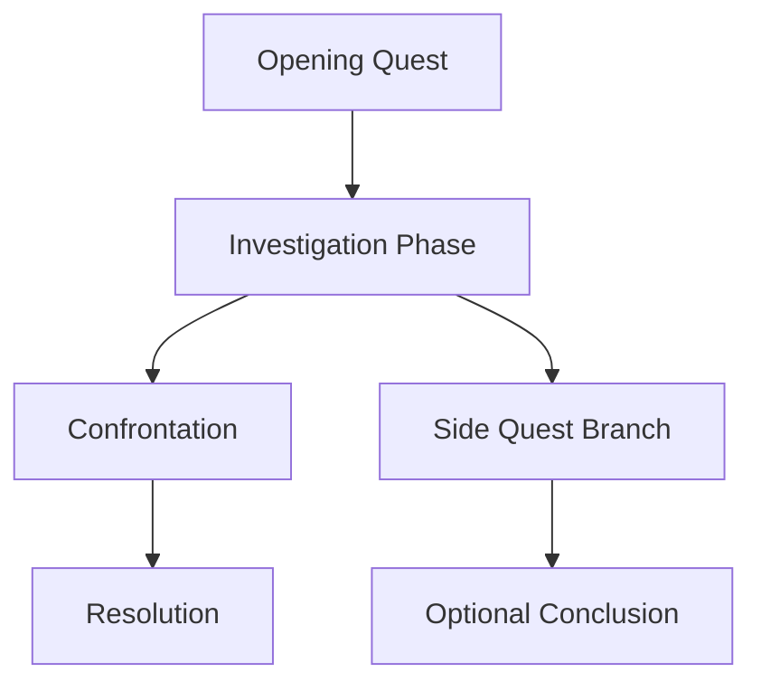
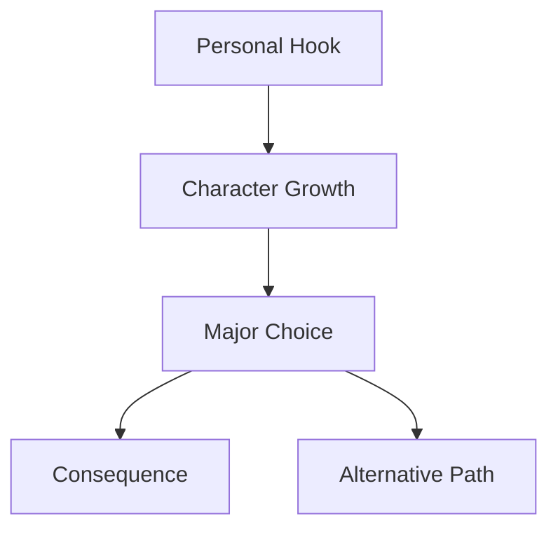

# Advanced Quest Management System

## Active Quests Dashboard
```dataview
TABLE
  priority as "Priority",
  status as "Status",
  quest_giver as "Quest Giver",
  location as "Location",
  reward as "Reward",
  deadline as "Deadline"
FROM ""
WHERE type = "quest" AND status = "active"
SORT priority DESC, deadline ASC
```

## Quest Status Tracking

### By Priority
```dataview
TABLE file.link as "Quest", quest_giver, deadline
FROM ""
WHERE type = "quest" AND priority = "high"
SORT deadline ASC
```

### By Campaign
```dataview
TABLE status, priority, quest_giver
FROM ""
WHERE type = "quest"
GROUP BY campaign
SORT campaign, priority DESC
```

## Quest Chains and Dependencies

### Main Story Arcs


### Character Development Quests


## Quest Templates by Type

### Investigation Quest
```
---
type: quest
name: Quest Name
campaign: Campaign
status: active
priority: medium
quest_type: investigation
quest_giver: [[NPC Name]]
location: [[Location]]
reward: Information/Item
deadline: Date
tags: [quest, investigation]
---

## Mystery
*What needs to be uncovered*

## Clues
1. First clue location
2. Second clue source
3. Final revelation

## Red Herrings
- False lead 1
- False lead 2

## Resolution Paths
- Direct confrontation
- Subtle investigation
- Social manipulation
```

### Combat Quest
```
---
type: quest
name: Quest Name
campaign: Campaign
status: active
priority: high
quest_type: combat
quest_giver: [[NPC Name]]
target: Enemy/Monster
location: [[Location]]
reward: XP/Gold/Items
deadline: Date
tags: [quest, combat]
---

## Objective
*Who/what to defeat and why*

## Enemy Details
- **Type:** Monster/Humanoid
- **CR:** Challenge Rating
- **Weaknesses:** Vulnerabilities
- **Tactics:** How they fight

## Battlefield
- **Terrain:** Description
- **Hazards:** Environmental dangers
- **Advantages:** Tactical opportunities

## Scaling Options
- **Easy:** Reduce enemy numbers
- **Hard:** Add reinforcements/hazards
```

## Quest Consequences System

### Success Outcomes
- Experience gained
- Relationships improved
- New opportunities unlocked
- World state changes

### Failure Outcomes
- Alternative paths opened
- Relationships damaged
- Consequences for world
- Future complications

### Partial Success
- Mixed results
- Unintended consequences
- Future quest hooks
- Character development

## Random Quest Generator

### Quest Types (d8)
| Roll | Type |
|------|------|
| 1 | Rescue/Recovery |
| 2 | Investigation |
| 3 | Escort/Protection |
| 4 | Elimination |
| 5 | Exploration |
| 6 | Negotiation |
| 7 | Delivery |
| 8 | Construction/Repair |

### Quest Complications (d6)
| Roll | Complication |
|------|-------------|
| 1 | Time pressure |
| 2 | Rival group |
| 3 | Missing information |
| 4 | Moral dilemma |
| 5 | Resource shortage |
| 6 | Betrayal |

### Quest Rewards (d8)
| Roll | Reward Type |
|------|------------|
| 1 | Gold/Treasure |
| 2 | Magic Item |
| 3 | Information |
| 4 | Ally/Contact |
| 5 | Territory/Property |
| 6 | Title/Status |
| 7 | Special Ability |
| 8 | Future Favor |
