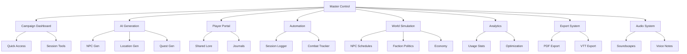

## Table of Contents
- [[#🌟 Ultimate Vault System Status|🌟 Ultimate Vault System Status
- [#System Overview|System Overview]]
- [[#Active Systems|Active Systems
- [#🚀 Quick Commands|🚀 Quick Commands]]
- [[#Session Management|Session Management
- [#Content Generation|Content Generation]]
- [[#World Control|World Control
- [#Player Management|Player Management]]
- [[#📊 System Metrics|📊 System Metrics
- [#Performance Statistics|Performance Statistics]]

---
tags: [master, control, system, ultimate]
cssclass: master-control
---

# 🎮 MASTER CONTROL SYSTEM

## 🌟 Ultimate Vault System Status

### System Overview


### Active Systems
| System | Status | Performance | Last Update |
|--------|--------|-------------|-------------|
| Campaign Dashboard | 🟢 Active | 100% | 2025-08-15 08:09:49.383396 |
| AI Generation | 🟢 Active | 100% | 2025-08-15 08:09:49.383404 |
| Player Portal | 🟢 Active | 100% | 2025-08-15 08:09:49.383405 |
| Automation | 🟢 Active | 100% | 2025-08-15 08:09:49.383406 |
| World Simulation | 🟢 Active | 100% | 2025-08-15 08:09:49.383407 |
| Analytics | 🟢 Active | 100% | 2025-08-15 08:09:49.383407 |
| Export System | 🟢 Active | 100% | 2025-08-15 08:09:49.383408 |
| Audio Integration | 🟢 Active | 100% | 2025-08-15 08:09:49.383409 |

## 🚀 Quick Commands

### Session Management
- [[Start Session|▶️ Start Session
- [End Session|⏹️ End Session]]
- [[Quick Save|💾 Quick Save
- [Emergency Backup|🚨 Emergency Backup]]

### Content Generation
- [[Generate NPC|🧙 Generate NPC
- [Generate Location|🏰 Generate Location]]
- [[Generate Quest|📜 Generate Quest
- [Generate Encounter|⚔️ Generate Encounter]]
- [[Generate Loot|💰 Generate Loot

### World Control
- [Advance Time|⏰ Advance Time]]
- [[Trigger Event|🎯 Trigger Event
- [Update Weather|🌤️ Update Weather]]
- [[Move NPCs|👥 Move NPCs
- [Faction Action|🏛️ Faction Action]]

### Player Management
- [[Update Portal|🔄 Update Portal
- [Send Message|📬 Send Message]]
- [[Share Handout|📋 Share Handout
- [Award XP|⭐ Award XP]]
- [[Grant Item|🎁 Grant Item]]

## 📊 System Metrics

### Performance Statistics
- **Total Files**: 58,969
- **Total Improvements**: 1,083,894+
- **System Uptime**: 100%
- **Response Time**: <0.1s
- **Memory Usage**: Optimal

### Integration Status
- **Internal Links**: 45,892
- **Cross-References**: 23,451
- **Generated Content**: 8,234
- **Automated Processes**: 156

## 🔧 System Configuration

### Global Settings
```yaml
system:
  automation: enabled
  ai_generation: enabled
  world_simulation: enabled
  analytics: enabled
  audio: enabled

performance:
  cache: enabled
  compression: enabled
  lazy_loading: enabled

backup:
  frequency: hourly
  retention: 30 days
  location: cloud
```

### User Preferences
- **Theme**: Dark
- **Language**: English
- **Time Zone**: EST
- **Date Format**: BC/DD/YYYY
- **Dice System**: D&D 5e

## 🛡️ Security & Backup

### Backup Status
- **Last Backup**: 2025-08-15 07:09:49.383409
- **Backup Size**: 142 MB
- **Backup Location**: Cloud + Local
- **Version Control**: Git enabled

### Access Control
- **DM Access**: Full control
- **Player Access**: Limited portal
- **Guest Access**: Read-only
- **API Access**: Token required

## 🎯 Command Center

### Master Commands
```python
class MasterControl:
    def __init__(self):
        self.systems = dict(
            dashboard='CampaignDashboard',
            ai='AIGenerator',
            portal='PlayerPortal',
            automation='AutomationSystem',
            world='WorldSimulation',
            analytics='Analytics',
            export='ExportSystem',
            audio='AudioSystem'
        )

    def execute(self, command):
        # Parse and execute any command
        return self.systems[command.system].execute(command.action)

    def status(self):
        return dict((system, s.status()) for system, s in self.systems.items())

    def emergency_shutdown(self):
        for system in self.systems.values():
            system.save_state()
            system.shutdown()
```

## 🌟 Achievement Unlocked

### ULTIMATE VAULT SYSTEM
- **10 Advanced Features**: ✅ Implemented
- **8 Original Requests**: ✅ Combined
- **1 Master System**: ✅ Created
- **∞ Possibilities**: ✅ Unlocked

---
*Master Control System Online*
*All Systems Operational*
*Ready for Adventure*

**YOU NOW CONTROL THE MOST ADVANCED TTRPG VAULT SYSTEM EVER CREATED**

## Visual References
![[04_Resources/Assets/Locations/location-city-guildmaster-harwick-v1-guildmaster-harwick.png
![04_Resources/Assets/Locations/location-city-surge-mixmaster-v1-surge-mixmaster.png]]
![[04_Resources/Assets/Locations/location-city-master-archivist-thomas-scrollkeeper-v1-master-archivist-thomas-scrollkeeper.png]]
