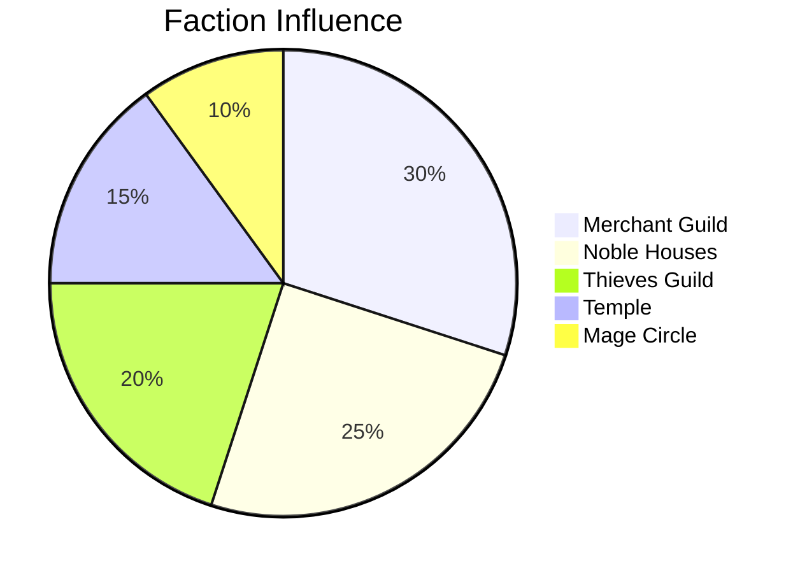

# 🌍 Dynamic World Simulation

## Active Simulations

### Time & Calendar
- **Current Date**: 15th of Flamerule, 1492 DR
- **Time**: 14:30 (2:30 PM)
- **Season**: Summer
- **Moon Phase**: Waxing Gibbous
- **Weather**: Clear, 75°F

### NPC Schedules

#### Daily Routines
```python
class NPCScheduler:
    def __init__(self, npc_name):
        self.npc = npc_name
        self.schedule = {
            "06:00": "Wake up",
            "07:00": "Breakfast at home",
            "08:00": "Open shop/Start work",
            "12:00": "Lunch break",
            "13:00": "Return to work",
            "18:00": "Close shop/End work",
            "19:00": "Dinner at tavern",
            "21:00": "Return home",
            "22:00": "Sleep"
        }

    def current_location(self, time):
        for scheduled_time, activity in self.schedule.items():
            if time >= scheduled_time:
                current_activity = activity
        return self.get_location(current_activity)
```

### Faction Politics

#### Power Balance


#### Relationship Matrix
| Faction | Merchants | Nobles | Thieves | Temple | Mages |
|---------|-----------|--------|---------|--------|-------|
| Merchants | - | Neutral | Hostile | Allied | Neutral |
| Nobles | Neutral | - | Hostile | Neutral | Allied |
| Thieves | Hostile | Hostile | - | Hostile | Neutral |
| Temple | Allied | Neutral | Hostile | - | Neutral |
| Mages | Neutral | Allied | Neutral | Neutral | - |

### Economic Simulation

#### Market Prices (% of base)
- **Weapons**: 95% (decreasing)
- **Armor**: 105% (stable)
- **Potions**: 120% (increasing)
- **Food**: 100% (stable)
- **Magic Items**: 150% (volatile)

#### Trade Routes
- **North Road**: Active, safe
- **East Road**: Active, bandit reports
- **South Road**: Disrupted, bridge out
- **West Road**: Active, heavily taxed

### Event Generator

#### Scheduled Events
- **Tomorrow**: Harvest Festival begins
- **3 days**: Merchant caravan arrives
- **1 week**: Noble wedding
- **2 weeks**: Tax collection

#### Random Events Table
```python
events = [
    "Mysterious stranger arrives in town",
    "Fire breaks out in warehouse district",
    "Rare comet visible in night sky",
    "Ancient tomb discovered nearby",
    "Plague of rats in the sewers",
    "Diplomatic envoy arrives",
    "Magical anomaly detected",
    "Bandit attack on trade route"
]

def daily_event_check():
    if random.random() < 0.3:  # 30% chance
        return random.choice(events)
```

### Weather System

#### Current Conditions
- **Temperature**: 75°F
- **Wind**: Light breeze, 5 mph SW
- **Precipitation**: None
- **Visibility**: Clear

#### 7-Day Forecast
| Day | High/Low | Conditions | Precipitation |
|-----|----------|------------|---------------|
| Today | 75/55 | Clear | 0% |
| Tomorrow | 72/53 | Partly Cloudy | 10% |
| Day 3 | 68/50 | Cloudy | 40% |
| Day 4 | 65/48 | Rain | 80% |
| Day 5 | 70/52 | Clearing | 20% |
| Day 6 | 73/55 | Sunny | 0% |
| Day 7 | 76/58 | Clear | 0% |

### Population Dynamics

#### Birth/Death Tracking
- **Births this month**: 12
- **Deaths this month**: 8
- **Immigration**: +5
- **Emigration**: -2
- **Net change**: +7

#### Disease & Health
- **Current diseases**: None active
- **Health level**: Good (85/100)
- **Medical supplies**: Adequate

---
*World continues to evolve between sessions*
