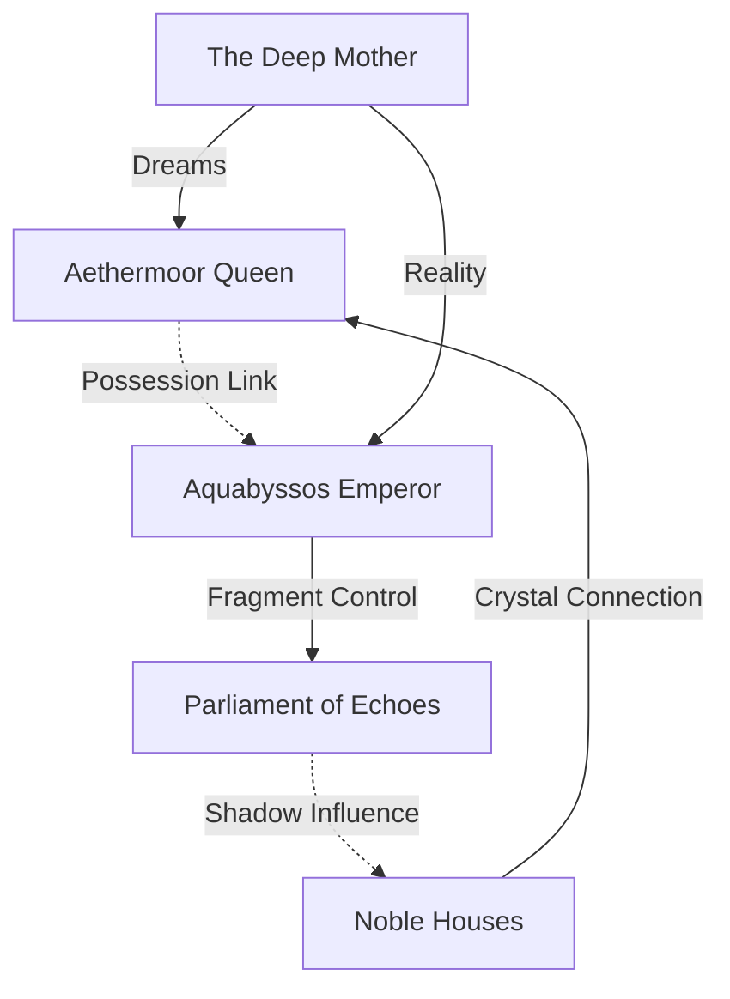

# Aethermoor-Aquabyssos World Connection Guide
## The Convergence of Surface and Depth

> *"Two worlds, divided by catastrophe, united by necessity."*

## 🌐 Dimensional Architecture

### The Three States of Reality

#### State 1: Complete Separation (Historical)
- **Timeline**: 300 years ago to present
- **Barrier**: The Surface Seal - magical membrane preventing interaction
- **Aethermoor**: Develops crystal magic, faction conflicts
- **Aquabyssos**: Evolves underwater civilization, depth adaptations
- **Connection Points**: None (sealed)

#### State 2: Partial Merger (Current Campaign)
- **Timeline**: Post-Crystal Festival events
- **Barrier**: Weakening, selective breaches
- **Merged Zones**:
  - [[02_Worldbuilding/Places/Port Meridian ↔ [02_Worldbuilding/Places/Abyssos Prime Upper Districts]]
  - [[02_Worldbuilding/Lore/Lighthouse of Storms ↔ [02_Worldbuilding/Places/The Inverse Palace]]
  - [[02_Worldbuilding/Places/Crystal Gardens ↔ [02_Worldbuilding/Places/Screaming Gardens]]
- **Mechanics**: Reality shifts every 12 hours

#### State 3: Full Convergence (Possible Future)
- **Timeline**: After Deep Mother resolution
- **Barrier**: Completely dissolved
- **New Geography**:
  - Floating Aquabyssos districts above Aethermoor cities
  - Inverted waterfalls connecting realms
  - Shared atmospheric zones (air/water hybrid)
- **Population**: Integrated society with adaptation variations

## 🔄 Continental Connections

### Parallel Structures
Each Aquabyssos continent has an Aethermoor counterpart:

| Aquabyssos | Aethermoor | Connection Type | Merger Effect |
|------------|------------|----------------|---------------|
| [[02_Worldbuilding/Places/Abyssos Prime | [02_Worldbuilding/Places/Port Meridian]] | Political Centers | Shared Parliament |
| [[02_Worldbuilding/Places/Nereidios | [02_Worldbuilding/Lore/Arcanum Heights]] | Knowledge Hubs | Merged Libraries |
| [[02_Worldbuilding/Lore/Corallion | [02_Worldbuilding/Lore/Crystal Forest]] | Living Systems | Symbiotic Growth |
| [[02_Worldbuilding/Lore/Vorthak | [02_Worldbuilding/Lore/Shattered Isles]] | Fragmented Realms | Reality Chaos |
| [[02_Worldbuilding/People/Tenebrarum | [02_Worldbuilding/Groups/Criminal_Organizations/Shadow Vale]] | Darkness Domains | Shadow Overlap |
| [[02_Worldbuilding/Places/Crystallium | [02_Worldbuilding/Lore/Resonance Peaks]] | Harmonic Centers | Frequency Sync |
| [[02_Worldbuilding/Places/Mourning Depths | Sorrow's End (to be detailed) | Emotional Extremes | Grief Manifest |
| [02_Worldbuilding/Places/Memoriam]] | [Forgotten] | Lost to Both | Unknown State |

### Transit Systems Between Worlds

#### Active Conduits
1. **Lighthouse Network**
   - [[02_Worldbuilding/Lore/Lighthouse of Storms - Primary portal
   - Seven lesser lighthouses - Dormant but activatable
   - Navigation: Crystal resonance keys
   - Risk: Temporal displacement

2. **Deep Wells**
   - Ancient shafts predating both civilizations
   - Located at: Major cities' foundations
   - Access: Requires depth adaptation Stage 2+
   - Danger: Void current exposure

3. **Memory Streams**
   - Flow between [02_Worldbuilding/Places/The Memory Meadows]] and [[02_Worldbuilding/Lore/Aethermoor Archives
   - Travel: Consciousness only, body remains
   - Duration: `dice: 1d4` hours maximum
   - Cost: Temporary memory loss

4. **Shadow Passages**
   - Created by shadow separation events
   - Connect: Any shadow to [02_Worldbuilding/People/Tenebrarum]]
   - Requirement: Shadow independence
   - Warning: One-way without shadow mastery

## 📊 Faction Interconnections

### Cross-World Organizations

#### The Depth Concordat ↔ The Crystal Council
- **Shared Goal**: Maintain separation/control merger
- **Conflict**: Degree of acceptable integration
- **Secret**: Leadership includes beings from both worlds
- **Resources**:
  - Aethermoor: Crystal technology
  - Aquabyssos: Depth magic

#### Surface Seekers ↔ Purist Coalition
- **Opposition**: Complete philosophical enemies
- **Surface Seekers**: Want to reclaim surface life
- **Purist Coalition**: Want to eliminate all water influence
- **Irony**: Would be natural allies if they could communicate

#### The Forgotten ↔ The Crimson Hand
- **Mystery**: Same organization across worlds?
- **Evidence**: Identical symbols, parallel actions
- **Theory**: Orchestrating merger for unknown purpose
- **Power**: Manipulate memory and magic

### Political Dynamics

#### Power Structures

## 🎭 Shared Threats & Opportunities

### The Seven Shards Connection
- **Aethermoor Shards**: Contain prison fragments
- **Aquabyssos Shards**: ARE the prison bars
- **Combined**: Form complete seal or complete release
- **Locations**: Mirror positions in both worlds
- **Activation**: Requires bloodline from each world

### The Crystal Plague / Adaptation Syndrome
| Stage | Aethermoor Effect | Aquabyssos Effect | Merger Result |
|-------|------------------|-------------------|---------------|
| 1 | Crystal veins | Gill development | Amphibious crystal |
| 2 | 25% crystallized | Water breathing | Living filter |
| 3 | 50% crystal | Pressure immunity | Reality anchor |
| 4 | 75% crystal | Shadow separation | Dual existence |
| 5 | Full crystal | Full adaptation | Transcendent being |

### Entity Connections
- **The Drowned God**: Aquabyssos defense system
- **The Deep Mother**: Sleeping creator of both realms
- **The Crystal Entity**: Aethermoor's response to drowning
- **The Forgotten One**: Exists in neither, remembers both

## 🗺️ Geographic Overlaps

### Merged Zone Properties

#### Port Meridian-Abyssos Prime Junction
- **Day Cycle**: Surface rules (commerce, sunlight)
- **Night Cycle**: Depth rules (pressure, shadows)
- **Transition Hour**: Reality flux, dangerous
- **Population**: 60% surface, 30% adapted, 10% hybrid
- **Government**: Dual parliament system
- **Challenges**:
  - Water supply (drinkable vs breathable)
  - Light sources (harmful to some)
  - Currency exchange rates
  - Legal system conflicts

#### Crystal Forest-Corallion Symbiosis
- **Growth Pattern**: Coral overtaking crystal trees
- **Ecosystem**: Hybrid organisms emerging
- **Resources**: New magical materials
- **Danger**: Consciousness merger spreading
- **Opportunity**: Living building materials

## 📈 Timeline Convergence Points

### Historical Parallels
| Year | Aethermoor Event | Aquabyssos Event | Connection |
|------|-----------------|------------------|------------|
| -300 | Kingdom founding | Empire height | Same rulers? |
| -200 | First crystal discovered | Deep magic found | Same source |
| -100 | Faction wars begin | Depth divisions | Orchestrated |
| 0 | Crystal Festival planned | Grand Conjunction | Synchronized |
| +3 weeks | Plague appears | Shadows separate | Causation |
| Now | Queen possessed | Emperor scattered | Linked minds |

### Prophetic Convergences
1. **The Seven Seals**: Both worlds have seven
2. **The Forgotten Age**: Missing century in both histories
3. **The Deep Calendar**: Astronomical alignment
4. **The Blood Moon**: Affects both worlds equally
5. **The Silent Hour**: Daily moment of connection

## 🔮 Merger Mechanics

### For DMs: Managing Two Worlds

#### Reality Shift Rules
- **Trigger**: Major story events, bloodline activation
- **Duration**: `dice: 1d4` hours to permanent
- **Effect Table** (d20):
  - 1-5: Minor overlap (see both worlds)
  - 6-10: Moderate merge (exist in both)
  - 11-15: Major fusion (choose which world)
  - 16-19: Complete merger (new reality)
  - 20: Paradox (reroll with advantage)

#### Character Existence
- **Single Body**: Standard, choose world per scene
- **Dual Existence**: Rare, maintain both versions
- **Quantum State**: Very rare, probability existence
- **Merged Being**: Endgame, transcendent form

## 🎲 Random Encounter Tables

### Crossover Encounters (d12)
1. Depth refugee seeking surface
2. Surface explorer lost in depths
3. Memory merchant trading between worlds
4. Shadow crossing dimensions
5. Crystal plague/adaptation hybrid victim
6. Temporal ghost from pre-separation
7. Messenger from other world's faction
8. Merged zone reality storm
9. Bloodline descendant unaware of heritage
10. Portal guardian (hostile/helpful)
11. Cross-world romance complications
12. Entity fragment manifesting

### Merged Zone Events (d10)
1. Gravity reversal hour
2. Atmosphere shift (air to water)
3. Shadow uprising attempt
4. Memory tide breach
5. Crystal growth surge
6. Diplomatic incident
7. Trade disruption
8. Identity confusion outbreak
9. Prophetic vision shared
10. Deep Mother stirs

## 🏛️ Integrated Campaigns

### Campaign Path Intersections

#### Aethermoor → Aquabyssos
- **Entry Point**: Post-Crystal Festival merger
- **Motivation**: Stop shadow harvest, save merged citizens
- **Challenges**: Adaptation, political navigation
- **Allies**: Marina's true form, reformed senators
- **Resolution**: Prevent or manage Deep Mother awakening

#### Aquabyssos → Aethermoor
- **Entry Point**: Lighthouse activation, memory stream
- **Motivation**: Cure adaptation, stop crystal plague
- **Challenges**: Surface prejudice, faction wars
- **Allies**: The Crimson Sage, Queen (if saved)
- **Resolution**: Unite worlds against greater threat

#### Parallel Campaigns
- **Two Groups**: One in each world
- **Communication**: Through bloodline carriers
- **Coordination**: Actions affect other group
- **Climax**: Groups meet at merger moment
- **Resolution**: Combined effort shapes future

## 📚 Lore Integration

### Shared Mythology
- **Creation Myth**: Both worlds were one ocean-land
- **Separation Legend**: Divine punishment vs protection
- **Hero Tales**: Same heroes, different interpretations
- **Prophecies**: Deliberately mistranslated
- **Lost Knowledge**: Each world has half

### Language Evolution
| Original | Aethermoor | Aquabyssos | Meaning Drift |
|----------|------------|------------|---------------|
| "Depth" | "Mystery" | "Home" | Understanding |
| "Surface" | "Freedom" | "Death" | Perspective |
| "Shadow" | "Deception" | "Truth" | Reality |
| "Crystal" | "Power" | "Prison" | Purpose |
| "Tide" | "Change" | "Constant" | Time |

## 🎯 Campaign Objectives

### Unification Ending
- Merge worlds successfully
- Integrate populations
- Combine magic systems
- Create hybrid civilization
- Face external threats together

### Separation Ending
- Reinforce barriers
- Maintain distinct worlds
- Limited diplomatic contact
- Preserve unique cultures
- Prepare for eventual reconnection

### Transformation Ending
- Create third option
- Transform both worlds
- Transcend physical reality
- Become planar nexus
- Attract multiversal attention

## 🔗 Related Documents
- [[08_Archive/2025-08-09/Campaign_Docs/Aethermoor/Aethermoor Campaign Overview|08 Archive/2025 08 09/Campaign Docs/Aethermoor/Aethermoor Campaign Overview
- [08_Archive/2025-08-09/Campaign_Docs/Aquabyssos/Aquabyssos Campaign Overview|08 Archive/2025 08 09/Campaign Docs/Aquabyssos/Aquabyssos Campaign Overview]]
- [[02_Worldbuilding/Places/The Seven Shards Mystery
- [03_Mechanics/Depth Adaptation System]]
- [[03_Mechanics/Crystal Plague Mechanics
- [NPC Cross-World Connections]]
- [[02_Worldbuilding/Lore/Merged Zone Navigation]]

## 📝 DM Guidelines

### Managing Complexity
1. Start with one connection point
2. Gradually reveal parallels
3. Let players discover links
4. Use NPCs to bridge worlds
5. Keep consistent internal logic

### Player Agency
- Choose merger degree
- Influence political outcomes
- Shape cultural integration
- Determine entity fates
- Create new possibilities

### Tonal Balance
- Wonder vs Horror
- Hope vs Despair
- Unity vs Division
- Progress vs Tradition
- Known vs Unknown

> *"In the space between worlds, all possibilities exist simultaneously. The question isn't which world survives, but what new world emerges from their collision."*

---

## Quick Reference: Connection Status Tracker

### Current State: [_____________]
- [ ] Completely Separated
- [ ] Initial Contact
- [ ] Partial Merger
- [ ] Active Integration
- [ ] Full Convergence

### Active Portals: [_____]
- [ ] Lighthouse Network
- [ ] Deep Wells
- [ ] Memory Streams
- [ ] Shadow Passages
- [ ] Natural Rifts

### Faction Relations: [_____]
- [ ] Hostile
- [ ] Suspicious
- [ ] Neutral
- [ ] Cooperative
- [ ] Allied

### Reality Stability: [_____/10]
- 10: Perfectly stable
- 7-9: Minor fluctuations
- 4-6: Regular shifts
- 2-3: Constant flux
- 1: Reality breakdown

## Player-Facing Summary

Aethermoor Aquabyssos World Connection Guide is a sky-borne element of the setting, known for brass fittings and cloudstone terraces. Its presence anchors ongoing storylines and offers clear player choices.

## Lore Details

Legends speak of Aethermoor Aquabyssos World Connection Guide as a nexus where past and present converge. Locals describe subtle omens—shifts in currents, a dimming of lanternfish, or whispers on the wind—that herald change around Aethermoor Aquabyssos World Connection Guide.

## Adventure Hooks

- A rumor ties Aethermoor Aquabyssos World Connection Guide to a missing shipment, linking factions with competing claims.
- An NPC seeks discreet help at Aethermoor Aquabyssos World Connection Guide to avert a public scandal.
- A map overlay reveals a hidden approach to Aethermoor Aquabyssos World Connection Guide active only during specific tides/storms.

## DM Notes

Play up tactile detail: sounds, pressure/wind changes, and meaningful symbology. Offer two clear approaches (stealth vs. parley) and one wildcard complication tied to a faction clock. Reward scouting and map use.

<!-- enriched: true -->

## Cross-References

- [[02_Worldbuilding/Lore/Shattered Isles

## Connections

- [02_Worldbuilding/Groups/Criminal_Organizations/Shadow Vale]]
- [[02_Worldbuilding/Lore/Arcanum Heights
- [02_Worldbuilding/Lore/Corallion]]
- [[02_Worldbuilding/Lore/Crystal Forest
- [02_Worldbuilding/Lore/Resonance Peaks]]
- [[02_Worldbuilding/Lore/Shattered Isles
- [02_Worldbuilding/Lore/Vorthak]]
- [[02_Worldbuilding/People/Tenebrarum
- [02_Worldbuilding/Places/Abyssos Prime Upper Districts]]
- [[02_Worldbuilding/Places/Crystal Gardens
- [02_Worldbuilding/Places/Crystallium]]
- [[02_Worldbuilding/Places/Memoriam
- [02_Worldbuilding/Places/Mourning Depths]]
