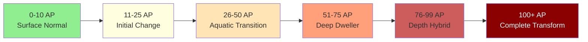

# Aquabyssos Quick Reference Dashboard
## Essential DM Tools for Underwater Horror

> [!tip] Navigation
> - [[#Core Mechanics|Core Mechanics]] • [[#Quick Tables|Quick Tables]] • [[#NPC Generator|NPCs]] • [[#Environmental Effects|Environment]] • [[#Session Tools|Session Tools]]

---

## 🎯 Core Mechanics

### ⚡ Quick Resolution

> [!mechanics|clean] **Universal DCs**
> - **Easy**: DC 10 (Routine task)
> - **Moderate**: DC 13 (Standard challenge)
> - **Hard**: DC 16 (Significant challenge)
> - **Extreme**: DC 19 (Near impossible)
> - **Depth Modifier**: +1 DC per 2,000 ft depth

### 🌊 Pressure Saves

```dataview
TABLE WITHOUT ID
	Depth as "Depth",
	DC as "Save DC",
	Frequency as "How Often",
	Failure as "Failure Result"
FROM #pressure-zones
SORT Depth ASC
```

| Depth | Save DC | How Often | Failure Result |
|-------|---------|-----------|----------------|
| 0-1k ft | DC 10 | 1/hour | 1 exhaustion |
| 1-3k ft | DC 14 | 2/hour | 1d4 damage + exhaustion |
| 3-6k ft | DC 16 | 2/hour | 2d4 damage + 2 exhaustion |
| 6-10k ft | DC 18 | 30 min | 3d4 damage + 2 exhaustion |
| 10k+ ft | DC 20+ | 10 min | 4d4 damage + death save |

### 🎭 Shadow Activity Scale

> [!shadow] **Current Shadow Level: `= this.shadow_activity`**
> 1. **Dormant**: Normal shadows
> 2. **Stirring**: Delayed reactions
> 3. **Active**: Independent gestures
> 4. **Hostile**: Attempting separation
> 5. **Critical**: Full replacement attempt

---

## 📊 Quick Tables

### 🎲 Random Encounters (d12)

> [!encounter|flex]
> **Roll**: `dice: 1d12`
> 
> 1. Memory Tide approaching (1d6 AP)
> 2. Shadow merchant caravan
> 3. Pressure suit malfunction
> 4. Lost surface explorer
> 5. Temporal echo (past/future)
> 6. Void current pull
> 7. Bioluminescent swarm
> 8. Depth cultists ritual
> 9. Leviathan parasite
> 10. Shadow acting strange
> 11. Emperor's eel messenger
> 12. Reality fracture

### 💱 Currency Exchange

| Surface | Aquabyssos | Value | Weight |
|---------|------------|-------|--------|
| 1 gp | 10 Sorrow Pearls | Standard | Normal |
| 1 pp | 1 Memory Shard | High | None |
| - | 1 Shadow Coin | Variable | Shadow |
| 100 gp | 1 Pressure Gem | Stable | Heavy |
| - | 1 Dream Token | Fleeting | Mental |

### 🏃 Chase Mechanics

> [!chase] **Underwater Pursuit**
> **Base Speed**: Half land speed unless adapted
> **Current Bonus**: +10 ft with current, -10 against
> **Visibility**: Disadvantage on attacks beyond 30 ft
> **3D Movement**: Use height advantage/disadvantage

---

## 👥 NPC Generator

### Quick NPC Builder

> [!npc|wide]
> **Name Generator**
> - **Prefix**: `dice: [[Aquatic Prefixes]]` 
> - **Suffix**: `dice: [[Depth Surnames]]`
> 
> **Motivation** `dice: 1d6`
> 1. Escape to surface
> 2. Dive deeper  
> 3. Forget everything
> 4. Remember the lost
> 5. Replace someone
> 6. Become nothing
> 
> **Dark Secret** `dice: 1d6`
> 1. Is actually a shadow
> 2. Murdered their past self
> 3. Exists in multiple timelines
> 4. Is forgetting themselves  
> 5. Carries a plague
> 6. Is someone's dream
> 
> **Adaptation Level** `dice: 1d6`
> 1. Pure human (desperate)
> 2. Partially adapted (conflicted)
> 3. Fully aquatic (resigned)
> 4. Crystalline hybrid (transformed)
> 5. Shadow-merged (duplicitous)
> 6. Beyond classification (alien)

### Instant Shadow Double

When an NPC's shadow becomes independent:
- **AC**: Original AC + 2
- **HP**: Half original HP
- **Abilities**: All original abilities
- **Additions**: Shadow step, resistance to non-magical
- **Weakness**: Radiant vulnerability
- **Personality**: Original's repressed traits

---

## 🌍 Environmental Effects

### Active Environmental Conditions

> [!environment|grid]
> ```toggle
> id: env-pressure
> label: "⚡ Pressure Zone Active"
> ```
> 
> ```toggle  
> id: env-shadow
> label: "🌑 Shadow Hour Active"
> ```
> 
> ```toggle
> id: env-memory  
> label: "🌊 Memory Tide Active"
> ```
> 
> ```toggle
> id: env-void
> label: "⚫ Void Current Active"  
> ```

### Quick Effect Reference

| Condition | Mechanical Effect | Narrative Cue |
|-----------|------------------|---------------|
| **Pressure Zone** | CON saves hourly | Ears popping, chest tight |
| **Shadow Hour** | Shadows independent | Shadows move wrong |
| **Memory Tide** | WIS save or visions | Water tastes of tears |
| **Void Current** | Existence checks | Light doesn't work |

---

## 🎯 Session Tools

### ⏱️ Session Pacing Tracker

> [!time] **Session Time Management**
> - [ ] **Opening Hook** (10 min)
> - [ ] **Investigation/Exploration** (60 min)
> - [ ] **Major Encounter** (45 min)
> - [ ] **Roleplay/Development** (45 min)
> - [ ] **Climax/Resolution** (30 min)
> - [ ] **Cliffhanger** (10 min)

### 📈 Adaptation Tracker



### 🎲 Advantage/Disadvantage Quick Rules

> [!columns]
> 
> > [!success] **Advantage**
> > - Adapted to depth
> > - Shadow cooperation
> > - With current
> > - Higher position
> > - Pressure suit working
> 
> > [!danger] **Disadvantage**
> > - Surface dweller deep
> > - Shadow opposition  
> > - Against current
> > - Lower position
> > - Equipment failure

---

## 💡 Quick Rulings

### When Players Want To...

> [!faq]- **Breathe Underwater Without Magic**
> - **Holding Breath**: 1 + CON mod minutes
> - **Emergency Gills**: Surgery, 2d10 damage, permanent
> - **Pressure Breathing**: Training required, extends x2
> - **Adaptation**: Automatic at 26+ AP

> [!faq]- **Control Their Shadow**
> - **Persuasion DC 15**: Cooperate for scene
> - **Intimidation DC 18**: Force submission
> - **Shadow Lock**: Prevents separation 24 hr
> - **Embrace**: Permanent at Stage 4+

> [!faq]- **Navigate Void Currents**
> - **INT DC 15**: Find right current
> - **WIS DC 13**: Maintain existence
> - **Lose 1d4 memories** on failure
> - **Arrive as someone else** on nat 1

> [!faq]- **Resist Transformation**
> - **Surface suit**: Halve AP gain
> - **Greater Restoration**: -2d4 AP
> - **Memory Anchor**: No AP for 24 hr
> - **Daily meditation**: -1 AP (max 5)

---

## 🔥 Emergency Procedures

### TPK Recovery Options

> [!danger] **Total Party Kill**
> 1. **Shadow Resurrection**: Return as shadows
> 2. **Memory Echo**: Replay from Memory Tide
> 3. **Temporal Loop**: Vorthak time reset
> 4. **Deep Mother Dream**: It was nightmare
> 5. **New Characters**: Rescue party sent

### Player Missing

> [!warning] **Absent Player**
> - **Shadow Separation**: Character's shadow acts
> - **Pressure Sickness**: In medical bay
> - **Memory Tide**: Lost in memories
> - **Temporal Shift**: Exists in different time
> - **Emergency Surface**: Recalled by faction

---

## 📚 Quick Links

### Essential References
- [[Depth Adaptation System]]
- [[Aquabyssos Survival Mechanics]]
- [[Continental Connections & Story Weave]]
- [[Shadow Separation Rules]]

### Current Campaign
- [[The Parliament of Shadows Campaign]]
- [[Session 04 - High Tide Horror|Latest Session]]
- [[Shadow Duchess Nyx|Key NPC]]
- [[The Inverse Palace|Current Location]]

### Tools & Tables
- [[Random Encounter Tables]]
- [[NPC Name Generator]]
- [[Treasure by Depth]]
- [[Madness Effects]]

---

## 📝 Session Notes Template

```markdown
## Session X: [Title]
**Date**: 
**Players Present**: 
**Location**: [[]]
**Depth**: X ft
**Shadow Level**: X/5

### Key Events
1. 
2. 
3. 

### Decisions Made
- 

### Consequences
- 

### Next Session
- 

### AP Tracking
| Player | Start | End | Change |
|--------|-------|-----|--------|
|        |       |     |        |
```

---

> [!quote] Remember
> *"In the depths, physics is the enemy, shadows are people, and going deeper is always easier than coming back up."*

---

*Quick Reference v1.0 | For full rules see complete mechanics documents*