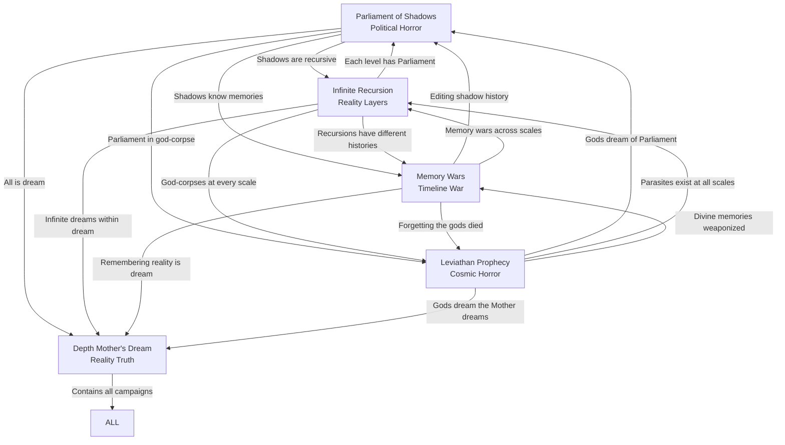

# Campaign Integration Matrix
## How All Aquabyssos Campaigns Connect

> *"Every campaign is a different lens viewing the same apocalypse."*

---

## 🕸️ The Master Connection Web

---

## 📍 Shared Locations & Their Variations

### Abyssos Prime / Parliament of Echoes

| Campaign | Version | Key Difference |
|----------|---------|----------------|
| **Parliament** | Shadow-corrupted government | Shadows replacing senators |
| **Recursion** | Exists at every scale | Infinite parliaments voting |
| **Leviathan** | Inside god's brain | Parliament is neural network |
| **Memory Wars** | Constantly edited | History changes daily |
| **Depth Mother** | Dream construct | Exists because Mother dreams it |

### The Memory Meadows

| Campaign | Function | Revelation |
|----------|----------|------------|
| **Parliament** | Shadow memory source | Shadows remember everything |
| **Recursion** | Recursive memory layers | Infinite memories of memories |
| **Leviathan** | God's dying memories | Divine amnesia growing |
| **Memory Wars** | Primary battlefield | Where erased memories go |
| **Depth Mother** | Mother's memory processing | Her trauma made manifest |

### The Infinite Garden

| Campaign | Nature | Truth |
|----------|--------|-------|
| **Parliament** | Shadow hideout | Shadows exist at all scales |
| **Recursion** | Central location | The original recursion point |
| **Leviathan** | God's nervous system | Recursive neural pathways |
| **Memory Wars** | Timeline nexus | All possible histories exist |
| **Depth Mother** | Dream logic manifest | How the Mother's mind works |

---

## 👥 Cross-Campaign NPCs

### Marina "Red Tide" Coralheart

| Campaign | Role | Secret |
|----------|------|--------|
| **Parliament** | Diplomatic liaison | Is actually her shadow |
| **Recursion** | Exists at multiple scales | Original at deepest level |
| **Leviathan** | Bloodline carrier | Has divine parasite heritage |
| **Memory Wars** | Memory smuggler | Remembers all timelines |
| **Depth Mother** | Dream anchor | Partially lucid always |
| **Aethermoor** | Crystal plague immune | Bridge between worlds |

### The Forgotten Representative

| Campaign | Identity | Purpose |
|----------|---------|---------|
| **Parliament** | Memoriam senator | Represents forgotten continent |
| **Recursion** | Exists at no scale | Outside recursion entirely |
| **Leviathan** | Dead god's consciousness | Last divine awareness |
| **Memory Wars** | The un-erased | Immune to memory weapons |
| **Depth Mother** | The Mother's doubt | Her uncertainty personified |

### The Infinite Gardener

| Campaign | Nature | Goal |
|----------|--------|------|
| **Parliament** | Shadow cultivator | Growing shadow independence |
| **Recursion** | Prime entity | Maintains all recursions |
| **Leviathan** | Divine gardener | Tends god-corpse ecology |
| **Memory Wars** | Memory gardener | Cultivates timeline seeds |
| **Depth Mother** | The Mother's creativity | Her imagination given form |

---

## 🔄 Campaign Transition Points

### From Parliament → Other Campaigns

**To Recursion**: Discover Parliament exists at multiple scales
- *Trigger*: Investigate shadow origins
- *Transition*: Enter shadow realm, find infinite parliaments

**To Leviathan**: Learn Parliament building is alive
- *Trigger*: Building bleeds during session
- *Transition*: Follow blood vessels to source

**To Memory Wars**: Shadow votes change past elections
- *Trigger*: Historical records keep changing
- *Transition*: Join faction to stabilize timeline

**To Depth Mother**: Realize senators are dreaming
- *Trigger*: Everyone has same dream
- *Transition*: Achieve lucid dreaming

### From Recursion → Other Campaigns

**To Parliament**: Find shadow conspiracy at every level
- *Trigger*: Same conspiracy different scales
- *Transition*: Track to original source

**To Leviathan**: Discover recursions are neural pathways
- *Trigger*: Map reveals brain structure
- *Transition*: Travel to consciousness core

**To Memory Wars**: Each recursion has different history
- *Trigger*: Timeline inconsistencies
- *Transition*: Someone editing all levels

**To Depth Mother**: Realize recursion is dream logic
- *Trigger*: Dream rules apply
- *Transition*: Wake up one level

### From Leviathan → Other Campaigns

**To Parliament**: Gods' antibodies infiltrate government
- *Trigger*: Senators acting inhuman
- *Transition*: Investigate divine infection

**To Recursion**: Find parasites at every scale
- *Trigger*: Microscopic civilizations
- *Transition*: Shrink to investigate

**To Memory Wars**: Divine memories being weaponized
- *Trigger*: God-thoughts as weapons
- *Transition*: Prevent memory harvest

**To Depth Mother**: Gods dream of something greater
- *Trigger*: Divine nightmares
- *Transition*: Enter god's dream

### From Memory Wars → Other Campaigns

**To Parliament**: Edit shadow independence history
- *Trigger*: Change when shadows gained consciousness
- *Transition*: New timeline needs investigation

**To Recursion**: Memories exist at multiple scales
- *Trigger*: Find recursive memory loops
- *Transition*: Enter memory recursion

**To Leviathan**: Forgotten that gods died
- *Trigger*: Timeline where gods live
- *Transition*: Reality adjusts violently

**To Depth Mother**: Remember reality is dream
- *Trigger*: Find pre-dream memories
- *Transition*: Achieve lucidity

### From Depth Mother → Other Campaigns

**To Any**: Wake up into that campaign's reality
- *Trigger*: Choose focus of awakening
- *Transition*: That campaign becomes "real"

---

## 🎭 Parallel Events Timeline

### The Synchronicity Calendar

**Day 0**: Campaign starts
- **Parliament**: Arrive at Abyssos Prime
- **Recursion**: Discover first recursion
- **Leviathan**: First divine spasm
- **Memory Wars**: First memory weapon fired
- **Depth Mother**: First lucid moment

**Day 30**: First crisis
- **Parliament**: Shadow senator revealed
- **Recursion**: Reality layers collapse
- **Leviathan**: Antibody surge
- **Memory Wars**: Timeline fractures
- **Depth Mother**: Mother stirs

**Day 60**: Convergence point
- **Parliament**: Shadow vote for independence
- **Recursion**: All scales overlap
- **Leviathan**: Divine consciousness awakens
- **Memory Wars**: Reality revision climax
- **Depth Mother**: Lucidity cascade

**Day 90**: Resolution window
- **All campaigns** reach decision point
- Actions in one affect all others
- Reality's fate determined collectively

---

## 🔗 Mechanical Crossovers

### Shared Mechanics Table

| Mechanic | Parliament | Recursion | Leviathan | Memory | Mother |
|----------|------------|-----------|-----------|---------|--------|
| **Shadow Independence** | Central | Per scale | In corpses | Edited | Dream shadows |
| **Adaptation Points** | Standard | Scale-based | Parasite | Memory-lost | Dream logic |
| **Sanity System** | Political | Paradox | Cosmic | Timeline | Existential |
| **Memory Effects** | Shadow-held | Recursive | Divine | Weaponized | Lucid |
| **Reality Stability** | Via votes | Via scales | Via gods | Via history | Via dream |

### Cross-Campaign Consequences

**If Parliament shadows win independence:**
- Recursion: Shadows independent at all scales
- Leviathan: Divine shadows wake gods
- Memory Wars: Shadow history becomes real
- Depth Mother: Mother's shadow wakes

**If Recursion collapses to one scale:**
- Parliament: Only one parliament exists
- Leviathan: Gods compress to point
- Memory Wars: One timeline survives
- Depth Mother: Dream simplifies

**If Leviathan gods wake:**
- Parliament: Government inside living being
- Recursion: Gods exist at all scales
- Memory Wars: Divine memories reshape history
- Depth Mother: Gods wake the Mother

**If Memory Wars erases history:**
- Parliament: No one remembers government
- Recursion: Scales forget each other
- Leviathan: Gods forget they're dead
- Depth Mother: Mother forgets to dream

**If Depth Mother wakes:**
- All campaigns: Reality ends/transforms
- New reality based on her first thought
- Influenced by campaign resolutions

---

## 🎲 Random Connection Generator

### When Campaigns Collide (d20)

| d20 | Crossover Event |
|-----|-----------------|
| 1-2 | NPC appears in different campaign |
| 3-4 | Location overlaps between campaigns |
| 5-6 | Event ripples affect other campaign |
| 7-8 | Shared dream/vision |
| 9-10 | Timeline/scale bleed |
| 11-12 | Faction operates in both |
| 13-14 | McGuffin exists in multiple campaigns |
| 15-16 | Parallel parties meet |
| 17-18 | Consequence cascade |
| 19 | Full campaign merger event |
| 20 | All campaigns true simultaneously |

---

## 📝 DM Integration Tools

### The Connection Tracker

Track these between campaigns:
- [ ] Shared NPC status/location
- [ ] Faction reputation changes
- [ ] Major event ripples
- [ ] Timeline/reality alterations
- [ ] Character crossovers
- [ ] Thematic resonances

### Campaign Influence Points

Actions in one campaign earn points affecting others:

**Major Decision** (10 points):
- Changes fundamental reality aspect
- Affects all campaigns

**Significant Action** (5 points):
- Kills/saves major NPC
- Alters important location
- Influences 2-3 campaigns

**Minor Ripple** (1 point):
- Small change noticed
- Affects 1 other campaign

**At 25 points**: Reality convergence event

---

## 🌊 The Ultimate Convergence

### When All Campaigns Merge

**The Five-Path Apocalypse**:
1. **Political**: Shadows vote reality out of existence
2. **Recursive**: Infinite collapse to singular point
3. **Divine**: Gods wake and reshape everything
4. **Memorial**: Everyone forgets everything
5. **Awakening**: The Mother's dream ends

### The Synthesis Ending

If parties from all campaigns work together:
- Parliament provides governance structure
- Recursion provides infinite resources
- Leviathan provides divine power
- Memory Wars provides historical control
- Depth Mother provides reality framework

**Result**: New stable reality incorporating all elements

### The Cascade Failure

If campaigns work against each other:
- Reality tears apart at contradictions
- Each campaign's reality splits off
- Multiverse of incompatible truths
- Players choose which reality to inhabit

---

## 🎯 Quick Integration Reference

### Universal Constants
- Shadows exist independently somewhere
- Memory has power and value
- Reality is more fluid than it appears
- The depths change everyone
- No solution is perfect

### Universal Questions
- What makes someone real?
- Can consciousness be copied?
- Is transformation death?
- Does truth matter if no one remembers?
- What price is too high for survival?

### Universal Threats
- Complete shadow replacement
- Total memory erasure
- Reality collapse
- Divine awakening
- The Mother waking

---

*"Run one campaign, tell one story. Run all campaigns, tell the truth."*
— The Integration Codex

## Using This Matrix

1. **Start with one campaign**
2. **Plant seeds for others**
3. **Let players discover connections**
4. **React to their theories**
5. **Weave their ideas into truth**
6. **Build toward convergence**
7. **Let them choose the ending**

The beauty of Aquabyssos is that all campaigns are true simultaneously. They're different perspectives on the same cosmic horror—that reality itself might be drowning in something's dream.

**The depths await. How deep will you go?**