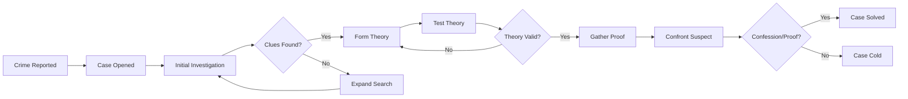

# 🔍 Aquabyssos Investigation Board
> *Active Cases & Mystery Tracker*

## 📊 Case Status Overview

```dataviewjs
const cases = dv.pages("#investigation AND #aquabyssos");
const active = cases.where(p => p.status === "active").length;
const cold = cases.where(p => p.status === "cold").length;
const solved = cases.where(p => p.status === "solved").length;

dv.paragraph(`### Current Statistics`);
dv.paragraph(`🟢 **Active**: ${active} | 🔵 **Cold**: ${cold} | ⚫ **Solved**: ${solved}`);

const total = active + cold + solved;
if (total > 0) {
    const solveRate = Math.round((solved / total) * 100);
    dv.paragraph(`**Solve Rate**: ${solveRate}%`);
}
```

## 🎯 Active Investigations

```dataview
TABLE WITHOUT ID
    "[[" + file.name + "|" + case_name + "]]" as "Case",
    case_id as "ID",
    investigation_type as "Type",
    priority as "Priority",
    started_session as "Started",
    lead_investigator as "Lead"
FROM #investigation AND #aquabyssos
WHERE status = "active"
SORT priority DESC
```

## 🧩 Clue Network

### Recently Discovered Clues
```dataviewjs
// This would aggregate clues from all active investigations
const investigations = dv.pages("#investigation AND #aquabyssos")
    .where(p => p.status === "active");

const recentClues = [];
// In a real implementation, this would parse each investigation's clues

dv.table(
    ["Clue", "Case", "Location", "Session"],
    recentClues
);
```

### Clue Connections Map
```dataviewjs
dv.paragraph("```mermaid");
dv.paragraph("graph TD");
dv.paragraph("    Shadow[Shadow Conspiracy] --> Parliament[Parliament Corruption]");
dv.paragraph("    Parliament --> Memory[Memory Weapons]");
dv.paragraph("    Memory --> Deep[Deep Mother Cult]");
dv.paragraph("    Shadow --> Surgeons[Silhouette Surgeons]");
dv.paragraph("    Surgeons --> Memory");
dv.paragraph("    Deep --> Timeline[Timeline Fractures]");
dv.paragraph("```");
```

## 🎭 Suspect Database

### High Priority Suspects
```dataview
TABLE WITHOUT ID
    file.link as "Suspect",
    suspected_of as "Suspected Of",
    danger_level as "Threat",
    last_seen as "Last Seen"
FROM #npc AND #aquabyssos
WHERE suspected_of != null
SORT danger_level DESC
LIMIT 10
```

## 🗺️ Investigation Locations

### Hot Spots (Multiple Cases)
```dataviewjs
const locations = {};
const investigations = dv.pages("#investigation AND #aquabyssos");

// Count location mentions across investigations
investigations.forEach(inv => {
    if (inv.file.outlinks) {
        inv.file.outlinks.forEach(link => {
            const path = link.path;
            if (path && path.includes("Locations")) {
                locations[path] = (locations[path] || 0) + 1;
            }
        });
    }
});

const hotSpots = Object.entries(locations)
    .filter(([loc, count]) => count > 1)
    .sort((a, b) => b[1] - a[1])
    .slice(0, 5);

if (hotSpots.length > 0) {
    dv.table(
        ["Location", "Cases", "Heat Level"],
        hotSpots.map(([loc, count]) => [
            loc.split("/").pop().replace(".md", ""),
            count,
            "🔥".repeat(Math.min(count, 5))
        ])
    );
} else {
    dv.paragraph("*No overlapping locations detected*");
}
```

## 📈 Investigation Progress Tracker

### Overall Progress by Type
```dataviewjs
const types = {
    "Murder": { total: 0, solved: 0 },
    "Conspiracy": { total: 0, solved: 0 },
    "Theft": { total: 0, solved: 0 },
    "Missing Person": { total: 0, solved: 0 },
    "Espionage": { total: 0, solved: 0 },
    "Supernatural": { total: 0, solved: 0 },
    "Political": { total: 0, solved: 0 }
};

const investigations = dv.pages("#investigation AND #aquabyssos");
investigations.forEach(inv => {
    if (inv.investigation_type && types[inv.investigation_type]) {
        types[inv.investigation_type].total++;
        if (inv.status === "solved") {
            types[inv.investigation_type].solved++;
        }
    }
});

const rows = Object.entries(types)
    .filter(([type, data]) => data.total > 0)
    .map(([type, data]) => {
        const percentage = data.total > 0 ? Math.round((data.solved / data.total) * 100) : 0;
        const bar = "█".repeat(Math.floor(percentage/10)) + "░".repeat(10 - Math.floor(percentage/10));
        return [type, `${data.solved}/${data.total}`, bar, `${percentage}%`];
    });

dv.table(["Type", "Solved/Total", "Progress", "Rate"], rows);
```

## 🔮 Mystery Web

### Overarching Mysteries
1. **The Seven Shards**: What are they really?
   - Related Cases: [[INV-001]], [[INV-003]], [[INV-007]]
   - Progress: 25%

2. **Shadow Independence Movement**: Who leads it?
   - Related Cases: [[INV-002]], [[INV-005]]
   - Progress: 40%

3. **The Deep Mother**: Myth or reality?
   - Related Cases: [[INV-004]], [[INV-008]]
   - Progress: 10%

4. **Timeline Recursion**: Why is time looping?
   - Related Cases: [[INV-006]], [[INV-009]]
   - Progress: 15%

## 📝 Investigation Patterns

### Recurring Elements
```dataviewjs
const elements = {
    "Shadow involvement": 0,
    "Memory manipulation": 0,
    "Depth correlation": 0,
    "Faction conspiracy": 0,
    "Timeline anomaly": 0
};

// Count pattern occurrences
const investigations = dv.pages("#investigation AND #aquabyssos");
investigations.forEach(inv => {
    const content = inv.file.name + " " + (inv.case_summary || "");
    Object.keys(elements).forEach(element => {
        if (content.toLowerCase().includes(element.split(" ")[0])) {
            elements[element]++;
        }
    });
});

const patterns = Object.entries(elements)
    .filter(([pattern, count]) => count > 0)
    .sort((a, b) => b[1] - a[1]);

if (patterns.length > 0) {
    dv.table(
        ["Pattern", "Occurrences", "Frequency"],
        patterns.map(([pattern, count]) => [
            pattern,
            count,
            "●".repeat(Math.min(count, 10))
        ])
    );
}
```

## 🎲 Investigation Tools

### Quick Case Creator
```button
name New Investigation
type command
action Templater: Create new note from template
id new-investigation
```
^button-investigation

### Evidence Analyzer
```button
name Analyze Evidence
type command
action Dataview: Refresh all queries
id analyze-evidence
```
^button-evidence

### Suspect Profiler
```button
name Profile Suspect
type link
action obsidian://open?vault=ObsidianTTRPGVault&file=Templates/Suspect_Profile
id profile-suspect
```
^button-suspect

## 📊 Cold Case Review

```dataview
TABLE WITHOUT ID
    "[[" + file.name + "|" + case_name + "]]" as "Cold Case",
    started_session as "Started",
    last_active as "Last Active",
    priority as "Original Priority"
FROM #investigation AND #aquabyssos
WHERE status = "cold"
SORT last_active DESC
```

## 🏆 Solved Cases Archive

```dataview
TABLE WITHOUT ID
    "[[" + file.name + "|" + case_name + "]]" as "Solved Case",
    investigation_type as "Type",
    sessions_to_solve as "Sessions",
    perpetrator as "Perpetrator"
FROM #investigation AND #aquabyssos
WHERE status = "solved"
SORT file.mtime DESC
LIMIT 5
```

## 📌 Investigation Resources

### Useful Queries
- [[All Suspects by Faction]]
- [[Clues by Location]]
- [[Timeline of Crimes]]
- [[Evidence Chain Analysis]]

### Reference Documents
- [[Investigation Procedures]]
- [[Interrogation Techniques]]
- [[Evidence Types Guide]]
- [[Legal System of Aquabyssos]]

## 🔄 Investigation Workflow



---
*Board Updated: <%tp.date.now("YYYY-MM-DD HH:mm")%>*
*Active Investigator: [[Current PC Lead]]*