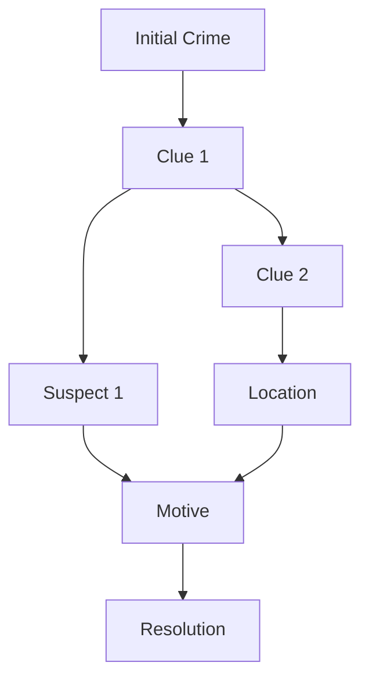
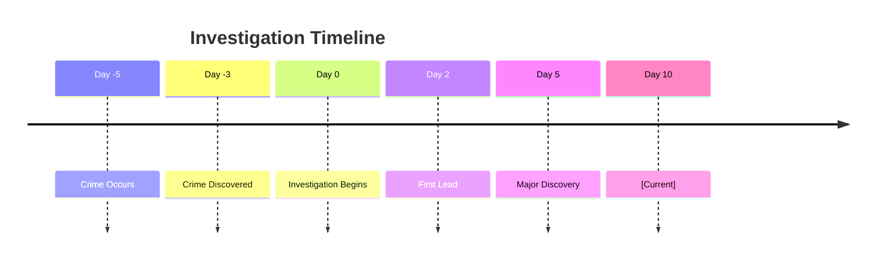

# 🔍 Case File: <%tp.get("case_name")%>
**Case ID**: <%tp.get("case_id")%>
**Status**: 🟡 Active Investigation

## 📋 Case Overview

### Initial Report
**Date**: Session <%tp.get("started_session")%>
**Reported By**: [[<%tp.system.prompt("Who reported this?")%>]]
**Location**: [[<%tp.system.prompt("Where did this occur?")%>]]

### Case Summary
<%tp.system.prompt("Describe the investigation in 2-3 sentences")%>

## 🎯 Investigation Goals

### Primary Objective
- [ ] <%tp.system.prompt("What is the main goal?")%>

### Secondary Objectives
- [ ] Identify all involved parties
- [ ] Uncover the motive
- [ ] Gather physical evidence
- [ ] <%tp.system.prompt("Additional objective", "")%>

## 🔍 Clue Tracker

### Discovered Clues
```dataviewjs
const clues = [
    { id: "C001", description: "Initial clue", location: "Scene", discovered: "Session X", relevance: "High" }
];

dv.table(
    ["ID", "Clue", "Location", "Discovered", "Relevance"],
    clues.map(c => [c.id, c.description, `[[${c.location}]]`, c.discovered, c.relevance])
);
```

### Undiscovered Clues (DM Only)
%%
- **Hidden Clue 1**: 
- **Hidden Clue 2**: 
- **Red Herring**: 
%%

### Clue Connections


## 🎭 Suspects

### Primary Suspects
#### [[<%tp.system.prompt("Primary Suspect Name")%>]]
- **Motive**: <%tp.system.prompt("What's their motive?")%>
- **Opportunity**: <%tp.system.prompt("When could they have done it?")%>
- **Alibi**: <%tp.system.prompt("What's their alibi?")%>
- **Evidence Against**: 
  - 
- **Evidence For Innocence**: 
  - 
- **Current Status**: Not Questioned

#### [[<%tp.system.prompt("Secondary Suspect Name", "")%>]]
- **Motive**: 
- **Opportunity**: 
- **Alibi**: 
- **Evidence Against**: 
- **Evidence For Innocence**: 
- **Current Status**: Not Questioned

### Persons of Interest
- [[]] - Witness
- [[]] - Expert consultant
- [[]] - Informant

## 📍 Key Locations

### Crime Scene
**Location**: [[<%tp.system.prompt("Crime scene location")%>]]
- **First Visited**: Session <%tp.system.prompt("Session number")%>
- **Evidence Found**: 
  - [ ] 
  - [ ] 
- **Anomalies Noted**: 

### Related Locations
```dataview
TABLE 
    relevance as "Relevance",
    visited as "Visited",
    evidence_found as "Evidence"
FROM #location
WHERE contains(file.name, this.case_name) OR contains(this.file.outlinks, file.link)
```

## 📊 Investigation Progress

### Investigation Phases
```dataviewjs
const phases = {
    "Discovery": 100,
    "Initial Investigation": 75,
    "Theory Formation": 50,
    "Evidence Gathering": 25,
    "Suspect Interrogation": 10,
    "Final Proof": 0,
    "Confrontation": 0
};

for (const [phase, progress] of Object.entries(phases)) {
    const filled = "█".repeat(Math.floor(progress/10));
    const empty = "░".repeat(10 - Math.floor(progress/10));
    dv.paragraph(`**${phase}**: ${filled}${empty} ${progress}%`);
}
```

## 🗂️ Evidence Inventory

### Physical Evidence
| Item | Description | Location Found | Significance |
|------|-------------|----------------|--------------|
| | | | |

### Testimonies
| Witness | Statement Summary | Reliability | Contradictions |
|---------|------------------|-------------|----------------|
| | | | |

### Documents
- [ ] 
- [ ] 

## 🔄 Investigation Timeline

### Event Chronology


### Key Events
1. **Session X**: Investigation initiated
2. **Session Y**: First major clue discovered
3. **Session Z**: Primary suspect identified

## 🎲 Investigation Mechanics

### Skill Checks Required
- **Investigation** (DC <%tp.system.prompt("Investigation DC", "15")%>): Search crime scene
- **Insight** (DC <%tp.system.prompt("Insight DC", "13")%>): Detect lies during questioning
- **Persuasion** (DC <%tp.system.prompt("Persuasion DC", "12")%>): Get witnesses to talk
- **Perception** (DC <%tp.system.prompt("Perception DC", "14")%>): Notice hidden details

### Special Rules
- Time Limit: <%tp.system.prompt("Is there a time limit?", "None")%>
- Faction Involvement: <%tp.system.prompt("Which factions care?", "None")%>
- Consequences of Failure: <%tp.system.prompt("What happens if they fail?")%>

## 🎯 Revelation Conditions

### What Players Need to Discover
1. [ ] The true perpetrator's identity
2. [ ] The motive behind the crime
3. [ ] The method used
4. [ ] <%tp.system.prompt("Additional revelation", "")%>

### Truth (DM Only)
%%
**What Really Happened**: 
<%tp.system.prompt("Describe what actually happened")%>

**The Real Perpetrator**: 
<%tp.system.prompt("Who really did it?")%>

**The Real Motive**: 
<%tp.system.prompt("Why did they do it?")%>

**Key Evidence That Proves It**: 
<%tp.system.prompt("What evidence proves the truth?")%>
%%

## 📝 Investigation Notes

### Session-by-Session Progress
#### Session <%tp.system.prompt("Session number")%>
- Discovered: 
- Questioned: 
- New leads: 

### Player Theories
- **Current Leading Theory**: 
- **Alternative Theories**: 
  - 
  - 

### DM Notes
%%
- Remember to plant clue about: 
- If stuck, introduce: 
- Red herring purpose: 
%%

## 🎬 Resolution Planning

### Confrontation Scene
- **Location**: [[]]
- **Participants**: 
- **Evidence Needed**: 
- **Possible Outcomes**: 
  - Success: 
  - Failure: 
  - Partial Success: 

### Rewards
- **XP**: 
- **Reputation**: 
- **Items**: 
- **Information**: 

## 🔗 Related Cases
- [[]]
- [[]]

## 📎 Attachments
- Maps: 
- Handouts: 
- NPC portraits: 

---
**Case Status Log**:
- <%tp.date.now("YYYY-MM-DD")%>: Case opened
- 

---
*Next Review: Session <%parseInt(tp.system.prompt("Starting Session Number")) + 2%>*