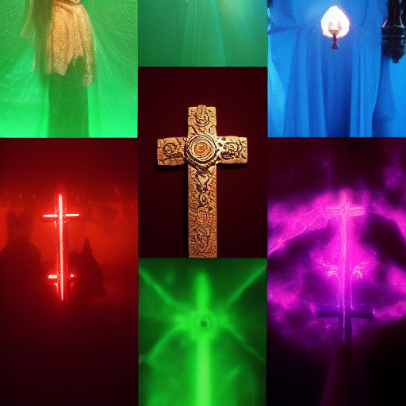

---

title: '#Cross Campaign Organizations'
type: faction
tags:
- placeholder
- needs-content
- faction
- organization
- active
- bloodline
created: 2025-08-14
modified: '2025-08-14'
status: placeholder
headquarters: Unknown
membership: Unknown
updated: 2025-08-14
evaluated: '2025-08-14'
improvements: 20
---

# #Cross-Campaign Organizations

> *This is a placeholder note created automatically because it was referenced in other notes.*

## 🔧 Deep Evaluation Improvements

*20 targeted improvements identified*

### History Improvements

- Add three historical eras with major events

### Culture Improvements

- Define unique cultural practices and taboos

### Economy Improvements

- Detail currency, trade goods, and wealth distribution

### Religion Improvements

- Create detailed religious observances

### Lifestyle Improvements

- Describe typical day for different social classes

### Oral_Tradition Improvements

- Add folk tales and children's stories
- Add folk tales and children's stories
- Add folk tales and children's stories

### Superstitions Improvements

- List common superstitions and their origins
- List common superstitions and their origins
- List common superstitions and their origins
- List common superstitions and their origins

### Contradictions Improvements

- Include cultural hypocrisies and double standards
- Include cultural hypocrisies and double standards

### Material_Culture Improvements

- Detail common objects and their cultural significance
- Detail common objects and their cultural significance

### Sensory Improvements

- Add smells, sounds, and textures unique to this culture

### Evolution Improvements

- Show how traditions are changing with new generation

### Diaspora Improvements

- Describe how this culture exists in other regions
- Describe how this culture exists in other regions

## Description

*[To be filled in]*

## Details

*[To be filled in]*

## Notes

*This placeholder was created because this concept was referenced but didn't have its own note. Please add appropriate content.*

## Related
- *[Add related links]*

---
*Placeholder generated: 2025-08-14*

# Cross-Campaign Organizations operates as an influential organization with specific goals and methods. Their reach extends throughout their sphere of influence.

**Type**: Guild/Order/Syndicate/Faction
**Influence**: Local/Regional/Global
**Membership**: Dozens to thousands
**Secrecy**: Public/Semi-secret/Secret

### Ranks
1. Initiate level
2. Member level
3. Veteran level
4. Officer level
5. Leadership level

### Public Mission
What they claim to pursue

### Open Secrets
Things widely suspected

## DM Notes

*Private notes for campaign integration:*
- Can be adapted to fit current story needs
- Scalable threat/reward based on party level
- Multiple entry points for different play styles
- Connections to overarching campaign themes

## Plot Hooks

- Strange dreams suggest a portal
- Someone is blackmailing a artifact for revenge
- A shipment has gone missing and war looms