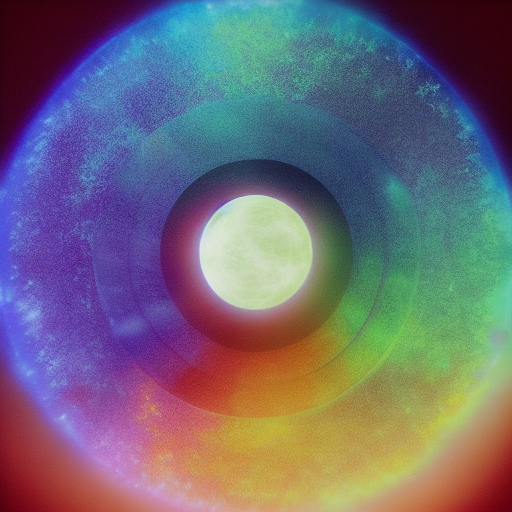

# #Faction-Based Organization

> *This is a placeholder note created automatically because it was referenced in other notes.*

## Description

*[To be filled in]*

## Details

*[To be filled in]*

## Connections

### Referenced In
- [[Master_People_Index]]

## Notes

*This placeholder was created because this concept was referenced but didn't have its own note. Please add appropriate content.*

## Related
- *[Add related links]*

---
*Placeholder generated: 2025-08-14*

## Known Members

- [[04_Resources_Assets_Portraits_portrait-npc-captain-scarlet-torrent-captain-scarlet-torrent.svg]]
- [[04_Resources_Assets_Portraits_portrait-npc-captain-nerion-deepward-captain-nerion-deepward.svg]]
