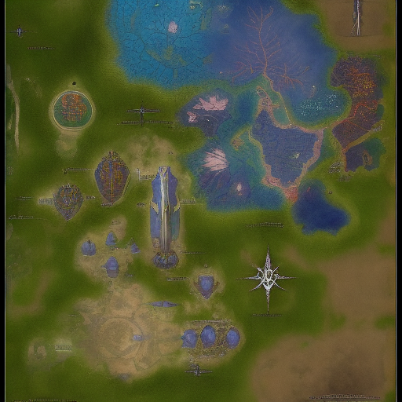

# 02_Worldbuilding/Factions/Abyssal Courts

> *This is a placeholder note created automatically because it was referenced in other notes.*

## Description

*[To be filled in]*

## Details

*[To be filled in]*

## Connections

### Referenced In
- [[System Cli Spells School Enchantment]]
- [[System Cli Items Weapons]]
- [[System Cli Spells School Illusion]]

## Notes

*This placeholder was created because this concept was referenced but didn't have its own note. Please add appropriate content.*

## Related
- *[Add related links]*

---
*Placeholder generated: 2025-08-14*

## Known Members

- [[Find the Shadow Cure]]
- [[04_Resources_Assets_Locations_location-city-master-smith-vulcan-deepforge-v1-master-smith-vulcan-deepforge.svg]]
- [[04_Resources_Assets_Portraits_portrait-npc-weaponsmith-captain-marcus-sharpedge-v1-weaponsmith-captain-marcus-sharpedge.svg]]
- [[04_Resources_Assets_Portraits_portrait-npc-captain-prism-shield-valeria-captain-prism-shield-valeria.svg]]
