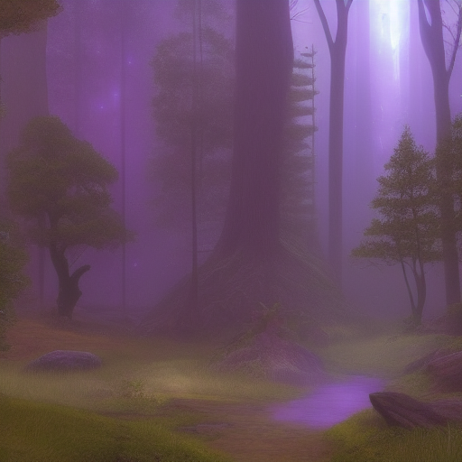

# 02_Worldbuilding/Groups/Crystal Cultivators Guild

> *This is a placeholder note created automatically because it was referenced in other notes.*

## Description

*[To be filled in]*

## Details

*[To be filled in]*

## Connections

### Referenced In
- [[12_Research/D&D_Statblocks/Crystal Gardens]]
- [[02_Worldbuilding/Places/Crystal Gardens]]

## Notes

*This placeholder was created because this concept was referenced but didn't have its own note. Please add appropriate content.*

## Related
- *[Add related links]*

---
*Placeholder generated: 2025-08-14*

## Known Members

- [[04_Resources_Assets_Symbols_symbol-heraldry-void-echo-silence-deafmake-v1-void-echo-silence-deafmake.svg]]
- [[Madame Crystal Eye]]
- [[04_Resources_Assets_Locations_location-city-dockmaster-bruno-steadyanchor-v1-dockmaster-bruno-steadyanchor.svg]]
