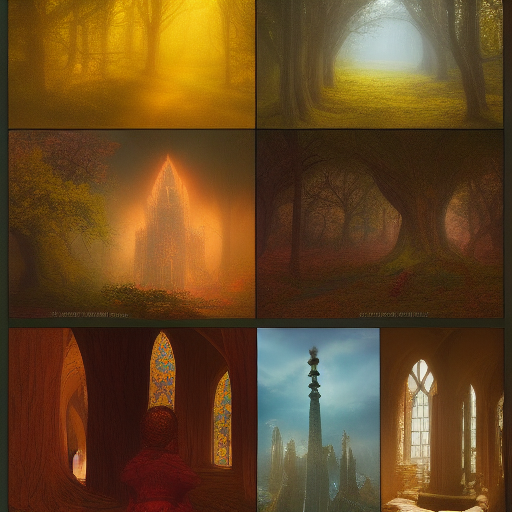

# 02_Worldbuilding/Groups/Cultural Preservation Societ

> *This is a placeholder note created automatically because it was referenced in other notes.*

## Description

*[To be filled in]*

## Details

*[To be filled in]*

## Connections

### Referenced In
- [[12_Research/D&D_Statblocks/Keeper Elara Mindwell]]
- [[02_Worldbuilding/Places/Keeper Elara Mindwell]]

## Notes

*This placeholder was created because this concept was referenced but didn't have its own note. Please add appropriate content.*

## Related
- *[Add related links]*

---
*Placeholder generated: 2025-08-14*

## Known Members

- [[Master_Wind_Singer_Melody_Tradition]]
- [[The Waking Prophets]]
