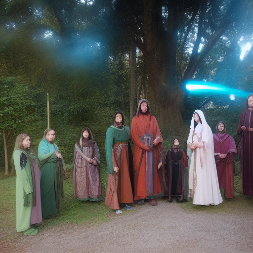

# 02_Worldbuilding/Groups/Order_of_the_Silent_Vigil

## Organization Overview

**Type**: Order
**Headquarters**: [[Central Location]]
**Membership**: ~50-500 members
**Influence**: Regional
**Status**: Active
**Secrecy**: Semi-public

## Description

02_Worldbuilding/Groups/Order_of_the_Silent_Vigil operates as a order dedicated to its core mission and the advancement of its members' interests. The organization maintains a significant presence in regional affairs through both public and private channels.

## Mission & Goals

### Primary Mission
The organization exists to:
- Advance specific interests or ideals
- Protect member privileges and resources
- Influence regional politics and economics
- Preserve or change existing power structures

### Public Goals
What they openly claim:
- Promote trade and prosperity
- Maintain order and tradition
- Advance knowledge and learning
- Protect the innocent

### Secret Objectives
Hidden agendas:
- Accumulate power and influence
- Control specific resources or information
- Eliminate rivals or threats
- Achieve long-term transformation

## History

### Founding
Established in response to specific historical needs, 02_Worldbuilding/Groups/Order_of_the_Silent_Vigil has evolved from its original purpose while maintaining core traditions.

### Major Events
- **Foundation**: Original establishment and charter
- **Growth Period**: Expansion of influence and membership
- **Conflicts**: Major disputes or wars
- **Recent Developments**: Current position and activities

### Historical Figures
Notable past members who shaped the organization:
- Founders and early leaders
- Revolutionary or reform figures
- Heroes and villains

## Structure & Hierarchy

### Leadership
- **Grand Master/Leader**: Supreme authority
- **Inner Circle**: Senior decision makers
- **Department Heads**: Operational leaders
- **Regional Commanders**: Local authority

### Ranks
1. **Initiate**: New members
2. **Apprentice**: Learning the ways
3. **Journeyman**: Full member
4. **Master**: Experienced member
5. **Elder**: Senior position
6. **Grand Master**: Ultimate authority

### Departments
- **Operations**: Day-to-day activities
- **Intelligence**: Information gathering
- **Resources**: Financial management
- **Recruitment**: Membership growth
- **Enforcement**: Security and discipline

## Membership

### Requirements
To join, candidates must:
- Meet skill or knowledge requirements
- Provide recommendations or sponsorship
- Pay initiation fees or dues
- Swear oaths of loyalty
- Complete initiation trials

### Benefits
Members receive:
- Access to resources and facilities
- Protection and legal support
- Training and advancement opportunities
- Business or political connections
- Exclusive information or privileges

### Obligations
Members must:
- Pay regular dues or tithes
- Respond to organizational calls
- Maintain secrecy about sensitive matters
- Support fellow members
- Advance organizational goals

## Resources & Assets

### Financial
- Treasury reserves
- Income from operations
- Member contributions
- Investment holdings
- Trade monopolies or contracts

### Physical
- Headquarters and facilities
- Safe houses and warehouses
- Transportation resources
- Equipment and supplies
- Libraries and archives

### Human Resources
- Skilled membership base
- Informant networks
- Allied organizations
- Political connections
- Military/security forces

## Operations

### Public Activities
- Trade and commerce
- Education and training
- Charitable works
- Cultural events
- Political lobbying

### Covert Operations
- Intelligence gathering
- Influence operations
- Economic manipulation
- Elimination of threats
- Secret research

## Relations

### Allies
- Aligned organizations
- Political patrons
- Business partners
- Religious supporters

### Rivals
- Competing organizations
- Political opponents
- Economic competitors
- Ideological enemies

### Neutral Parties
- Government bodies
- Independent merchants
- Foreign organizations
- Common population

## Notable Members

### Current Leadership
- **Grand Master**: [Name]
- **Spymaster**: [Name]
- **Treasurer**: [Name]
- **Enforcer**: [Name]

### Key Operatives
Active members of significance:
- Field commanders
- Master craftsmen
- Diplomatic representatives
- Special agents

## Customs & Culture

### Traditions
- Initiation ceremonies
- Rank advancement rituals
- Annual gatherings
- Secret handshakes or signs

### Symbols
- Official insignia
- Secret marks
- Ceremonial items
- Colors and heraldry

### Codes
- Behavioral expectations
- Communication ciphers
- Loyalty oaths
- Operational protocols

## Current Activities

The organization currently focuses on:
- Expanding influence in new regions
- Dealing with specific threats
- Pursuing major objectives
- Managing internal conflicts

## Locations

### Headquarters
Primary base of operations with full facilities and defenses.

### Chapter Houses
Regional centers for local operations.

### Safe Houses
Secret locations for sensitive activities.

## Adventure Hooks

1. **Join the Organization**: Recruitment or infiltration mission
2. **Internal Conflict**: Power struggle within ranks
3. **External Threat**: Defend against enemies
4. **Secret Mission**: Undertake covert operation
5. **Betrayal**: Deal with traitor or corruption

## DM Notes

### Secrets
- True leadership identity
- Hidden resources or weapons
- Secret alliances or conflicts
- Long-term master plan

### Using in Campaign
- Source of quests and resources
- Political intrigue element
- Character backstory connection
- Campaign antagonist or ally

## Known Members

- [[04_Resources_Assets_Locations_location-city-captain-marlowe-tidecrest-v1-captain-marlowe-tidecrest.svg]]
- [[04_Resources_Assets_Portraits_portrait-npc-patriarch-valdris-lightbringer-patriarch-valdris-lightbringer.png]]

## Overview

02_Worldbuilding_Groups_Order_of_the_Silent_Vigil operates as an influential organization with specific goals and methods. Their reach extends throughout their sphere of influence.

**Type**: Guild/Order/Syndicate/Faction
**Influence**: Local/Regional/Global
**Membership**: Dozens to thousands
**Secrecy**: Public/Semi-secret/Secret

## Goals

### Public Mission
What they claim to pursue

### True Objectives
- Primary goal
- Secondary objectives
- Long-term vision

### Current Projects
- Active operations
- Research efforts
- Political maneuvers

## Relationships

### Allies
- Aligned organizations
- Political supporters
- Business partners

### Enemies
- Rival organizations
- Opposed factions
- Active threats

### Neutral Parties
- Potential allies or enemies
- Trade partners
- Watching parties

---
*Tags*: #organization #order #faction #worldbuilding