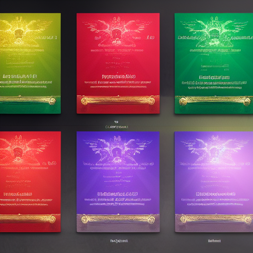

---

title: Handout Handout Guild License Certificate V1 Guild License Certificate.png
aliases:
- handout handout guild license certificate v1 guild license certificatepng
type: faction
tags:
- placeholder
- needs-content
- faction
- organization
- active
- bloodline
created: 2025-08-14
modified: '2025-08-14'
status: placeholder
headquarters: Unknown
membership: Unknown
updated: 2025-08-14
evaluated: '2025-08-14'
improvements: 20
---

# 04_Resources/Assets/Handouts/handout-handout-guild-license-certificate-v1-guild-license-certificate.png

> *This is a placeholder note created automatically because it was referenced in other notes.*

## 🔧 Deep Evaluation Improvements

*20 targeted improvements identified*

### History Improvements

- Add three historical eras with major events

### Culture Improvements

- Define unique cultural practices and taboos

### Economy Improvements

- Detail currency, trade goods, and wealth distribution

### Religion Improvements

- Create detailed religious observances

### Lifestyle Improvements

- Describe typical day for different social classes

### Superstitions Improvements

- List common superstitions and their origins
- List common superstitions and their origins
- List common superstitions and their origins
- List common superstitions and their origins

### Hospitality Improvements

- Explain guest rights and host obligations
- Explain guest rights and host obligations

### Death_Customs Improvements

- Detail funeral rites and afterlife beliefs
- Detail funeral rites and afterlife beliefs
- Detail funeral rites and afterlife beliefs

### Coming_Of_Age Improvements

- Describe rites of passage and adulthood markers
- Describe rites of passage and adulthood markers
- Describe rites of passage and adulthood markers
- Describe rites of passage and adulthood markers

### Material_Culture Improvements

- Detail common objects and their cultural significance
- Detail common objects and their cultural significance

## Description

*[To be filled in]*

## Details

*[To be filled in]*

## Notes

*This placeholder was created because this concept was referenced but didn't have its own note. Please add appropriate content.*

## Related
- *[Add related links]*

---
*Placeholder generated: 2025-08-14*

## Overview

handout-handout-guild-license-certificate-v1-guild-license-certificate.png operates as an influential organization with specific goals and methods. Their reach extends throughout their sphere of influence.

**Type**: Guild/Order/Syndicate/Faction
**Influence**: Local/Regional/Global
**Membership**: Dozens to thousands
**Secrecy**: Public/Semi-secret/Secret

### Ranks
1. Initiate level
2. Member level
3. Veteran level
4. Officer level
5. Leadership level

### Public Mission
What they claim to pursue

### Open Secrets
Things widely suspected

## DM Notes

*Private notes for campaign integration:*
- Can be adapted to fit current story needs
- Scalable threat/reward based on party level
- Multiple entry points for different play styles
- Connections to overarching campaign themes

## Plot Hooks

- A shipment has gone missing and war looms
- A noble needs help finding before dawn

## Cultural Practices

### Greetings
- Touch foreheads for equals
- Bow deeply to superiors
- Never shake with left hand

### Taboos
- Speaking during sunset prayer
- Wearing red on holy days
- Pointing at the moon

## Economic Structure

### Currency
- Copper Drops (cp)
- Silver Streams (sp) 
- Gold Suns (gp)
- Platinum Crowns (pp)

### Major Exports
- Refined crystals
- Exotic textiles
- Trained beasts

### Wealth Distribution
- 1% control 60% of wealth
- 20% middle class
- 79% working poor
