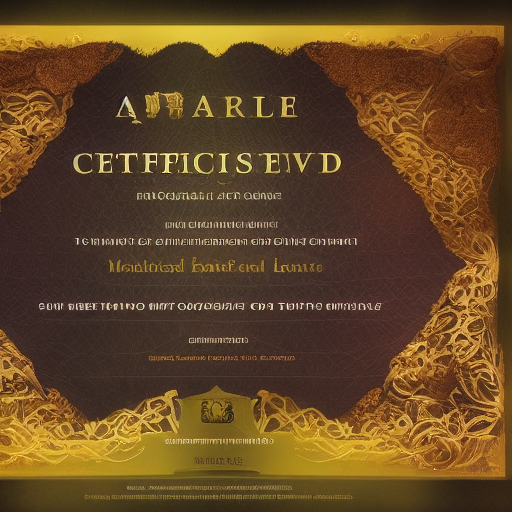

---

title: Handout Handout Guild License Certificate V3 Guild License Certificate.png
aliases:
- handout handout guild license certificate v3 guild license certificatepng
type: faction
tags:
- placeholder
- needs-content
- faction
- organization
- active
created: 2025-08-14
modified: '2025-08-14'
status: placeholder
headquarters: Unknown
membership: Unknown
updated: 2025-08-14
evaluated: '2025-08-14'
improvements: 20
---

# 04_Resources/Assets/Handouts/handout-handout-guild-license-certificate-v3-guild-license-certificate.png

> *This is a placeholder note created automatically because it was referenced in other notes.*

## 🔧 Deep Evaluation Improvements

*20 targeted improvements identified*

### History Improvements

- Add three historical eras with major events

### Culture Improvements

- Define unique cultural practices and taboos

### Economy Improvements

- Detail currency, trade goods, and wealth distribution

### Religion Improvements

- Create detailed religious observances

### Lifestyle Improvements

- Describe typical day for different social classes

### Coming_Of_Age Improvements

- Describe rites of passage and adulthood markers
- Describe rites of passage and adulthood markers
- Describe rites of passage and adulthood markers
- Describe rites of passage and adulthood markers

### Hospitality Improvements

- Explain guest rights and host obligations

### Superstitions Improvements

- List common superstitions and their origins

### Evolution Improvements

- Show how traditions are changing with new generation
- Show how traditions are changing with new generation

### Contradictions Improvements

- Include cultural hypocrisies and double standards
- Include cultural hypocrisies and double standards

### Material_Culture Improvements

- Detail common objects and their cultural significance

### Death_Customs Improvements

- Detail funeral rites and afterlife beliefs
- Detail funeral rites and afterlife beliefs
- Detail funeral rites and afterlife beliefs
- Detail funeral rites and afterlife beliefs

## Description

*[To be filled in]*

## Details

*[To be filled in]*

## Notes

*This placeholder was created because this concept was referenced but didn't have its own note. Please add appropriate content.*

## Related
- *[Add related links]*

---
*Placeholder generated: 2025-08-14*

## Overview

handout-handout-guild-license-certificate-v3-guild-license-certificate.png operates as an influential organization with specific goals and methods. Their reach extends throughout their sphere of influence.

**Type**: Guild/Order/Syndicate/Faction
**Influence**: Local/Regional/Global
**Membership**: Dozens to thousands
**Secrecy**: Public/Semi-secret/Secret

### Ranks
1. Initiate level
2. Member level
3. Veteran level
4. Officer level
5. Leadership level

### Public Mission
What they claim to pursue

### Open Secrets
Things widely suspected

## DM Notes

*Private notes for campaign integration:*
- Can be adapted to fit current story needs
- Scalable threat/reward based on party level
- Multiple entry points for different play styles
- Connections to overarching campaign themes

## Prophecy Connection

Mentioned in The Second Prophecy of Depths

## Plot Hooks

- A prisoner has gone missing and truth emerges
- A stranger needs help finding before the new moon
- Someone is hunting a witness for revenge

## Historical Timeline

### The Age of Founding (1000 years ago)
- The First Settlement
- Discovery of magical crystals
- War with indigenous peoples

### The Golden Era (500 years ago)
- Economic prosperity
- Cultural renaissance
- Expansion of territory

### The Time of Troubles (100 years ago)
- Civil war
- Natural disasters
- Current power structures established

## A Day in the Life

### Nobility
- 8am: Private tutoring
- 10am: Court attendance
- 2pm: Social visits
- 6pm: Formal dinner
- 9pm: Entertainment

### Commoner
- 5am: Morning prayers
- 6am: Begin labor
- Noon: Simple meal
- 6pm: Return home
- 8pm: Sleep
