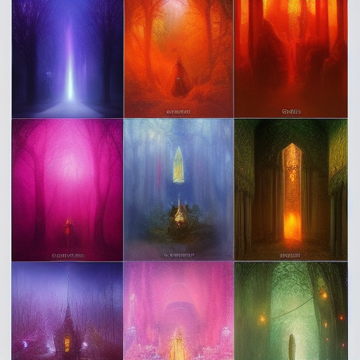

## Overview

TODO
## Structure

TODO
## Goals

TODO
## Assets

TODO
## Conflicts

TODO
## Hooks

TODO

## Player-Facing Summary

Royal Academy of Arcane Arts 2 is a undersea element of the setting, known for bioluminescent glow and pressure-glass. Its presence anchors ongoing storylines and offers clear player choices.

## Lore Details

Legends speak of Royal Academy of Arcane Arts 2 as a nexus where past and present converge. Locals describe subtle omens—shifts in currents, a dimming of lanternfish, or whispers on the wind—that herald change around Royal Academy of Arcane Arts 2.

## Adventure Hooks

- A rumor ties Royal Academy of Arcane Arts 2 to a missing shipment, linking factions with competing claims.
- An NPC seeks discreet help at Royal Academy of Arcane Arts 2 to avert a public scandal.
- A map overlay reveals a hidden approach to Royal Academy of Arcane Arts 2 active only during specific tides/storms.

## DM Notes

Play up tactile detail: sounds, pressure/wind changes, and meaningful symbology. Offer two clear approaches (stealth vs. parley) and one wildcard complication tied to a faction clock. Reward scouting and map use.

<!-- enriched: true -->

## Known Members

- [[Lord Aurelius Goldwave]]

## Members

### Notable Members
- [[Leader Name]] - Current head
- [[Key Officer]] - Important figure
- [[Rising Star]] - Ambitious member

### Membership Requirements
- Skills or qualities needed
- Initiation process
- Ongoing obligations

## Resources

### Financial
- Funding sources
- Wealth level
- Economic influence

### Physical Assets
- Properties owned
- Equipment available
- Special resources

### Human Resources
- Member skills
- Allies and contacts
- Information networks

## Operations

### Regular Activities
- Day-to-day operations
- Revenue generation
- Member services

### Special Operations
- Covert activities
- Major projects
- Crisis responses

## Relationships

### Allies
- Aligned organizations
- Political supporters
- Business partners

### Enemies
- Rival organizations
- Opposed factions
- Active threats

### Neutral Parties
- Potential allies or enemies
- Trade partners
- Watching parties

## Secrets

### Open Secrets
Things widely suspected

### Hidden Truths
- Real leadership
- True funding sources
- Secret objectives

### Deep Mysteries
- Ancient connections
- Forbidden knowledge
- Ultimate goals

## Connections

- See also: [[Master Timeline]]
- Related: [[Power Structures]]
- Connected to: [[World Events]]
