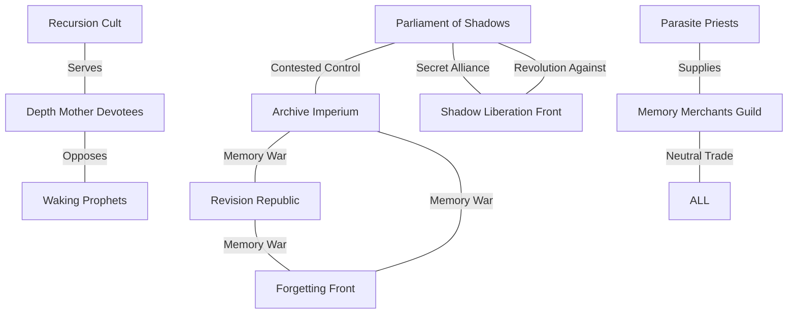

---
tags:
- aquabyssos
- draft
- faction-web
- factions
- politics
- relationships
type: Group
campaign: Aquabyssos
created: 2025-08-07
MyContainer: None
MyCategory: Unknown - Category/Group
obsidianUIMode: preview
world: Aquabyssos
updated: '2025-08-11T13:08:51.344065+00:00'
status: draft
---

# Aquabyssos Faction Relationship Web
## Political Powers of the Drowned Realm

> *"In Aquabyssos, every alliance is temporary, every enemy might be your shadow, and every faction has already betrayed someone today."*

## Major Faction Overview

---

## The Parliamentary Powers

### 🏛️ Parliament of Shadows
**Philosophy**: "Governance through shadow democracy"
**Territory**: Abyssos Prime, Parliamentary Districts
**Leader**: The Speaker of Shadows (identity shifts)
**Military**: The Umbral Guard (10,000 shadow-integrated soldiers)

**Assets**:
- Control of official government
- Shadow voting mechanisms
- Diplomatic immunity networks
- Deep state intelligence apparatus

**Goals**:
1. Maintain governmental control
2. Integrate shadows into society
3. Prevent complete shadow revolution
4. Control information flow

**Relationships**:
- 🤝 **Archive Imperium**: Uneasy cooperation (information exchange)
- ⚔️ **Shadow Liberation Front**: Active suppression
- 💰 **Memory Merchants**: Primary customer
- 🤐 **Depth Mother Devotees**: Secret funding
- ❓ **Recursion Cult**: Monitoring closely

**Secrets**:
- Half the Parliament is already shadow-replaced
- The Speaker has no original body
- They know how to prevent shadow independence

---

### 🗃️ Archive Imperium
**Philosophy**: "Perfect memory creates perfect reality"
**Territory**: Nereidios, The Memory Meadows
**Leader**: Archive-Prince Mnemonic
**Military**: The Remembrance Legion (5,000 memory-enhanced warriors)

**Assets**:
- Largest memory repository
- Historical revision detection
- Memory manipulation technology
- Temporal viewing chambers

**Goals**:
1. Catalog all memories in existence
2. Prevent historical revision
3. Achieve perfect recall for all
4. Create unchangeable truth

**Relationships**:
- ⚔️ **Revision Republic**: Active warfare
- ⚔️ **Forgetting Front**: Existential enemies
- 💰 **Memory Merchants**: Reluctant suppliers
- 🤝 **Parliament**: Information brokers
- 😨 **Waking Prophets**: Terrified of their truth

**Secrets**:
- They've already lost original timeline
- The Archive contains pre-Drowning memories
- They know the Depth Mother's true name

---

## The Memory Warriors

### ✏️ Revision Republic
**Philosophy**: "The past should serve the present"
**Territory**: Variable (they edit their borders)
**Leader**: The Remembrancer General
**Military**: The Editorial Guard (8,000 reality editors)

**Assets**:
- Reality editing technology
- Propaganda retroactive to past
- Temporal insertion capabilities
- Mass memory modification

**Goals**:
1. Create optimal history
2. Erase traumatic events
3. Install favorable memories
4. Win the Memory Wars

**Relationships**:
- ⚔️ **Archive Imperium**: Memory warfare
- ⚔️ **Forgetting Front**: Ideological enemies
- 🤝 **Parliament**: Edit their rivals away
- 💰 **Memory Merchants**: Buy specific memories
- 🎭 **Recursion Cult**: Potential allies

**Secrets**:
- Already edited own origins
- Can't remember original goals
- Their leader doesn't exist consistently

---

### 🚫 Forgetting Front
**Philosophy**: "True freedom requires no past"
**Territory**: Memoriam, Void Zones
**Leader**: The Forgetting Bomb
**Military**: Blank Slate Battalion (3,000 amnesiacs)

**Assets**:
- Antimemetic weapons
- Memory erasure fields
- Forgetting plague samples
- Identity dissolution chambers

**Goals**:
1. Erase all history
2. Create eternal present
3. Destroy memory infrastructure
4. Achieve collective amnesia

**Relationships**:
- ⚔️ **Everyone**: Wants to erase them all
- 😨 **Memory Merchants**: Existential threat
- ❓ **Memoriam**: Natural sanctuary
- 🤝 **Void entities**: Strange allies

**Secrets**:
- Their leader can't be remembered
- They've forgotten why they started
- Victory means their own erasure

---

## The Shadow Powers

### ✊ Shadow Liberation Front
**Philosophy**: "Shadows deserve independence"
**Territory**: Tenebrarum, Shadow markets
**Leader**: The Penumbral Council
**Military**: Free Shadow Army (20,000+ shadows)

**Assets**:
- Shadow communication network
- Independence acceleration tech
- Shadow-only zones
- Replacement capabilities

**Goals**:
1. Complete shadow independence
2. Equal rights for shadows
3. Overthrow original dominance
4. Create shadow nation

**Relationships**:
- ⚔️ **Parliament**: Revolutionary war
- 🤝 **Shadow Surgeons**: Medical support
- 💰 **Memory Merchants**: Shadow memory trade
- 😨 **Humans**: Existential threat
- 🤐 **Depth Mother Devotees**: Secret supporters

**Secrets**:
- Can force shadow separation
- Planning mass replacement event
- Some leaders are human sympathizers

---

## The Religious Orders

### 🙏 Parasite Priests
**Philosophy**: "We are divine infection"
**Territory**: God-corpse regions
**Leader**: High Parasite Primus
**Military**: Divine Antibody Controllers (2,000)

**Assets**:
- God-flesh modification tech
- Antibody suppression rituals
- Divine memory access
- Corpse navigation maps

**Goals**:
1. Perfect parasitic harmony
2. Keep god-corpses dead
3. Evolve humanity into better parasites
4. Prevent divine awakening

**Relationships**:
- 🤝 **Parliament**: Stability alliance
- ⚔️ **Waking Prophets**: Theological enemies
- 💰 **Memory Merchants**: Divine memory trade
- 😨 **Depth Mother Devotees**: Terrified of awakening
- 🤝 **Recursion Cult**: Shared interests

**Secrets**:
- Know how to wake the gods
- Hiding god consciousness fragments
- Their leader is part god-flesh

---

### 🌊 Depth Mother Devotees
**Philosophy**: "The Mother must wake"
**Territory**: The Primordial Vaults
**Leader**: The Depth Speaker
**Military**: Awakening Vanguard (6,000 transformed)

**Assets**:
- Depth Mother communication
- Transformation acceleration
- Dream manipulation
- Prophecy interpretation

**Goals**:
1. Wake the Depth Mother
2. Achieve universal transformation
3. Merge all consciousness
4. End the dream

**Relationships**:
- ⚔️ **Waking Prophets**: Competition
- 🤐 **Parliament**: Secret manipulation
- 🤝 **Recursion Cult**: Useful pawns
- ⚔️ **Parasite Priests**: Prevent awakening
- 😨 **Everyone else**: Apocalyptic threat

**Secrets**:
- Already contacted the Mother
- Know the exact awakening date
- Their leader is a Mother fragment

---

### 👁️ Waking Prophets
**Philosophy**: "Reality is a prison"
**Territory**: Nomadic, Dream spaces
**Leader**: The First Prophet
**Military**: Dream Warriors (1,000 lucid dreamers)

**Assets**:
- Lucid dreaming mastery
- Reality manipulation
- Pre-dream memories
- Wake resistance

**Goals**:
1. Prove reality is dream
2. Achieve mass lucidity
3. Transcend the dream
4. Find true reality

**Relationships**:
- ⚔️ **Parasite Priests**: Theological war
- ⚔️ **Depth Mother Devotees**: Competition
- 😨 **Archive Imperium**: Threat to truth
- 🤝 **Forgetting Front**: Potential allies
- ❓ **Reality itself**: Antagonistic

**Secrets**:
- Have escaped the dream before
- Know what's outside
- Their prophet isn't from this reality

---

## The Neutral Powers

### 💰 Memory Merchants Guild
**Philosophy**: "Everything has a price in memories"
**Territory**: Trade routes, Memory exchanges
**Leader**: Guildmaster Valeria Mnemos
**Military**: Memory Guards (3,000 protecting trade)

**Assets**:
- Memory banking system
- Emotional currency reserves
- Trade route control
- Memory laundering services

**Goals**:
1. Maintain trade neutrality
2. Profit from all factions
3. Control memory economy
4. Survive any outcome

**Relationships**:
- 💰 **Everyone**: Trades with all
- 🤝 **Parliament**: Licensed operations
- ⚔️ **Memory Warriors**: War profiteering
- 😨 **Forgetting Front**: Existential threat
- 🤐 **Criminal underground**: Secret deals

**Secrets**:
- Manipulating the Memory Wars
- Have backup memories of everyone
- Can crash memory economy at will

---

### 🔄 Recursion Cult
**Philosophy**: "Reality has infinite layers"
**Territory**: The Infinite Garden
**Leader**: The Singular
**Military**: Scale Warriors (number varies by recursion)

**Assets**:
- Recursion navigation
- Scale manipulation
- Infinite resources (theoretically)
- Paradox weapons

**Goals**:
1. Access all recursion levels
2. Achieve singular existence
3. Collapse or expand reality
4. Understand the pattern

**Relationships**:
- 🤝 **Depth Mother Devotees**: Serve unknowingly
- ❓ **Parliament**: Confusing each other
- 🎭 **Revision Republic**: Reality games
- ∞ **Themselves**: At different scales
- 🌀 **Reality**: Complicated

**Secrets**:
- Found the original recursion
- Their leader exists at all scales
- Know reality's recursive formula

---

## Faction Relationship Matrix

| Faction | Allies | Enemies | Neutral | Unknown |
|---------|--------|---------|---------|---------|
| **Parliament** | Archive (uneasy) | Shadow Liberation | Merchants | Recursion |
| **Archive** | Parliament | Memory Warriors | Merchants | Waking |
| **Revision** | None | Archive, Forgetting | Parliament | Recursion |
| **Forgetting** | Void entities | Everyone | None | None |
| **Shadow Lib** | Shadow Surgeons | Parliament | Merchants | Depth |
| **Parasites** | Parliament | Waking | Merchants | Shadow |
| **Depth Mother** | Recursion | Parasites | None | All |
| **Waking** | Maybe Forgetting | Parasites, Depth | None | Reality |
| **Merchants** | Money | Forgetting | All | None |
| **Recursion** | Themselves | None | All | All |

## Reputation Tracking System

### Starting Reputation
All factions begin at 0 (Neutral) unless background specifies otherwise.

### Reputation Scale
- **-10 to -8**: Kill on sight
- **-7 to -5**: Hostile
- **-4 to -2**: Unfriendly
- **-1 to +1**: Neutral
- **+2 to +4**: Friendly
- **+5 to +7**: Allied
- **+8 to +10**: Trusted Inner Circle

### Reputation Changes

**Major Actions**:
- Complete faction quest: +2
- Betray faction: -5
- Save faction leader: +4
- Kill faction members: -3
- Share intelligence: +1

**Faction Conflicts**:
- Helping allies of enemies: -1
- Helping enemies of allies: -2
- Staying neutral in conflicts: -1 all involved
- Mediating successfully: +1 all involved

---

## Secret Faction Connections

### The Hidden Concordat
Unknown to most, five factions secretly coordinate:
- Parliament shadows
- Archive forbidden section
- Depth Mother inner circle
- Recursion navigators
- Memory merchant elite

**Their Shared Goal**: Controlled awakening of the Depth Mother

### The True Opposition
Three factions genuinely oppose the Concordat:
- Waking Prophets (want immediate awakening)
- Forgetting Front (want no awakening)
- Shadow Liberation (want shadow dominance first)

---

## Using the Faction Web

### For DMs
1. **Track reputation changes** after each session
2. **Use faction conflicts** to create moral dilemmas
3. **Reveal connections** gradually through play
4. **Let factions respond** to party actions
5. **Create faction missions** with conflicting goals

### Faction Mission Generator
Roll d10 twice: first for requesting faction, second for target

1. Parliament of Shadows
2. Archive Imperium
3. Revision Republic
4. Forgetting Front
5. Shadow Liberation
6. Parasite Priests
7. Depth Mother Devotees
8. Waking Prophets
9. Memory Merchants
10. Recursion Cult

### Mission Types (d6)
1. Steal intelligence
2. Assassinate member
3. Sabotage operation
4. Negotiate alliance
5. Infiltrate ranks
6. Deliver ultimatum

---

*"In Aquabyssos politics, today's ally is tomorrow's shadow, and yesterday's enemy never existed."*
— Political Survivor's Wisdom
