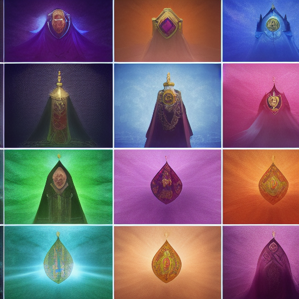

---

title: Assets Vehicles Vehicle Ship Crown Council Flagship V2 Crown Council Flagship.svg
aliases:
- 04 Resources Assets Vehicles vehicle ship crown council flagship v2 crown council
  flagshipsvg
type: organization
tags:
- faction
- active
- organization
created: '2025-08-14'
modified: '2025-08-14'
headquarters: Unknown
membership: Unknown
evaluated: '2025-08-14'
improvements: 20
---

## 🔧 Deep Evaluation Improvements

*20 targeted improvements identified*

### History Improvements

- Add three historical eras with major events

### Culture Improvements

- Define unique cultural practices and taboos

### Economy Improvements

- Detail currency, trade goods, and wealth distribution

### Religion Improvements

- Create detailed religious observances

### Lifestyle Improvements

- Describe typical day for different social classes

### Diaspora Improvements

- Describe how this culture exists in other regions
- Describe how this culture exists in other regions

### Hospitality Improvements

- Explain guest rights and host obligations
- Explain guest rights and host obligations

### Sensory Improvements

- Add smells, sounds, and textures unique to this culture
- Add smells, sounds, and textures unique to this culture
- Add smells, sounds, and textures unique to this culture
- Add smells, sounds, and textures unique to this culture

### Coming_Of_Age Improvements

- Describe rites of passage and adulthood markers
- Describe rites of passage and adulthood markers

### Evolution Improvements

- Show how traditions are changing with new generation

### Death_Customs Improvements

- Detail funeral rites and afterlife beliefs

### Contradictions Improvements

- Include cultural hypocrisies and double standards

### Superstitions Improvements

- List common superstitions and their origins

### Oral_Tradition Improvements

- Add folk tales and children's stories

## Organization Overview

**Type**: Council
**Headquarters**: [[Central Location]]
**Membership**: ~50-500 members
**Influence**: Regional
**Status**: Active
**Secrecy**: Semi-public

## Description

04_Resources/Assets/Vehicles/vehicle-ship-crown-council-flagship-v2-crown-council-flagship.svg operates as a council dedicated to its core mission and the advancement of its members' interests. The organization maintains a significant presence in regional affairs through both public and private channels.

### Primary Mission
The organization exists to:
- Advance specific interests or ideals
- Protect member privileges and resources
- Influence regional politics and economics
- Preserve or change existing power structures

### Public Goals
What they openly claim:
- Promote trade and prosperity
- Maintain order and tradition
- Advance knowledge and learning
- Protect the innocent

### Secret Objectives
Hidden agendas:
- Accumulate power and influence
- Control specific resources or information
- Eliminate rivals or threats
- Achieve long-term transformation

### Founding
Established in response to specific historical needs, 04_Resources/Assets/Vehicles/vehicle-ship-crown-council-flagship-v2-crown-council-flagship.svg has evolved from its original purpose while maintaining core traditions.

### Historical Figures
Notable past members who shaped the organization:
- Founders and early leaders
- Revolutionary or reform figures
- Heroes and villains

### Ranks
1. **Initiate**: New members
2. **Apprentice**: Learning the ways
3. **Journeyman**: Full member
4. **Master**: Experienced member
5. **Elder**: Senior position
6. **Grand Master**: Ultimate authority

### Requirements
To join, candidates must:
- Meet skill or knowledge requirements
- Provide recommendations or sponsorship
- Pay initiation fees or dues
- Swear oaths of loyalty
- Complete initiation trials

### Benefits
Members receive:
- Access to resources and facilities
- Protection and legal support
- Training and advancement opportunities
- Business or political connections
- Exclusive information or privileges

### Obligations
Members must:
- Pay regular dues or tithes
- Respond to organizational calls
- Maintain secrecy about sensitive matters
- Support fellow members
- Advance organizational goals

### Key Operatives
Active members of significance:
- Field commanders
- Master craftsmen
- Diplomatic representatives
- Special agents

## Current Activities

The organization currently focuses on:
- Expanding influence in new regions
- Dealing with specific threats
- Pursuing major objectives
- Managing internal conflicts

### Headquarters
Primary base of operations with full facilities and defenses.

### Chapter Houses
Regional centers for local operations.

### Safe Houses
Secret locations for sensitive activities.

## Adventure Hooks

1. **Join the Organization**: Recruitment or infiltration mission
2. **Internal Conflict**: Power struggle within ranks
3. **External Threat**: Defend against enemies
4. **Secret Mission**: Undertake covert operation
5. **Betrayal**: Deal with traitor or corruption

## Overview

04_Resources_Assets_Vehicles_vehicle-ship-crown-council-flagship-v2-crown-council-flagship.svg operates as an influential organization with specific goals and methods. Their reach extends throughout their sphere of influence.

**Type**: Guild/Order/Syndicate/Faction
**Influence**: Local/Regional/Global
**Membership**: Dozens to thousands
**Secrecy**: Public/Semi-secret/Secret

### Public Mission
What they claim to pursue

### Neutral Parties
- Potential allies or enemies
- Trade partners
- Watching parties

---
*Tags*: #organization #council #faction #worldbuilding

## Secret Connections

*[Hidden from players]* Connected to The Secret Pact - Summon ancient evil

## Plot Hooks

- The authorities needs help stealing before winter
- Someone is blackmailing an heir for revenge
- Someone is blackmailing a witness for power

## Historical Timeline

### The Age of Founding (1000 years ago)
- The First Settlement
- Discovery of magical crystals
- War with indigenous peoples

### The Golden Era (500 years ago)
- Economic prosperity
- Cultural renaissance
- Expansion of territory

### The Time of Troubles (100 years ago)
- Civil war
- Natural disasters
- Current power structures established

## A Day in the Life

### Nobility
- 8am: Private tutoring
- 10am: Court attendance
- 2pm: Social visits
- 6pm: Formal dinner
- 9pm: Entertainment

### Commoner
- 5am: Morning prayers
- 6am: Begin labor
- Noon: Simple meal
- 6pm: Return home
- 8pm: Sleep
