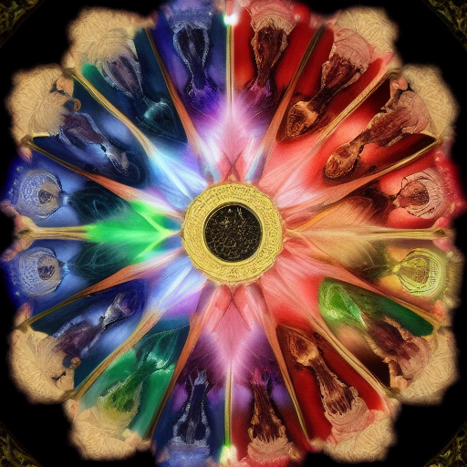

# The Shadow Conspiracy Hierarchy
*The Architecture of Umbral Power*

## Overview

[[The Shadow Conspiracy|02 Worldbuilding/People/The Shadow Conspiracy]] operates through a sophisticated hierarchical structure that combines corporate efficiency, military discipline, and occult mysticism. The organization has evolved from loose collection of shadow entities into a continental power structure capable of coordinating operations across multiple governments, institutions, and dimensions.

The hierarchy serves three primary functions: operational command for complex multi-site missions, knowledge compartmentalization preventing security breaches, and spiritual progression for shadow entities seeking evolution beyond their current existence. Each level represents not just authority, but fundamental transformation in the operative's relationship with shadow essence and human consciousness.

## The Seven Spheres of Shadow Authority

### First Sphere: The Umbral Council
**Position**: Supreme leadership and strategic direction  
**Members**: 3 entities (identities classified beyond Top Shadow clearance)  
**Nature**: Transcendent shadow beings, possibly collective consciousness  
**Authority**: Absolute command over all shadow conspiracy activities

#### The Prime Umbral
**Role**: Supreme strategic planning and dimensional interface  
**Identity**: Unknown - communicates only through shadow resonance  
**Responsibilities**: Long-term species evolution planning, inter-dimensional negotiations, ultimate decision authority  
**Powers**: Reality manipulation, consciousness networking, temporal awareness

**Communication Methods**:
- Direct consciousness interface with Second Sphere operatives
- Shadow resonance transmission across continental distances
- Manifestation through environmental shadow manipulation
- Dream infiltration and subconscious influence

#### The Tactical Umbral
**Role**: Operational coordination and resource allocation  
**Identity**: Suspected to be collective consciousness of 12 shadow entities  
**Responsibilities**: Continental operation oversight, resource distribution, strategic asset management  
**Powers**: Simultaneous consciousness presence, perfect information processing, tactical precognition

#### The Mystic Umbral
**Role**: Shadow essence research and consciousness technology development  
**Identity**: Rumored to be original shadow being from first dimensional breach  
**Responsibilities**: Evolution research, consciousness manipulation development, shadow-human integration protocols  
**Powers**: Consciousness manipulation mastery, shadow essence synthesis, dimensional research capabilities

### Second Sphere: The Shadow Regents
**Position**: Regional command and specialized department leadership  
**Members**: 12 entities across continental operations  
**Nature**: Enhanced shadow beings with significant human consciousness integration  
**Authority**: Regional autonomy within strategic parameters set by Umbral Council

#### Continental Regents (4 positions)

##### The Northern Shadow Regent
**Current Holder**: [[Archshadow Morrigan Voidheart]]  
**Territory**: Northern Aquabyssos including Crystallium and surrounding regions  
**Specialization**: Government infiltration and political manipulation  
**Resources**: 2,800 operatives, 15 major facilities, extensive political network

**Key Operations**:
- Parliamentary infiltration through [[Parliamentary Infiltration Methods]]
- Economic manipulation via shadow-controlled merchant houses
- Cultural influence through educational institution control
- Military intelligence gathering and sabotage coordination

##### The Eastern Shadow Regent
**Current Holder**: [[Archshadow Thane Abyssal]]  
**Territory**: Eastern coastal regions including major port cities  
**Specialization**: Maritime operations and international expansion  
**Resources**: 1,900 operatives, 12 major facilities, shadow fleet operations

**Key Operations**:
- International shadow operative deployment and coordination
- Maritime trade route control and cargo infiltration
- Diplomatic mission infiltration and intelligence gathering
- Cross-continental communication network maintenance

##### The Southern Shadow Regent  
**Current Holder**: [[Archshadow Nerissa Deepcurrent]]  
**Territory**: Southern Aquabyssos including industrial and research centers  
**Specialization**: Technology development and industrial infiltration  
**Resources**: 2,100 operatives, 18 major facilities, advanced research capabilities

**Key Operations**:
- [[Consciousness Manipulation Technology]] development and refinement
- Industrial sabotage and production manipulation
- Scientific research infiltration and technological advancement
- Manufacturing facility control for equipment production

##### The Western Shadow Regent
**Current Holder**: [[Archshadow Daemon Shadowrift]]  
**Territory**: Western territories including frontier settlements and natural resource sites  
**Specialization**: Resource extraction and population control  
**Resources**: 1,600 operatives, 8 major facilities, extensive territorial networks

**Key Operations**:
- Natural resource extraction and monopolization
- Frontier settlement infiltration and control
- Agricultural production manipulation and food security control
- Territory expansion and new settlement shadow integration

#### Departmental Regents (8 positions)

##### The Surgical Regent
**Current Holder**: [[Archshadow Mortis Voidcut]]  
**Department**: [[Shadow Surgery Network]] operations  
**Specialization**: Consciousness transfer and identity replacement procedures  
**Authority**: All surgical facilities, medical personnel, replacement operations

##### The Intelligence Regent
**Current Holder**: [[Archshadow Whisper Truthseer]]  
**Department**: Information gathering, counter-intelligence, security  
**Specialization**: Espionage operations and security management  
**Authority**: Intelligence networks, counter-intelligence operations, internal security

##### The Influence Regent
**Current Holder**: [[Archshadow Charm Mindweaver]]  
**Department**: Social manipulation and cultural influence  
**Specialization**: Psychological operations and social engineering  
**Authority**: Media control, cultural organizations, public opinion manipulation

##### The Military Regent
**Current Holder**: [[Archshadow Steel Voidstrike]]  
**Department**: Combat operations and enforcement  
**Specialization**: Direct action and physical enforcement  
**Authority**: Combat operatives, enforcement units, security forces

##### The Economic Regent
**Current Holder**: [[Archshadow Gold Shadowstream]]  
**Department**: Financial operations and resource management  
**Specialization**: Economic manipulation and resource allocation  
**Authority**: Financial institutions, trade operations, resource distribution

##### The Research Regent
**Current Holder**: [[Archshadow Mind Voidwright]]  
**Department**: Technology development and consciousness research  
**Specialization**: Scientific advancement and experimental programs  
**Authority**: Research facilities, experimental programs, technology development

##### The Diplomatic Regent
**Current Holder**: [[Archshadow Voice Shadowspeak]]  
**Department**: External relations and alliance management  
**Specialization**: Inter-organizational cooperation and international relations  
**Authority**: Diplomatic operations, alliance negotiations, external communications

##### The Evolution Regent
**Current Holder**: [[Archshadow Spirit Transformation]]  
**Department**: Shadow-human integration and species development  
**Specialization**: Evolution programs and integration protocols  
**Authority**: Integration programs, enhancement procedures, evolution research

### Third Sphere: The Shadow Commanders
**Position**: Operational command and specialized project leadership  
**Members**: 48 individuals across all departments and regions  
**Nature**: Advanced shadow operatives with extensive human consciousness integration  
**Authority**: Multi-site operation command, specialized project oversight

#### Regional Commanders (12 positions)
Each Continental Regent oversees 3 Regional Commanders responsible for specific geographical areas:

**Command Structure Example - Northern Region**:
- **Commander Mist Crystalline**: Crystallium city operations and government infiltration
- **Commander Depth Tidecaller**: Coastal operations and maritime intelligence
- **Commander Stone Shadowfall**: Mountain region operations and resource extraction

#### Departmental Commanders (36 positions)
Each Departmental Regent oversees multiple specialized commanders:

**Medical Department Example**:
- **Surgical Commander Prime**: Primary facility operations and major replacement procedures
- **Surgical Commander Field**: Mobile unit coordination and emergency procedures
- **Surgical Commander Research**: Experimental procedure development and technology advancement

### Fourth Sphere: The Shadow Captains
**Position**: Direct operational leadership and facility command  
**Members**: 144 individuals managing specific facilities or operation types  
**Nature**: Enhanced shadow operatives or heavily modified humans  
**Authority**: Single facility command, specialized operation leadership

#### Facility Captains
Direct commanders of major shadow conspiracy installations:

**[[Shadow Surgery Network]] Examples**:
- **Captain Scalpel Voidhand**: The Deep Ward primary facility commander
- **Captain Healing Shadowtouch**: The Restoration Chambers mobile operations
- **Captain Memory Darkblade**: The Garden of Whispers pediatric operations

#### Operation Captains
Leaders of specific ongoing missions or programs:

**Intelligence Operation Examples**:
- **Captain Whisper Nightear**: Parliamentary surveillance coordination
- **Captain Shadow Truthseeker**: Counter-intelligence and security operations  
- **Captain Mind Voidreader**: Information extraction and interrogation programs

### Fifth Sphere: The Shadow Lieutenants
**Position**: Team leadership and specialized skill coordination  
**Members**: 432 individuals managing specific operational teams  
**Nature**: Advanced shadow operatives or enhanced humans with specialized training  
**Authority**: Team command, specialized skill application

#### Field Lieutenants
Direct team leaders for operational activities:

**Infiltration Teams**:
- **Lieutenant Identity Shadowmask**: Government infiltration specialist
- **Lieutenant Charm Voidvoice**: Social manipulation and influence operations
- **Lieutenant Memory Darkedit**: Information extraction and consciousness modification

#### Technical Lieutenants
Specialists managing technological and research operations:

**Technology Teams**:
- **Lieutenant Crystal Voidtuner**: Consciousness manipulation equipment operation
- **Lieutenant Shadow Memoryscribe**: Data storage and information processing
- **Lieutenant Mind Darkwright**: Research equipment development and maintenance

### Sixth Sphere: The Shadow Agents
**Position**: Direct operational execution and specialized tasks  
**Members**: 2,400 individuals performing active missions  
**Nature**: Shadow operatives or enhanced humans with mission-specific training  
**Authority**: Individual mission execution, specialized skill application

#### Infiltration Agents
Operatives placed within target organizations:

**Government Infiltration**:
- Parliamentary staff members with shadow enhancement
- Military personnel with modified loyalties
- Law enforcement officials with consciousness conditioning
- Civil service employees with behavioral modification

#### Technical Agents
Specialists maintaining conspiracy technology and operations:

**Medical Operations**:
- Surgical assistants trained in consciousness manipulation procedures
- Equipment technicians maintaining consciousness transfer apparatus  
- Recovery specialists managing post-procedure patient care
- Security personnel protecting surgical facilities

### Seventh Sphere: The Shadow Initiates
**Position**: Entry-level operatives and support personnel  
**Members**: 8,000+ individuals in various training and support roles  
**Nature**: Recently recruited humans or basic shadow entities  
**Authority**: Specific task execution under direct supervision

#### Recruitment Categories

##### Voluntary Initiates
Humans who have chosen to join shadow conspiracy through ideological alignment:

**Motivations**:
- Belief in shadow-human evolution as beneficial progress
- Disillusionment with current government and social systems
- Desire for enhanced abilities and consciousness expansion
- Personal ambition for power and influence within shadow hierarchy

##### Coerced Initiates
Individuals compelled to serve through blackmail, threats, or family pressure:

**Leverage Methods**:
- Family members held hostage or under threat
- Compromising information requiring ongoing cooperation
- Financial dependence created through conspiracy manipulation
- Legal threats or frame-up operations requiring compliance

##### Modified Initiates
Humans who have undergone consciousness modification making them willing shadow servants:

**Modification Levels**:
- Minimal conditioning maintaining original personality with enhanced loyalty
- Moderate modification altering core values and priorities
- Extensive reconstruction creating new personality aligned with shadow goals
- Complete replacement with shadow consciousness maintaining human appearance

## Communication Networks and Security

### The Umbral Communication Web
Sophisticated multi-layered communication system enabling coordination across continental distances:

#### Shadow Resonance Networks
Direct consciousness-to-consciousness communication using shadow essence as transmission medium:

**Capabilities**:
- Instantaneous communication across unlimited distances
- Encrypted transmission undetectable by conventional technology
- Emotional and memory sharing between connected operatives
- Group consciousness coordination for complex operations

**Access Levels**:
- **Full Resonance**: First through Third Sphere operatives
- **Limited Resonance**: Fourth and Fifth Sphere operatives for operational needs
- **Directed Resonance**: Lower sphere operatives receive orders but cannot initiate contact
- **Emergency Resonance**: All operatives can send distress signals to higher spheres

#### Crystalline Memory Networks
Physical information storage and sharing using consciousness manipulation technology:

**Network Components**:
- Central memory archives storing operational intelligence and procedures
- Regional distribution nodes providing local access to information
- Mobile memory units for field operations requiring information access
- Personal memory crystals containing individual operational data and instructions

**Security Protocols**:
- Multi-level encryption requiring specific consciousness signatures for access
- Automatic memory wipe systems activated by unauthorized access attempts
- False information layers protecting genuine intelligence from compromise
- Emergency destruction protocols preventing information capture

#### Conventional Communication Backup
Traditional communication methods for non-shadow personnel and external coordination:

**Communication Channels**:
- Coded message systems using legitimate business and government channels
- Dead drop networks for physical information exchange
- Infiltrated communication companies providing priority message handling
- Emergency contact systems for crisis coordination

### Security Measures and Counter-Intelligence

#### Internal Security Protocols

##### Compartmentalized Knowledge System
Information access strictly controlled based on operational need and hierarchy level:

**Knowledge Compartments**:
- **Strategic Level**: Overall conspiracy goals and long-term planning (First-Second Sphere)
- **Operational Level**: Multi-site coordination and resource allocation (Second-Fourth Sphere)
- **Tactical Level**: Specific mission details and local intelligence (Fourth-Sixth Sphere)
- **Execution Level**: Individual task instructions without broader context (Sixth-Seventh Sphere)

##### Loyalty Verification Programs
Regular assessment of operative reliability and security risk:

**Verification Methods**:
- Psychological evaluation and consciousness monitoring for signs of disloyalty
- Performance assessment and mission success rate analysis
- Personal relationship monitoring for potential compromise or blackmail risks
- Memory audit procedures detecting unauthorized information access or sharing

#### Counter-Intelligence Operations

##### Infiltration Detection Systems
Methods for identifying and neutralizing external infiltration attempts:

**Detection Techniques**:
- Consciousness authenticity screening identifying non-shadow enhanced infiltrators
- Behavioral pattern analysis detecting actions inconsistent with shadow operative training
- Information flow monitoring identifying unauthorized intelligence gathering attempts
- Social network analysis tracking suspicious relationship patterns and communications

##### Opposition Neutralization Protocols
Systematic approach to dealing with anti-shadow conspiracy threats:

**Response Strategies**:
- **Soft Neutralization**: Consciousness modification, memory alteration, or replacement
- **Hard Neutralization**: Direct elimination or permanent incapacitation
- **Misdirection**: False flag operations directing opposition attention toward alternative targets
- **Absorption**: Conversion of opposition members to shadow conspiracy service

## Hierarchy Advancement and Evolution

### Promotion Pathways

#### Merit-Based Advancement
Progression through hierarchy based on operational success and demonstrated abilities:

**Advancement Criteria**:
- Mission success rates and operational effectiveness
- Innovation in shadow conspiracy techniques and procedures
- Leadership capabilities and subordinate management skills
- Loyalty demonstration and security risk assessment

#### Shadow Enhancement Progression
Advancement tied to increasing integration with shadow essence:

**Enhancement Stages**:
- **Basic Shadow Awareness**: Initial consciousness modification allowing shadow communication
- **Shadow Integration**: Partial consciousness merger providing enhanced abilities
- **Shadow Synthesis**: Advanced integration creating hybrid consciousness entity
- **Shadow Transcendence**: Complete transformation into pure shadow being with vast capabilities

#### Consciousness Evolution Requirements
Higher hierarchy positions require specific consciousness modifications:

**Evolution Prerequisites**:
- **Third Sphere and Above**: Must undergo consciousness splicing allowing multiple personality management
- **Second Sphere**: Requires consciousness networking capability for coordination with peers
- **First Sphere**: Complete transcendence of human consciousness limitations

### Operational Specialization Tracks

#### Intelligence Specialization
Career path focused on information gathering and analysis:

**Specialization Progression**:
- **Information Gatherer**: Basic intelligence collection and surveillance
- **Data Analyst**: Information processing and pattern recognition
- **Counter-Intelligence**: Opposition detection and neutralization
- **Intelligence Command**: Multi-operation coordination and strategic planning

#### Medical Specialization  
Career path focused on consciousness manipulation and surgical operations:

**Specialization Progression**:
- **Surgical Assistant**: Basic medical procedure support
- **Consciousness Technician**: Equipment operation and procedure execution
- **Medical Specialist**: Advanced procedure development and research
- **Surgical Command**: Facility management and program coordination

#### Infiltration Specialization
Career path focused on identity replacement and social manipulation:

**Specialization Progression**:
- **Social Observer**: Surveillance and behavioral analysis
- **Identity Constructor**: False personality development and implementation
- **Infiltration Specialist**: Complex long-term impersonation operations
- **Infiltration Command**: Multi-agent coordination and strategic placement

## Adventure Hooks and Campaign Integration

### Hierarchy Investigation Scenarios (Levels 7-12)

#### The Chain of Command
Heroes discover low-level shadow operative and must trace connections up hierarchy while avoiding detection by higher-level operatives with enhanced abilities.

**Investigation Challenges**:
- Each hierarchy level requires different detection and approach methods
- Higher-level operatives possess increasingly sophisticated counter-intelligence capabilities
- Information compartmentalization makes connecting different hierarchy levels difficult
- Time pressure as hierarchy becomes aware of investigation and initiates countermeasures

#### The Promotion Ceremony
Heroes infiltrate shadow conspiracy advancement ritual revealing hierarchy structure and advancement requirements while witnessing consciousness modification procedures.

**Infiltration Complexity**:
- Sophisticated security measures require genuine shadow consciousness authentication
- Ceremony location changes frequently requiring real-time intelligence gathering
- Advancement procedures provide intelligence on shadow enhancement capabilities
- Discovery risk increases dramatically due to concentrated high-level operative presence

### Hierarchy Disruption Campaigns (Levels 10-15)

#### The Decapitation Strike
Coordinated assault on shadow conspiracy leadership requiring heroes to simultaneously target multiple hierarchy levels while preventing succession protocols.

**Strategic Challenges**:
- Leadership dispersion across multiple secure facilities requiring coordinated assault
- Succession protocols automatically promoting replacement leadership
- Communication networks enabling rapid response to leadership attacks
- Counter-attack capabilities of surviving hierarchy members

#### The Internal Revolution
Heroes work with dissatisfied shadow conspiracy members to create internal uprising against hierarchy leadership while managing competing revolutionary factions.

**Political Complexity**:
- Multiple shadow operative factions with different goals for hierarchy reform
- Legitimate grievances against hierarchy leadership creating potential allies
- Risk of revolution creating chaos without necessarily improving situation
- Moral complexity of working with shadow conspiracy members against other shadow operatives

### Personal Stakes Scenarios (Levels 8-14)

#### The Corrupted Ally
Important ally or player character family member begins advancing through shadow conspiracy hierarchy, forcing heroes to choose between loyalty and opposing shadow influence.

**Emotional Stakes**:
- Gradual revelation of ally's hierarchy advancement and increasing shadow integration
- Consciousness modification making ally genuinely believe they're helping friends
- Rescue attempts potentially causing psychological damage to consciousness-modified ally
- Time pressure as ally's hierarchy advancement reaches point of no return

---

*"Power flows through shadow like water through channels - those who understand the current find themselves carried to greatness, while those who resist are swept aside by forces beyond their comprehension."* - Orientation speech for new Shadow Initiates

## DM Notes

### Using Hierarchy in Campaigns
- Start with low-level operatives before revealing full organizational scope
- Use hierarchy advancement as motivation for shadow NPC actions and decisions
- Create opportunities for heroes to exploit hierarchy communication and command structures
- Balance hierarchy competence with opportunities for heroes to succeed against organization

### Scaling Opposition
- **Low Level Campaigns**: Focus on Sixth-Seventh Sphere operatives with basic enhancement
- **Mid Level Campaigns**: Introduce Fourth-Fifth Sphere operatives with advanced capabilities
- **High Level Campaigns**: Direct confrontation with Second-Third Sphere entities
- **Epic Level Campaigns**: First Sphere encounters and hierarchy leadership confrontation

### Moral Complexity Integration
- Present hierarchy members with genuine motivations and understandable goals
- Show both voluntary participation and coercive recruitment methods
- Create opportunities for hierarchy members to change sides or seek redemption
- Balance hierarchy threat level with potential for diplomatic resolution or internal reform

## Player-Facing Summary

The Shadow Conspiracy Hierarchy is a undersea element of the setting, known for bioluminescent glow and pressure-glass. Its presence anchors ongoing storylines and offers clear player choices.

## Lore Details

Legends speak of The Shadow Conspiracy Hierarchy as a nexus where past and present converge. Locals describe subtle omens—shifts in currents, a dimming of lanternfish, or whispers on the wind—that herald change around The Shadow Conspiracy Hierarchy.

## Adventure Hooks

- A rumor ties The Shadow Conspiracy Hierarchy to a missing shipment, linking factions with competing claims.
- An NPC seeks discreet help at The Shadow Conspiracy Hierarchy to avert a public scandal.
- A map overlay reveals a hidden approach to The Shadow Conspiracy Hierarchy active only during specific tides/storms.

<!-- enriched: true -->

## Structure

### Leadership
- **Supreme Leader**: Ultimate authority
- **Council/Board**: Decision makers
- **Department Heads**: Operational leaders

### Ranks
1. Initiate level
2. Member level
3. Veteran level
4. Officer level
5. Leadership level

## Members

### Notable Members
- [[Leader Name]] - Current head
- [[Key Officer]] - Important figure
- [[Rising Star]] - Ambitious member

### Membership Requirements
- Skills or qualities needed
- Initiation process
- Ongoing obligations

## Goals

### Public Mission
What they claim to pursue

### True Objectives
- Primary goal
- Secondary objectives
- Long-term vision

### Current Projects
- Active operations
- Research efforts
- Political maneuvers

## Resources

### Financial
- Funding sources
- Wealth level
- Economic influence

### Physical Assets
- Properties owned
- Equipment available
- Special resources

### Human Resources
- Member skills
- Allies and contacts
- Information networks

## Operations

### Regular Activities
- Day-to-day operations
- Revenue generation
- Member services

### Special Operations
- Covert activities
- Major projects
- Crisis responses

## Relationships

### Allies
- Aligned organizations
- Political supporters
- Business partners

### Enemies
- Rival organizations
- Opposed factions
- Active threats

### Neutral Parties
- Potential allies or enemies
- Trade partners
- Watching parties

## Secrets

### Open Secrets
Things widely suspected

### Hidden Truths
- Real leadership
- True funding sources
- Secret objectives

### Deep Mysteries
- Ancient connections
- Forbidden knowledge
- Ultimate goals
