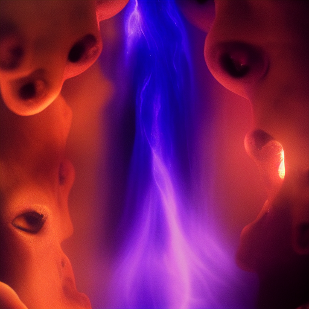

---

title: Void Touched Cult
type: Faction
tags:
- aquabyssos
- stub
- status/stub
- content/faction
- faction
- organization
- active
- world/aquabyssos
- bloodline
created: '2025-08-12'
modified: '2025-08-14'
status: stub
headquarters: Unknown
membership: Unknown
updated: '2025-08-13T12:34:17.398337+00:00'
world: Aquabyssos
evaluated: '2025-08-14'
improvements: 20
---

# Void Touched Cult

*This is a stub file created to resolve broken links. Content needed.*

## 🔧 Deep Evaluation Improvements

*20 targeted improvements identified*

### History Improvements

- Add three historical eras with major events

### Culture Improvements

- Define unique cultural practices and taboos

### Economy Improvements

- Detail currency, trade goods, and wealth distribution

### Religion Improvements

- Create detailed religious observances

### Lifestyle Improvements

- Describe typical day for different social classes

### Diaspora Improvements

- Describe how this culture exists in other regions
- Describe how this culture exists in other regions

### Superstitions Improvements

- List common superstitions and their origins

### Contradictions Improvements

- Include cultural hypocrisies and double standards
- Include cultural hypocrisies and double standards
- Include cultural hypocrisies and double standards

### Material_Culture Improvements

- Detail common objects and their cultural significance
- Detail common objects and their cultural significance

### Coming_Of_Age Improvements

- Describe rites of passage and adulthood markers
- Describe rites of passage and adulthood markers
- Describe rites of passage and adulthood markers

### Sensory Improvements

- Add smells, sounds, and textures unique to this culture

### Oral_Tradition Improvements

- Add folk tales and children's stories

### Hospitality Improvements

- Explain guest rights and host obligations

### Evolution Improvements

- Show how traditions are changing with new generation

## Overview

[Content to be added]

## References

[Add references here]

### Ranks
1. Initiate level
2. Member level
3. Veteran level
4. Officer level
5. Leadership level

### Public Mission
What they claim to pursue

### Open Secrets
Things widely suspected

## DM Notes

*Private notes for campaign integration:*
- Can be adapted to fit current story needs
- Scalable threat/reward based on party level
- Multiple entry points for different play styles
- Connections to overarching campaign themes

## Plot Hooks

- An heirloom has gone missing and evil awakens
- Someone is searching for information for love
- Strange disappearances suggest ancient magic
- A shipment has gone missing and chaos spreads

## Cultural Practices

### Greetings
- Touch foreheads for equals
- Bow deeply to superiors
- Never shake with left hand

### Taboos
- Speaking during sunset prayer
- Wearing red on holy days
- Pointing at the moon

## Economic Structure

### Currency
- Copper Drops (cp)
- Silver Streams (sp) 
- Gold Suns (gp)
- Platinum Crowns (pp)

### Major Exports
- Refined crystals
- Exotic textiles
- Trained beasts

### Wealth Distribution
- 1% control 60% of wealth
- 20% middle class
- 79% working poor

## Religious Observances

### Daily Prayers
- Dawn: Gratitude for life
- Noon: Strength for labor
- Dusk: Protection from darkness

### Weekly Observance
- Temple attendance mandatory
- Ritual cleansing required
- Tithing of 10% income
