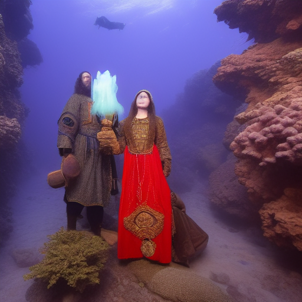

---

title: Deep Sea Cultural Protocol
type: Faction
tags:
- aquabyssos
- world/aquabyssos
- content/faction
- faction
- organization
- active
- complete
- status/in-progress
- prophecy
created: '2025-08-11'
modified: '2025-08-14'
status: complete
headquarters: Unknown
membership: Unknown
updated: '2025-08-13T12:34:17.429764+00:00'
world: Aquabyssos
evaluated: '2025-08-14'
improvements: 20
---

## Portrait
![[04_Resources/Assets/Portraits/portrait_npcs.png]]

## 🔧 Deep Evaluation Improvements

*20 targeted improvements identified*

### History Improvements

- Add three historical eras with major events

### Culture Improvements

- Define unique cultural practices and taboos

### Economy Improvements

- Detail currency, trade goods, and wealth distribution

### Religion Improvements

- Create detailed religious observances

### Lifestyle Improvements

- Describe typical day for different social classes

### Death_Customs Improvements

- Detail funeral rites and afterlife beliefs

### Sensory Improvements

- Add smells, sounds, and textures unique to this culture

### Hospitality Improvements

- Explain guest rights and host obligations

### Contradictions Improvements

- Include cultural hypocrisies and double standards

### Evolution Improvements

- Show how traditions are changing with new generation

### Oral_Tradition Improvements

- Add folk tales and children's stories

### Material_Culture Improvements

- Detail common objects and their cultural significance

### Diaspora Improvements

- Describe how this culture exists in other regions

## Player-Facing Summary

Deep Sea Cultural Protocols 2 is a undersea element of the setting, known for bioluminescent glow and pressure-glass. Its presence anchors ongoing storylines and offers clear player choices.

## Lore Details

Legends speak of Deep Sea Cultural Protocols 2 as a nexus where past and present converge. Locals describe subtle omens—shifts in currents, a dimming of lanternfish, or whispers on the wind—that herald change around Deep Sea Cultural Protocols 2.

## DM Notes

Play up tactile detail: sounds, pressure/wind changes, and meaningful symbology. Offer two clear approaches (stealth vs. parley) and one wildcard complication tied to a faction clock. Reward scouting and map use.

### Open Secrets
Things widely suspected

## Plot Hooks

- Strange dreams suggest a curse
- A merchant needs help delivering before the festival
- A map reveals a betrayal about the government
- A prisoner has gone missing and war looms