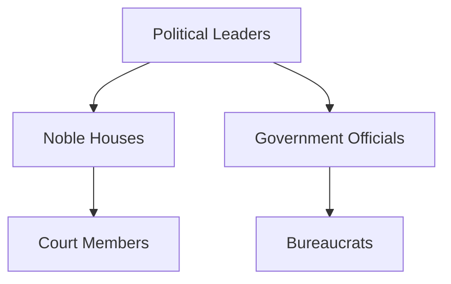
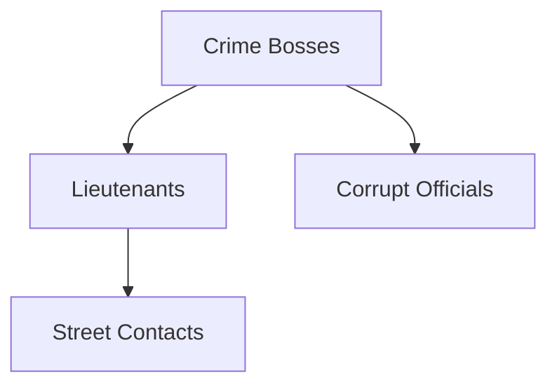
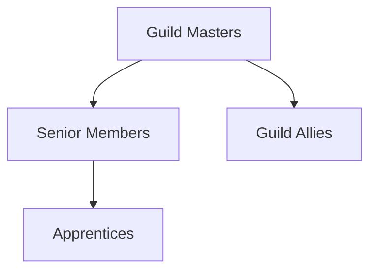

# NPC Relationship Map

## Major Relationships

### Political Alliances

### Criminal Networks

### Guild Connections

## Relationship Types
- **Allied:** Work together toward common goals
- **Enemy:** Actively oppose each other
- **Rival:** Compete but not necessarily hostile
- **Family:** Blood or marriage relations
- **Mentor/Student:** Teaching relationships
- **Employer/Employee:** Professional relationships

## Dynamic Relationships
*Relationships that change based on player actions*

### Conditional Allies
- NPCs who help only under certain conditions
- Former enemies who can be redeemed
- Neutral parties who can be swayed

### Relationship Consequences
- How NPC relationships affect quests
- Ripple effects of befriending/antagonizing key figures
- Long-term campaign implications

## Relationships
- Student of [[The Great Cacophony 2]]
- Rival to [[High Oracle Serenity Deepcall 2]]
- Ally of [[High Theologian Commander Aurelius]]
- Former agent of the Abyssal Trading Consortium

## Motivations
### Primary Motivation
Wants to restore their family's honor in the Depth Hierarchy

### Secondary Goals
- Gain influence in their district
- Master a forgotten combat technique

## Plot Hooks
3. **Secret Meeting**: NPC_Relationship_Map needs escorts to a clandestine meeting in the Abyssal Trenches
4. **Memory Theft**: NPC_Relationship_Map's memories have been stolen and sold on the black market
5. **Double Agent**: Evidence suggests NPC_Relationship_Map is working for two opposing factions