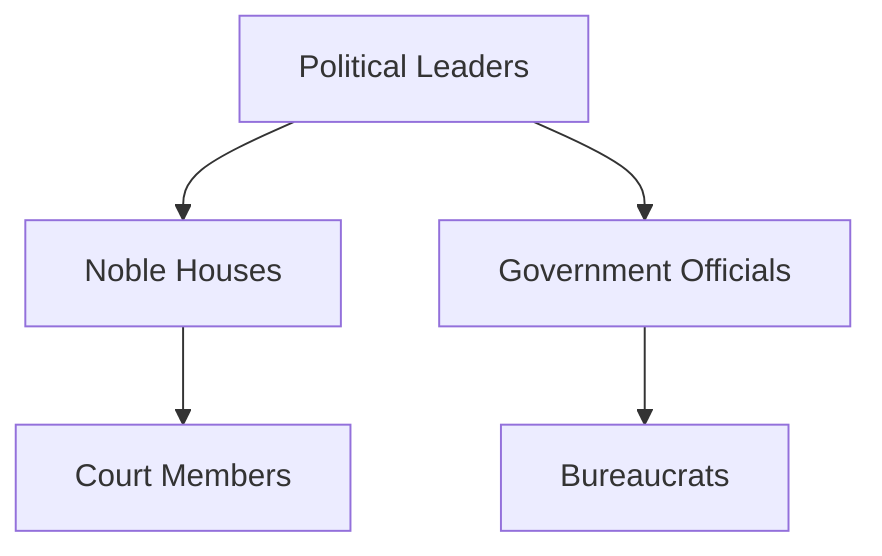
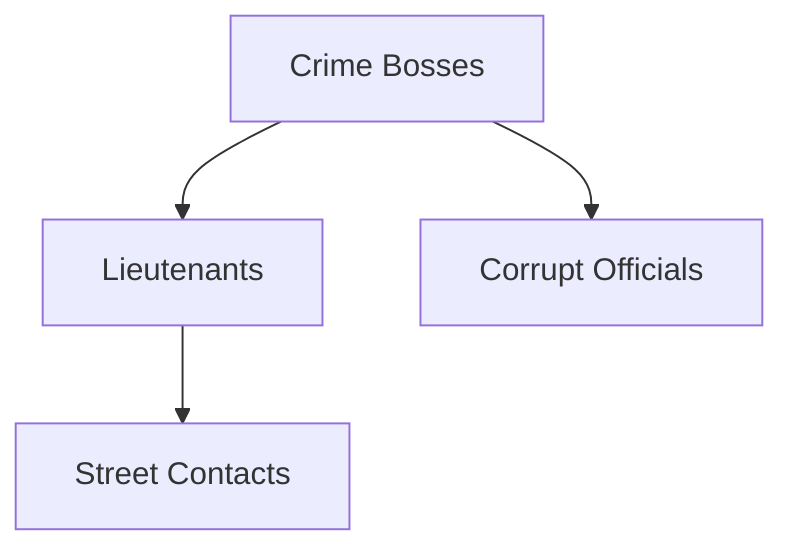
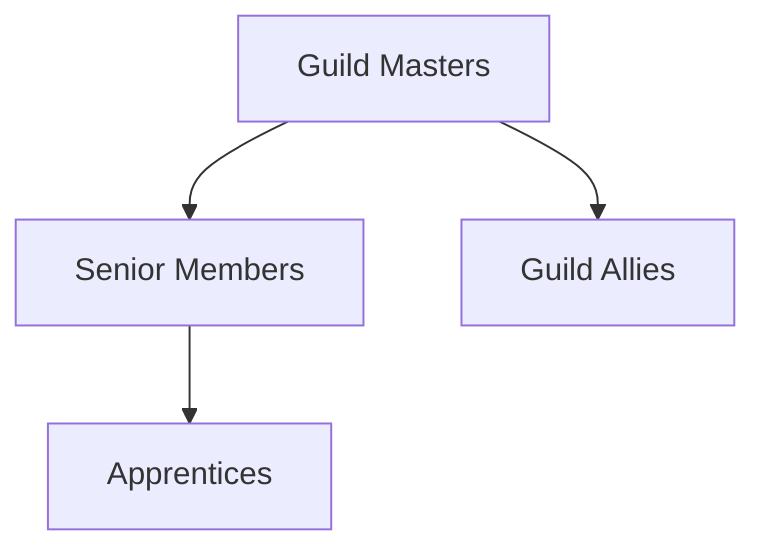

# NPC Relationship Map

## Major Relationships

### Political Alliances

### Criminal Networks

### Guild Connections

## Relationship Types
- **Allied:** Work together toward common goals
- **Enemy:** Actively oppose each other
- **Rival:** Compete but not necessarily hostile
- **Family:** Blood or marriage relations
- **Mentor/Student:** Teaching relationships
- **Employer/Employee:** Professional relationships

## Dynamic Relationships
*Relationships that change based on player actions*

### Conditional Allies
- NPCs who help only under certain conditions
- Former enemies who can be redeemed
- Neutral parties who can be swayed

### Relationship Consequences
- How NPC relationships affect quests
- Ripple effects of befriending/antagonizing key figures
- Long-term campaign implications
