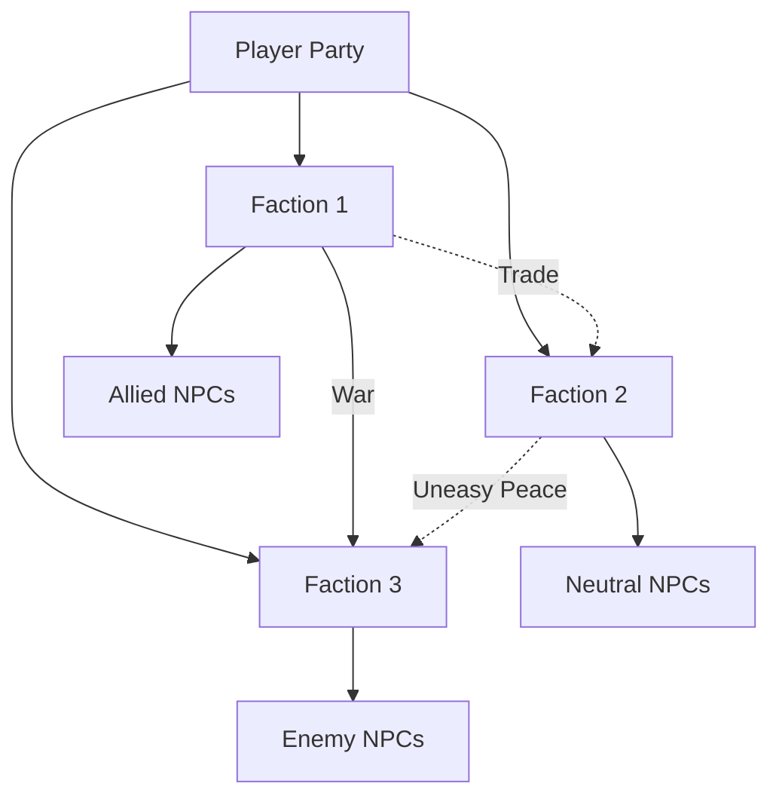

# Faction Relationship Chart

## Instructions
1. Replace faction names above
2. Adjust relationship arrows
3. Use solid lines for strong relationships
4. Use dotted lines for weak/uncertain relationships
