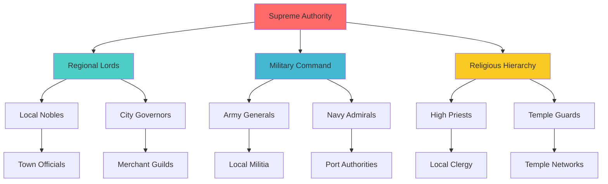
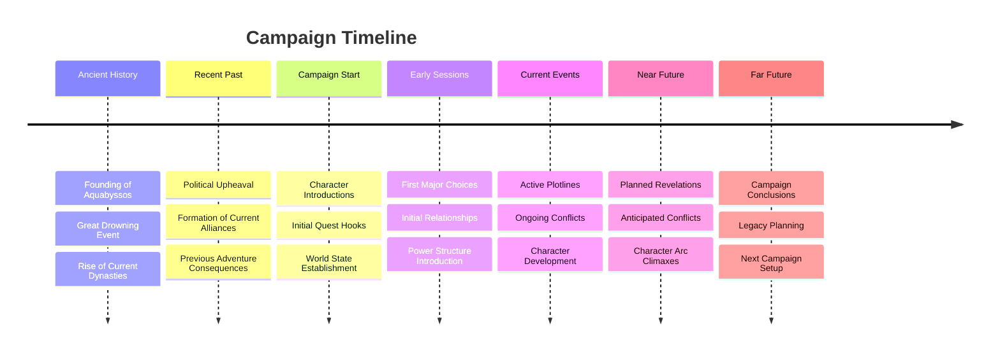
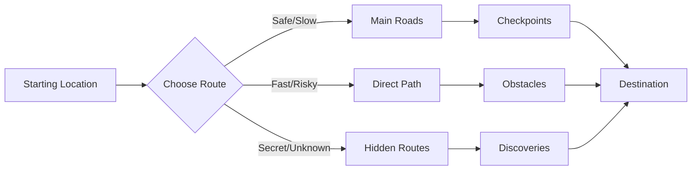

# Advanced NPC Relationship Mapping

## Interactive Relationship Web

```excalidraw
{
  "type": "excalidraw",
  "version": 2,
  "source": "https://excalidraw.com",
  "elements": [
    {
      "type": "ellipse",
      "version": 100,
      "versionNonce": 1,
      "isDeleted": false,
      "id": "central-hub",
      "fillStyle": "hachure",
      "strokeWidth": 2,
      "strokeStyle": "solid",
      "roughness": 1,
      "opacity": 100,
      "angle": 0,
      "x": 400,
      "y": 300,
      "strokeColor": "#e03131",
      "backgroundColor": "#ffc9c9",
      "width": 120,
      "height": 80,
      "seed": 1,
      "groupIds": [],
      "strokeSharpness": "sharp",
      "boundElements": [
        {
          "id": "text-central",
          "type": "text"
        }
      ],
      "updated": 1
    },
    {
      "type": "text",
      "version": 50,
      "versionNonce": 1,
      "isDeleted": false,
      "id": "text-central",
      "fillStyle": "hachure",
      "strokeWidth": 1,
      "strokeStyle": "solid",
      "roughness": 1,
      "opacity": 100,
      "angle": 0,
      "x": 430,
      "y": 330,
      "strokeColor": "#000000",
      "backgroundColor": "transparent",
      "width": 60,
      "height": 20,
      "seed": 1,
      "groupIds": [],
      "strokeSharpness": "sharp",
      "boundElements": [],
      "updated": 1,
      "text": "PLAYERS",
      "fontSize": 16,
      "fontFamily": 1,
      "textAlign": "center",
      "verticalAlign": "middle",
      "containerId": "central-hub"
    }
  ],
  "appState": {
    "gridSize": null,
    "viewBackgroundColor": "#ffffff"
  },
  "files": {}
}
```

## Relationship Mapping Guide

### Color Coding System
- 🔴 **Red:** Enemies, antagonists, hostile relationships
- 🟢 **Green:** Allies, friends, positive relationships
- 🟡 **Yellow:** Neutral, uncertain, or business relationships
- 🔵 **Blue:** Family, romantic, or deep personal bonds
- 🟣 **Purple:** Mysterious, unknown, or complex relationships
- ⚫ **Black:** Dead, missing, or severed relationships

### Relationship Line Types
- **Solid Line:** Strong, established relationship
- **Dashed Line:** Weak, uncertain, or developing relationship
- **Thick Line:** Very important relationship to campaign
- **Arrow:** One-way relationship (unrequited, unknown, power dynamic)
- **Double Arrow:** Mutual relationship

### NPC Grouping Strategies
- **Inner Circle:** Most important recurring NPCs
- **Middle Ring:** Significant but less frequent NPCs
- **Outer Ring:** Minor NPCs, background characters
- **Faction Clusters:** Group by organization or allegiance

### Dynamic Elements
- **Moving Connections:** Relationships that change over time
- **Conditional Lines:** Relationships dependent on player actions
- **Hidden Connections:** Secret relationships revealed later

## Faction Power Structure



### Power Flow Analysis
- **Top-Down:** How orders and influence flow downward
- **Bottom-Up:** How information and pressure flow upward
- **Lateral:** Peer-to-peer relationships and competition
- **Cross-Cutting:** Relationships that bypass hierarchy

## Timeline Visualization



## Combat Positioning Tools

### Battle Grid Template
*Use this as a starting point for combat encounters*

```excalidraw
{
  "type": "excalidraw",
  "version": 2,
  "source": "https://excalidraw.com",
  "elements": [
    {
      "type": "rectangle",
      "version": 1,
      "versionNonce": 1,
      "isDeleted": false,
      "id": "battle-grid",
      "fillStyle": "cross-hatch",
      "strokeWidth": 1,
      "strokeStyle": "solid",
      "roughness": 0,
      "opacity": 30,
      "angle": 0,
      "x": 50,
      "y": 50,
      "strokeColor": "#000000",
      "backgroundColor": "#e3fafc",
      "width": 600,
      "height": 400,
      "seed": 1,
      "groupIds": [],
      "strokeSharpness": "sharp",
      "boundElements": []
    }
  ],
  "appState": {
    "gridSize": 25,
    "viewBackgroundColor": "#ffffff"
  },
  "files": {}
}
```

### Tactical Elements Legend
- **🟦 Blue Squares:** Player Characters
- **🟥 Red Circles:** Enemies
- **🟨 Yellow Triangles:** NPCs/Allies
- **🟫 Brown Rectangles:** Terrain/Obstacles
- **🟩 Green Areas:** Beneficial terrain
- **🟪 Purple Areas:** Hazardous terrain

## World Map Integration

### Regional Overview
*Connect this to detailed location files*

1. **Aquabyssos Empire**
   - Capital: [[Aquabyssos Prime]]
   - Major Cities: [[Port Nerida]], [[Coral Gardens]]
   - Geography: Underwater civilization, kelp forests

2. **Aethermoor Dominion**
   - Capital: [[Sky Citadel]]
   - Major Cities: [[Cloud Harbor]], [[Storm Peak]]
   - Geography: Floating islands, aerial navigation

3. **Neutral Territories**
   - Trading Posts: [[Crossroads Market]]
   - Wild Lands: [[The Untamed Depths]]
   - Contested Areas: [[Border Conflicts]]

### Travel Route Planning
*Visual representation of journey options*


