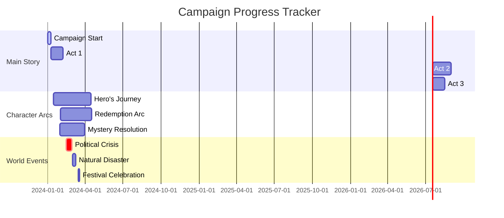
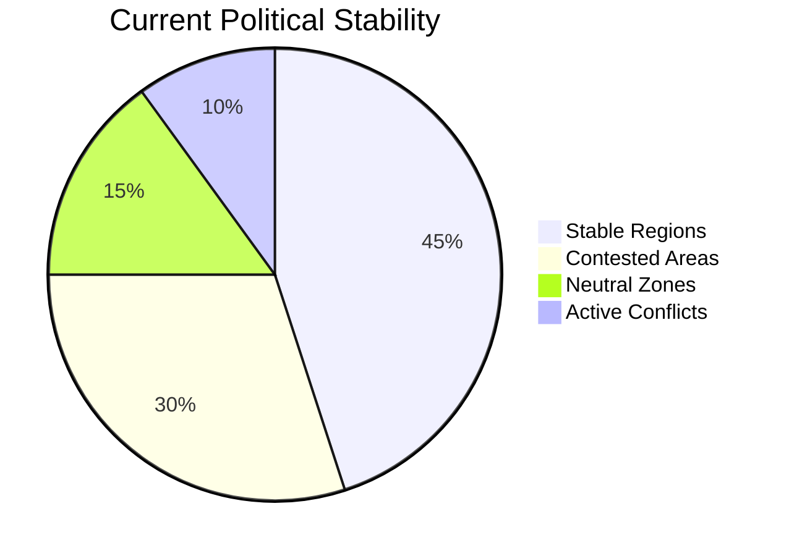
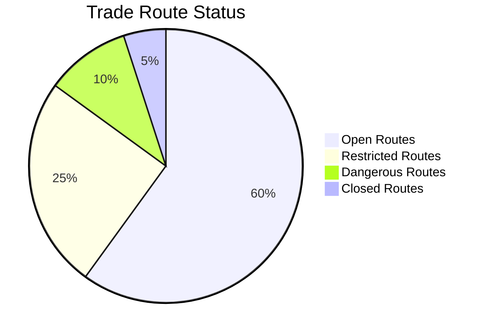
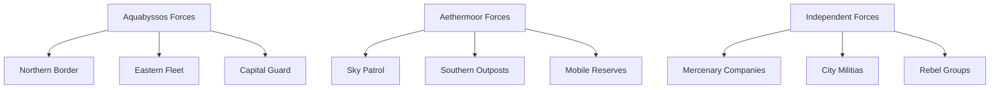
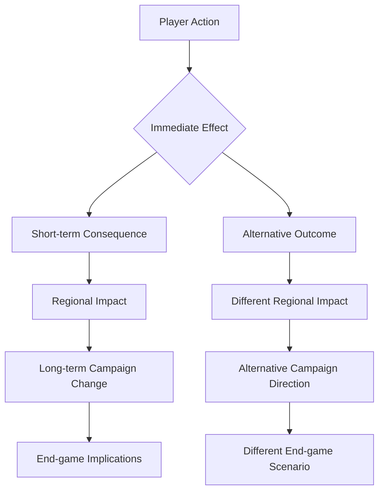
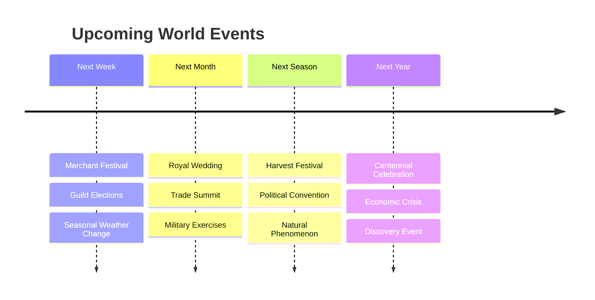

# Campaign Timeline Visualization

## Interactive Timeline

## Session-by-Session Progress

### Visual Session Tracker
| Session | Date | Main Events | Character Focus | Plot Progress |
|---------|------|-------------|-----------------|---------------|
| 1 | 2024-01-01 | Party Formation | Introductions | 🟢🟢⚪⚪⚪ |
| 2 | 2024-01-08 | First Quest | Team Building | 🟢🟢🟢⚪⚪ |
| 3 | 2024-01-15 | Major Discovery | Character A Arc | 🟢🟢🟢🟢⚪ |
| 4 | 2024-01-22 | Faction Conflict | Political Intrigue | 🟢🟢🟢🟢🟢 |

### Progress Indicators
- 🟢 **Complete:** Story element fully explored
- 🟡 **In Progress:** Currently developing
- ⚪ **Planned:** Future content prepared
- 🔴 **Blocked:** Waiting on player decisions
- 🟣 **Optional:** Side content available

## World State Tracking

### Political Climate

### Economic Conditions

### Military Positioning

## Dynamic Event Tracking

### Consequence Chains
*How player actions create ripple effects*

### Relationship Temperature
*Track how NPC relationships change over time*

| NPC Name | Initial | Session 3 | Session 6 | Session 9 | Trend |
|----------|---------|-----------|-----------|-----------|-------|
| Lord Blackwater | Neutral | Friendly | Allied | Trusted | ⬆️📈 |
| Captain Storm | Hostile | Hostile | Neutral | Friendly | ⬆️📈 |
| Madame Nightwhisper | Unknown | Suspicious | Cautious | Neutral | ⬆️📈 |

### World Events Calendar
*Upcoming events that will affect the campaign*

