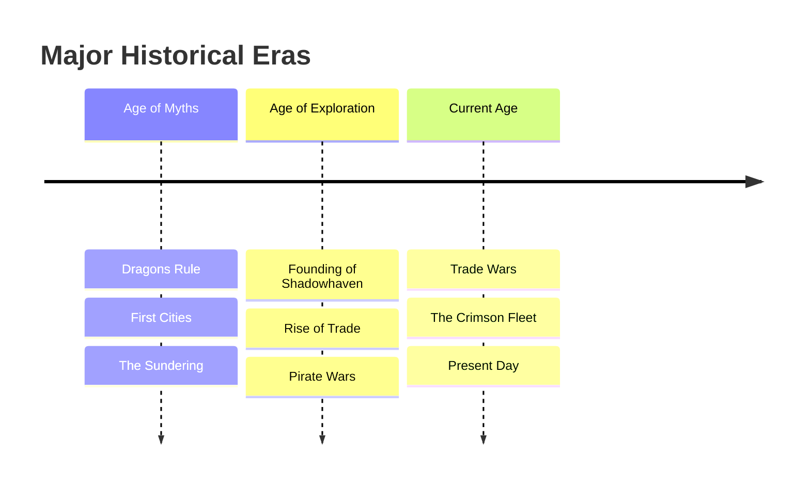

# World Event Timeline

> [!timeline] The History of the Cerulean Archipelago
> A chronological record of major events shaping our world

## 📅 Timeline Overview

## 🌅 Age of Myths (Before -5000)

### The Dawn Times
**Date:** Time Immemorial
**Event:** Creation of the Archipelago
**Significance:** The gods raise islands from the primordial sea
**Effects Still Felt:**
- Ancient ruins on many islands
- Dormant divine magic sites
- Mysterious artifacts

### The Dragon Dominion
**Date:** -5000 to -3000
**Event:** Dragons rule the skies and seas
**Key Figures:** 
- Thalassarion the Deep Wyrm
- Celestrion the Storm Herald
**Legacy:**
- Dragon turtle descendants
- Draconic ruins
- Hidden hoards

### The First Mariners
**Date:** -3000 to -2000
**Event:** Mer-folk establish underwater cities
**Locations:** 
- [[05_Templates/Example_Campaign/Locations/The Sunken City of Aeridor]]
- Coral Palace of the Depths
**Current Status:** Mostly ruins, some inhabited

---

## ⚓ Age of Exploration (-2000 to -500)

### The Great Voyages
**Date:** -2000 to -1500
**Event:** Surface races discover sailing
**Innovations:**
- First sailing ships
- Celestial navigation
- Trade routes established

### The Island Nations
**Date:** -1500 to -1000
**Event:** Independent city-states founded
**Major Settlements:**
- Proto-Shadowhaven
- Ancient Port Celeste
- Lost Goldenharbor

### The First Pirate Age
**Date:** -1000 to -500
**Event:** Lawlessness on the seas
**Notable Groups:**
- The Black Tide Brotherhood
- Storm Reavers
- The Crimson Sails (predecessors)

---

## 🏛️ The Classical Period (-500 to 500)

### The Trade Compact
**Date:** -482
**Event:** First inter-island trade agreement
**Signatories:** Seven major ports
**Terms:** 
- Standardized currency
- Protected trade routes
- Shared naval patrols

### The War of Tides
**Date:** -234 to -189
**Event:** Mer-folk vs Surface dwellers
**Cause:** Territorial disputes over shipping lanes
**Resolution:** Treaty of the Depths
**Lasting Effects:**
- Underwater/surface boundaries
- Diplomatic protocols
- Hybrid communities

### The Golden Age
**Date:** -100 to 300
**Event:** Peace and prosperity
**Achievements:**
- Art and culture flourish
- Magical research advances
- Population growth
**End:** The Sundering

---

## 💥 The Sundering (Year 300-305)

### The Cataclysm
**Date:** Year 300, 3rd Moon, 15th Day
**Event:** [[02_Worldbuilding/Lore/The Sundering]] - Magical catastrophe
**Cause:** [Disputed - magical experiment? Divine wrath? Planar invasion?]
**Immediate Effects:**
- Three islands sink completely
- Tidal waves destroy coastal cities
- Magic becomes unstable

### The Dark Years
**Date:** 301-305
**Event:** Chaos and collapse
**Characteristics:**
- No central authority
- Monsters from the depths
- Failed harvests
- Mass migrations

### The Reconstruction
**Date:** 305-350
**Event:** Rebuilding begins
**Key Developments:**
- New Shadowhaven founded inland
- Defensive focus in architecture
- Magical regulation begins

---

## ⚔️ The Age of Conflict (350-750)

### The Succession Wars
**Date:** 412-439
**Event:** Noble houses vie for control
**Major Players:**
- House Stormwind
- House Goldwater
- House Ironanchor
**Result:** Council system established

### The Second Pirate Age
**Date:** 567-634
**Event:** Piracy resurges
**Causes:** 
- Weak naval forces
- Economic disparity
- Political fragmentation
**End:** Great Pirate Purge

### The Cult Wars
**Date:** 701-723
**Event:** Religious conflicts
**Factions:**
- Temple of Divine Order
- Cult of the Depths
- Storm Worshippers
**Resolution:** Religious Tolerance Edict

---

## 🏰 The Modern Era (750-Present)

### The Trade Revolution
**Date:** 752-821
**Event:** New trade routes and methods
**Innovations:**
- Magical preservation
- Faster ships
- Banking systems
**Results:** Economic boom

### The Five-Port Alliance
**Date:** 856
**Event:** Major ports unite against pirates
**Members:**
- Shadowhaven
- Port Celeste
- Ironhold
- Port Verran
- Millbrook
**Status:** Dissolved 934

### The Great Storm
**Date:** 967-969
**Event:** Three years of supernatural storms
**Effects:**
- Ships lost: 200+
- Islands isolated
- New sea monsters appear
**Theory:** Magical experiment gone wrong

### Rise of the Crimson Fleet
**Date:** 995-Present
**Event:** New pirate confederation forms
**Leader:** [[05_Templates/Example_Campaign/NPCs/Captain Kaelen]] (from 1019)
**Threat Level:** Increasing
**Current Status:** Active threat

---

## 📰 Recent History (Last 50 Years)

### 975 - The Trade Wars Begin
- Shadowhaven vs Port Celeste rivalry intensifies
- Economic espionage common
- Proxy conflicts through pirates

### 983 - The Lighthouse War
- Dispute over Whisper Rock Lighthouse
- Three-day naval battle
- Uneasy truce established

### 991 - Discovery of Ancient Magic
- Old ruins found with active enchantments
- Rush to claim magical sites
- Several expeditions vanish

### 995 - Crimson Fleet Founded
- Surviving pirate crews unite
- First Captain: "Blackwater Jake"
- Base established at Serpent's Spire

### 1001 - The Merchant Massacre
- Crimson Fleet attacks convoy
- 12 ships lost, 300+ dead
- Triggers naval buildup

### 1010 - The False Peace
- Diplomatic summit held
- Trade agreements signed
- Pirates temporarily quiet
- Preparations in secret

### 1019 - Captain Kaelen's Rise
- Takes control of Crimson Fleet
- New tactics and organization
- Threat level escalates

### 1023 - The Vanishing Begins
- First merchant ship disappears
- Initially blamed on pirates
- Pattern emerges over months

### 1024 - The Arcane Disturbances
- Magic becomes unstable in cities
- Wizard guild investigates
- Connection to vanishings suspected

### 1025 - Present Day
- Three ships now missing
- Political tensions high
- Heroes recruited to investigate
- Storm clouds gathering...

---

## 🔮 Prophesied Events

### The Tide of Shadows
**Source:** Oracle Moonwhisper
**Prediction:** "When crimson sails blot out the sun, the depths shall rise to claim what was sundered"
**Interpretation:** Unclear - Crimson Fleet victory? Return of sunken lands?

### The Last Voyage
**Source:** Ancient mer-folk texts
**Prediction:** "The final ship shall sail backwards through time"
**Interpretation:** Time magic? Metaphorical?

### The Unification
**Source:** Multiple seers
**Prediction:** "Five ports become one, or all become none"
**Interpretation:** Alliance or destruction

---

## 📊 Timeline Patterns

### Cyclical Events
- **Pirate Resurgence:** Every 200-300 years
- **Major Storms:** Every 50-70 years  
- **Trade Wars:** Every 100-150 years
- **Magical Instability:** Every 500 years?

### Warning Signs
Current events matching historical patterns:
- [ ] Economic disparity increasing ✓
- [ ] Pirate organization strengthening ✓
- [ ] Political fragmentation ✓
- [ ] Magical disturbances ✓
- [ ] Missing ships ✓

**Conclusion:** Major historical event likely imminent

---

## 🗺️ Lost to Time

### Sunken/Lost Locations
- **Goldenharbor:** Sunk in Sundering
- **Coral Gardens:** Destroyed in War of Tides
- **Starfall Island:** Vanished 823
- **The Floating Market:** Lost in Great Storm

### Missing Expeditions
- **The Sunset Voyager** (891): Sought Goldenharbor
- **The Discovery** (934): Mapping expedition
- **The Magellan** (991): Magical research vessel
- **The Compass Rose** (1018): Treasure hunters

### Unexplained Events
- **The Night of Falling Stars** (456): Sky lit up, no explanation
- **The Silent Day** (678): All sound ceased for one day
- **The Backwards Storm** (823): Storm moved against wind
- **The Fish Rain** (967): Thousands of fish fell on Port Celeste

---

## 📚 Historical Resources

### Primary Sources
- **The Shadowhaven Chronicles**: Official city records
- **Songs of the Sea**: Bardic oral traditions
- **The Mer-Folk Tablets**: Translated prophecies
- **Pirates' Code**: Historical document

### Scholarly Works
- "The Sundering: Causes and Effects" - Sage Wellspring
- "Economic Cycles of the Archipelago" - Master Goldcount
- "Pirates: Scourge or Necessity?" - Captain (Ret.) Fairwind

### Ongoing Research
- Archaeological digs at Sundering sites
- Magical dating of artifacts
- Oral history collection project
- Deep sea exploration

---

## 🎯 Using This Timeline

### For Players
- Find historical connections to current events
- Discover family histories
- Understand cultural contexts
- Identify patterns

### For DMs
- Create historical callbacks
- Plant future plot seeds
- Justify current conflicts
- Add depth to locations

### Adventure Hooks
- Sunken treasure from historical wrecks
- Time-displaced survivors
- Ancient curses activating
- Historical mysteries solving current problems

---

*"Those who forget history are doomed to repeat it. Those who remember it are doomed to watch others repeat it." - Sage Wellspring*