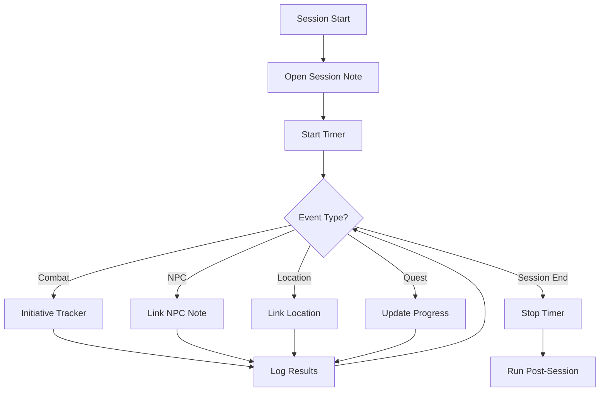

# Session Automation System

> [!robot] Automated Session Management
> Scripts and workflows to streamline session preparation and post-session tasks

## 🤖 Templater Scripts

### Auto-Create Next Session

Add this to your Templater folder as `next-session.md`:

```javascript
<%*
// Get the current highest session number
const sessions = tp.file.find_tfile("Sessions").children;
let highestNum = 0;
sessions.forEach(file => {
  const match = file.basename.match(/Session (\d+)/);
  if (match) {
    const num = parseInt(match[1]);
    if (num > highestNum) highestNum = num;
  }
});

const nextNum = highestNum + 1;
const dateStr = tp.date.now("YYYY-MM-DD");
const fileName = `Session ${nextNum} - ${dateStr}`;

// Create the new session
await tp.file.create_new(
  tp.file.find_tfile("Template-Session-Enhanced"),
  fileName,
  false,
  tp.file.find_tfile("Sessions")
);
%>
```

### Post-Session Checklist

```javascript
<%*
// Post-session automation checklist
const sessionNum = tp.file.title.match(/\d+/)[0];
const tasks = [
  "Update quest progress",
  "Award XP to players", 
  "Distribute treasure",
  "Update NPC relationships",
  "Archive combat encounters",
  "Create next session file",
  "Update campaign timeline",
  "Send session summary to players"
];

// Create checklist
let checklist = "## 📋 Post-Session Checklist\n\n";
tasks.forEach(task => {
  checklist += `- [ ] ${task}\n`;
});

// Add automation buttons
checklist += "\n### Quick Actions\n";
checklist += "`BUTTON[createNextSession]` Create Next Session\n";
checklist += "`BUTTON[updateQuests]` Update Quest Progress\n";
checklist += "`BUTTON[archiveCombat]` Archive Combat Notes\n";

tR += checklist;
%>
```

## 🔄 QuickAdd Macros

### Session Prep Macro

Create a QuickAdd macro with these steps:

1. **Create Session Note**
   ```javascript
   const sessionNum = await tp.system.prompt("Session Number:");
   const fileName = `Session ${sessionNum} - ${tp.date.now("YYYY-MM-DD")}`;
   ```

2. **Gather Previous Info**
   ```javascript
   // Get last session summary
   const lastSession = sessionNum - 1;
   const lastFile = tp.file.find_tfile(`Session ${lastSession}`);
   const lastContent = await tp.file.read(lastFile);
   ```

3. **Pre-populate Content**
   ```javascript
   // Extract cliffhanger
   const cliffMatch = lastContent.match(/### Cliffhanger\n>(.*?)\n/s);
   const cliffhanger = cliffMatch ? cliffMatch[1] : "";
   
   // Get active quests
   const activeQuests = DataviewAPI.query(`
     LIST FROM #quest WHERE quest_status = "active"
   `);
   ```

## 📊 Dataview Queries

### Session Dashboard

```dataview
## Recent Sessions Summary
TABLE 
  date_played as "Date",
  duration_hours as "Duration",
  length(npcs_encountered) as "NPCs Met",
  length(locations_visited) as "Locations",
  xp_awarded as "XP"
FROM #session
SORT session_number DESC
LIMIT 5

## Quest Progress Tracker
TABLE
  quest_progress as "Progress",
  sessions_since_update as "Sessions Since Update"
FROM #quest
WHERE quest_status = "active"

## NPC Appearance Tracker
TABLE
  last_seen as "Last Seen",
  sessions_since as "Sessions Ago",
  relationship as "Relationship"
FROM #npc
WHERE important = true
SORT last_seen DESC
```

## 🎲 Meta Bind Integration

### Session Control Panel

```yaml
# Session Control Panel
INPUT[buttonGroup(
  option(Start Session, startSession),
  option(End Session, endSession),
  option(Take Break, pauseSession)
):sessionControl]

# Session Timer
INPUT[duration:sessionTimer]

# Quick Notes
INPUT[textArea:quickNotes]

# Combat Tracker
INPUT[toggle:combatActive] Combat Active
INPUT[number:combatRound] Round Number

# Treasure Roller
BUTTON[rollTreasure] Roll Random Treasure
VIEW[{treasureResult}]
```

### Auto-Calculate XP

```javascript
// Add to Meta Bind JS
function calculateSessionXP() {
  const encounters = dv.page("current").combat_encounters || [];
  let totalXP = 0;
  
  encounters.forEach(enc => {
    totalXP += enc.xp_value || 0;
  });
  
  // Add quest XP
  const questsCompleted = dv.page("current").quests_completed || [];
  questsCompleted.forEach(quest => {
    totalXP += quest.xp_reward || 0;
  });
  
  // Add roleplay bonus
  const rpBonus = dv.page("current").roleplay_rating || 0;
  totalXP += rpBonus * 50;
  
  return totalXP;
}
```

## 🔗 Button Configurations

### Create Next Session Button

```button
name Create Next Session
type command
action Templater: Create new note from template
color blue
```

### Update Quest Progress Button

```button
name Update Quest Progress
type js
action
```
```javascript
const quests = dv.pages("#quest").where(q => q.quest_status == "active");
const questNames = quests.map(q => q.file.name);
const selected = await tp.system.suggester(questNames, questNames);

if (selected) {
  const quest = tp.file.find_tfile(selected);
  const progress = await tp.system.prompt("New progress (0-100):");
  // Update quest file with new progress
}
```

### Archive Session Button

```button
name Archive Session
type js
action
```
```javascript
const currentFile = app.workspace.getActiveFile();
const archivePath = "Ω_Archive/Sessions/" + currentFile.name;
await app.fileManager.renameFile(currentFile, archivePath);
new Notice("Session archived successfully!");
```

## 📅 Campaign Timeline Auto-Update

### Timeline Entry Template

```javascript
<%*
// Auto-add to timeline
const timelineFile = tp.file.find_tfile("World Event Timeline");
const session = tp.file.title;
const date = tp.date.now("YYYY-MM-DD");
const events = await tp.system.prompt("Major events (comma separated):");

const entry = `
### ${date} - Session ${session}
**Events:** ${events}
**Consequences:** 
- 
`;

// Append to timeline
const content = await tp.file.read(timelineFile);
const newContent = content.replace(
  "## 📰 Recent History",
  `## 📰 Recent History\n${entry}`
);
await tp.file.write(newContent, timelineFile);
%>
```

## 🎯 Workflow Automation

### Pre-Session Workflow

1. **One Week Before**
   - [ ] Run session prep macro
   - [ ] Review player notes
   - [ ] Prepare encounters
   - [ ] Update NPC motivations

2. **One Day Before**
   - [ ] Final prep review
   - [ ] Prepare handouts
   - [ ] Set up battle maps
   - [ ] Review rules questions

3. **Day Of Session**
   - [ ] Open session template
   - [ ] Start session timer
   - [ ] Enable quick notes
   - [ ] Open initiative tracker

### During Session Workflow



### Post-Session Workflow

1. **Immediately After**
   - [ ] Save session notes
   - [ ] Calculate XP
   - [ ] Note cliffhanger
   - [ ] Quick player summary

2. **Within 24 Hours**
   - [ ] Full session write-up
   - [ ] Update all references
   - [ ] Archive combat notes
   - [ ] Prepare next session

3. **Within Week**
   - [ ] Player feedback
   - [ ] Campaign adjustments
   - [ ] Long-term planning
   - [ ] Resource preparation

## 🛠️ Troubleshooting

### Common Issues

**Session number conflicts**
```javascript
// Fix duplicate session numbers
const sessions = dv.pages("#session");
const numbers = sessions.map(s => s.session_number);
const duplicates = numbers.filter((n, i) => numbers.indexOf(n) !== i);
```

**Missing references**
```javascript
// Find broken links
const brokenLinks = dv.pages()
  .where(p => p.file.outlinks.some(l => !l.file))
  .map(p => p.file.name);
```

**Performance issues**
- Archive sessions older than 6 months
- Limit Dataview queries to recent data
- Use indexes for common searches
- Compress images and maps

## 📚 Additional Resources

### Templates
- [[Template-Session-Enhanced|Enhanced Session Template]]
- [[Template-Combat-Encounter|Combat Encounter]]
- [[Template-Quick-NPC|Quick NPC]]

### Guides
- [[Dataview Query Guide]]
- [[Templater Advanced]]
- [[Meta Bind Examples]]

---

*Automation system v2.0 - Last updated: 2025-08-05*