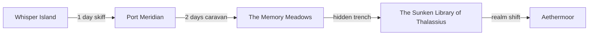

# Location Network Graph

## Travel Network Overview
```dataview
TABLE WITHOUT ID link(file.name) AS "Location",
  travel_time AS "Travel Time",
  realm_shift AS "Realm Shift Points",
  resources AS "Resources",
  danger AS "Danger Level"
FROM "02_Worldbuilding/Places"
WHERE status = "complete"
SORT file.name ASC
```

## Graph (Sample)


## Notes
- Travel time is expressed in days by default; underwater routes may use pressure-lock segments.
- Realm-shift points are rare; consuming a charge from a shard or meeting ritual requirements may be necessary.
- Resource availability fluctuates with the Living Economy; see [[03_Mechanics/Living_Economy_System.md|Living Economy System]].