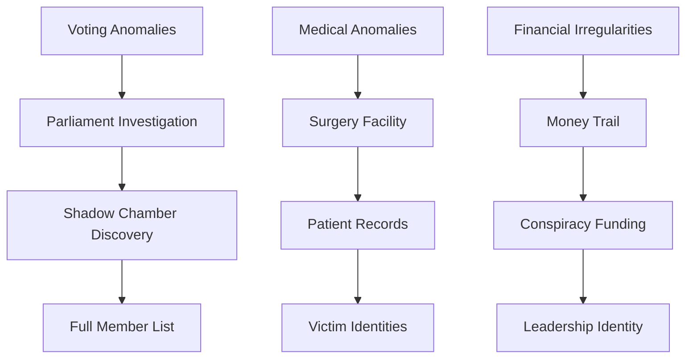

# Investigation_Mechanics

---
title: Investigation Mechanics
type: Mechanics
tags:
- evidence-system
- detection-methods
- mechanics/investigation
- research
- world/both
- status/active
- active
- shadow-conspiracy
created: '2025-08-13'
modified: '2025-08-14'
status: active
updated: '2025-08-13T17:10:00.000000'
world: Both
---


# Shadow Conspiracy: Investigation Mechanics
*Complete System for Uncovering the Conspiracy*

> [!info] Investigation Framework
> This investigation system combines:
> - Evidence collection and verification
> - NPC interrogation and trust building
> - Shadow detection techniques
> - Timeline pressure and consequences
> - Multiple solution paths

## Evidence Collection System

### Evidence Points Tracking

The party needs **10 Evidence Points** to publicly expose the conspiracy and gain governmental support.

```meta-bind
INPUT[progressBar(minValue(0), maxValue(10)):evidence-points]
LABEL[Evidence Points Collected]
```

### Evidence Categories

#### Documentary Evidence (1-2 points each)
- **Parliamentary Voting Records**: Impossible unanimous votes
- **Medical Files**: Shadow surgery patient records
- **Financial Ledgers**: Unexplained fund transfers
- **Communication Intercepts**: Coded shadow messages
- **Personnel Files**: Staff with memory gaps

#### Physical Evidence (2-3 points each)
- **Shadow Surgery Tools**: Specialized medical equipment
- **Consciousness Crystals**: Storage devices for stolen personalities
- **Shadow Essence Samples**: Proof of consciousness manipulation
- **Surgical Scars**: Physical marks on victims
- **Shadow Duplicate Remains**: Bodies that dissolve into shadow

#### Witness Testimony (1 point each, 2 if high-ranking)
- **Escaped Victims**: First-hand surgery accounts
- **Whistleblowers**: Inside information from conspirators
- **Medical Staff**: Witnessed strange procedures
- **Security Personnel**: Observed suspicious behavior
- **Family Members**: Noticed personality changes

#### Captured Conspirators (3-4 points)
- **Shadow Surgeon**: Direct evidence of techniques
- **Corrupted Official**: Proof of governmental infiltration
- **Shadow Duplicate**: Living evidence of the conspiracy
- **Conspiracy Coordinator**: Knowledge of network structure

### Evidence Verification

Not all evidence is genuine. The conspiracy plants false leads.

```dice-roller
dice: 1d20
Evidence Verification Check
1-5: False evidence (lose 1 point if accepted)
6-10: Partial truth (half value)
11-15: Genuine (full value)
16-20: Exceptional quality (+1 bonus point)
```

### Evidence Chain Requirements

Some evidence requires prior discoveries:



## Shadow Detection Methods

### Physical Detection

#### Environmental Signs
- **Temperature**: Drops 5-10°F near shadow-touched
- **Light Behavior**: Shadows move independently
- **Mirrors**: Show different or no reflections
- **Animals**: React with fear or aggression

#### Medical Examination
DC 15 Medicine check reveals:
- Surgical scars at skull base
- Unusual neural activity patterns
- Dual pulse rhythms
- Memory gaps in recent events

### Magical Detection

#### Spell Effectiveness
| Spell | Effect on Shadow-Touched | DC to Resist |
|-------|--------------------------|--------------|
| Detect Evil and Good | Shows as aberration | Auto-success |
| Detect Thoughts | Reveals dual consciousness | DC 18 Wisdom |
| Zone of Truth | Causes system conflict | DC 15 Constitution |
| True Seeing | Shows shadow overlay | Auto-success |
| Identify | Reveals shadow surgery | DC 20 Investigation |

#### Custom Detection Ritual
**Shadow Resonance Test** (10 minutes, requires shadow detection kit)
- All shadow-touched within 30 feet must make DC 15 Charisma save
- On failure, shadow aura becomes visible for 1 hour
- On success, they're aware of the detection attempt

### Behavioral Detection

#### Pattern Recognition (Insight DC varies)
- **DC 10**: Notice unusually coordinated behavior
- **DC 15**: Detect scripted speech patterns
- **DC 18**: Identify memory inconsistencies
- **DC 20**: Predict shadow agent actions

#### Social Tests
**Memory Verification**: Ask about shared past experiences
**Emotional Response**: Shadow-touched have limited emotional range
**Personal Habits**: Original personality quirks are absent
**Decision Patterns**: Always choose options benefiting conspiracy

## Investigation Tools

### Shadow Detection Kit
*Rare adventuring gear, 500 gp*

**Contents**:
- Specialized mirror (shows true reflection)
- Temperature-sensitive crystals
- Memory verification questions
- Behavioral pattern guide
- Evidence collection tools

**Use**: Advantage on Investigation checks related to shadow detection

### Consciousness Scanner
*Very rare wondrous item*

**Properties**:
- 3 charges, regains 1d3 at dawn
- **Scan (1 charge)**: Detect shadow-touched within 30 feet
- **Deep Scan (2 charges)**: Reveal specific shadow modifications
- **Purge (3 charges)**: Attempt to remove shadow control (DC 18 Wisdom save)

### Memory Archive Crystal
*Rare wondrous item*

**Properties**:
- Stores up to 10 memories for comparison
- Compare memories between individuals
- Detect altered or implanted memories
- Preserve evidence of consciousness manipulation

## NPC Interrogation System

### Trust Building Mechanics

```meta-bind
INPUT[slider(minValue(-10), maxValue(10)):npc-trust]
LABEL[NPC Trust Level]
```

#### Trust Modifiers
- **Saved their life**: +3
- **Exposed conspiracy evidence**: +2
- **Shared personal vulnerability**: +1
- **Professional approach**: +0
- **Aggressive questioning**: -2
- **Threatened or intimidated**: -3
- **Associated with conspiracy**: -5

### Interrogation Techniques

#### Soft Approach (Persuasion)
- Build rapport over multiple conversations
- Share information to gain trust
- Appeal to moral conscience
- Offer protection or rewards

```dice-roller
dice: 1d20+CHA
Soft Interrogation
DC = 15 - (Trust Level)
```

#### Hard Approach (Intimidation)
- Immediate results but damages trust
- May trigger shadow defensive protocols
- Can cause witnesses to flee
- Sometimes necessary for time pressure

```dice-roller
dice: 1d20+STR/CHA
Hard Interrogation
DC = 20 - (Fear Level)
```

#### Analytical Approach (Investigation)
- Catch inconsistencies in stories
- Cross-reference with evidence
- Build logical case
- Expose lies through facts

```dice-roller
dice: 1d20+INT
Analytical Interrogation
DC = 18 - (Evidence Points/2)
```

### Information Extraction Table `dice: 1d12`

| d12 | Information Gained | Trust Required |
|-----|-------------------|----------------|
| 1-2 | Rumors and gossip | 0+ |
| 3-4 | Personal observations | 2+ |
| 5-6 | Names of suspects | 4+ |
| 7-8 | Conspiracy methods | 6+ |
| 9-10 | Network structure | 8+ |
| 11-12 | Leadership identity | 10 |

## Timeline and Consequences

### Investigation Phases

**Phase 1: Discovery (Sessions 1-2)**
- Initial anomalies noticed
- Beginning evidence collection
- First shadow encounters
- **Deadline**: Prevent first major vote

**Phase 2: Infiltration (Sessions 3-4)**
- Facility exploration
- Deep evidence gathering
- Trust network building
- **Deadline**: Stop military coup preparation

**Phase 3: Exposure (Sessions 5-6)**
- Public revelation preparation
- Ally coordination
- Counter-conspiracy operations
- **Deadline**: Prevent complete takeover

**Phase 4: Confrontation (Sessions 7-8)**
- Direct action against leadership
- Final evidence presentation
- Climactic battles
- **Deadline**: Save both realms

### Consequence Tracking

```meta-bind
INPUT[progressBar(minValue(0), maxValue(100)):conspiracy-control]
LABEL[Conspiracy Control Level]
```

#### Control Level Effects
- **0-25%**: Conspiracy hidden, isolated incidents
- **26-50%**: Increasing influence, coordinated actions
- **51-75%**: Major governmental control, public unrest
- **76-99%**: Near-complete takeover, resistance underground
- **100%**: Total shadow control, campaign failure

#### Escalation Triggers
- Failed investigation checks: +5% control
- Missed deadlines: +10% control
- Conspirator escapes: +3% control
- Evidence destroyed: +5% control
- Ally corrupted: +7% control

## Investigation Challenges

### Skill Challenge Framework

**Uncovering the Truth** (Complexity 5, 10 successes before 5 failures)

**Primary Skills**:
- Investigation (DC 15): Find evidence
- Insight (DC 15): Detect deception
- Persuasion (DC 15): Gain cooperation
- Stealth (DC 17): Infiltrate facilities

**Secondary Skills** (can aid primary):
- Medicine (DC 12): Identify surgery signs
- Arcana (DC 14): Detect magical manipulation
- History (DC 13): Research past incidents
- Performance (DC 16): Go undercover

### Complex Investigation Scenes

#### The Parliamentary Archive Heist
**Objective**: Steal voting records without detection

**Challenges**:
1. Bypass magical security (Arcana DC 18)
2. Navigate archive maze (Investigation DC 15)
3. Locate specific records (History DC 14)
4. Copy without triggering alarms (Sleight of Hand DC 16)
5. Escape undetected (Stealth DC 17)

**Success**: Gain 2 evidence points + suspicious voting patterns
**Failure**: Alert conspiracy, +10% control level

#### The Memory Reconstruction
**Objective**: Restore corrupted official's true memories

**Challenges**:
1. Gain official's trust (Persuasion DC 16)
2. Identify memory tampering (Medicine DC 15)
3. Access Memory Palace (Arcana DC 18)
4. Navigate consciousness maze (Investigation DC 17)
5. Restore without damage (Medicine DC 19)

**Success**: Gain valuable ally + 3 evidence points
**Failure**: Official permanently damaged, become enemy

## Random Investigation Events

### Daily Investigation Events `dice: 1d20`

| d20 | Event | Effect |
|-----|-------|--------|
| 1-2 | False lead planted | Waste time, -1 day |
| 3-4 | Witness disappears | Lose potential evidence |
| 5-6 | Conspiracy surveillance detected | Stealth checks required |
| 7-8 | Ally requests urgent help | Moral dilemma |
| 9-10 | Evidence cache discovered | +1 evidence point |
| 11-12 | Shadow agent approaches | Potential double agent |
| 13-14 | Public incident | Investigate or intervene |
| 15-16 | Government crackdown | Increased security |
| 17-18 | Breakthrough lead | Major discovery opportunity |
| 19-20 | Conspiracy mistake | Temporary advantage |

### Investigation Complications `dice: 1d10`

| d10 | Complication | Resolution |
|-----|--------------|------------|
| 1 | Evidence contradicts itself | Deeper investigation needed |
| 2 | Witness terrified to talk | Protection or persuasion |
| 3 | Official obstruction | Legal or illegal approach |
| 4 | Time-sensitive lead | Rush or lose opportunity |
| 5 | Moral compromise required | Difficult choice |
| 6 | Resource shortage | Find funding or equipment |
| 7 | Internal party conflict | Resolve disagreement |
| 8 | Public opinion against party | PR campaign needed |
| 9 | False flag operation | Prove innocence |
| 10 | All leads go cold | New approach required |

## Dataview Queries for Investigation

### Evidence Tracker
```dataview
TABLE 
  evidence-type as "Type",
  evidence-value as "Points",
  verified as "Verified",
  location-found as "Source"
FROM "Shadow_Conspiracy"
WHERE contains(tags, "evidence")
SORT evidence-value DESC
```

### Suspect Database
```dataview
TABLE 
  shadow-status as "Status",
  position as "Position",
  evidence-against as "Evidence",
  last-seen as "Location"
FROM "Shadow_Conspiracy"
WHERE contains(tags, "suspect")
SORT shadow-status DESC
```

### Investigation Progress
```dataview
TABLE 
  phase as "Phase",
  deadline as "Deadline",
  successes as "Successes",
  failures as "Failures"
FROM "Shadow_Conspiracy"
WHERE contains(tags, "investigation-phase")
SORT phase ASC
```

## Quick Reference Cards

### Shadow Detection Checklist
- [ ] Check temperature around suspect
- [ ] Observe shadow behavior
- [ ] Test reflection in mirror
- [ ] Ask personal history questions
- [ ] Watch for coordinated behavior
- [ ] Look for surgical scars
- [ ] Cast detection magic
- [ ] Monitor emotional responses

### Evidence Security Protocol
1. Document immediately
2. Create copies/backups
3. Secure in multiple locations
4. Verify authenticity
5. Establish chain of custody
6. Prepare for presentation
7. Protect witnesses
8. Plan for conspiracy counter-moves

---

## Connected Resources
- [[Shadow Conspiracy NPCs]]
- [[Shadow Surgery Techniques]]
- [[Parliament Building Maps]]
- [[Evidence Item Descriptions]]
- [[Witness Protection Protocols]]

## Related

*Links to related content will be added here.*
