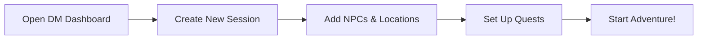

# 🐉 Obsidian TTRPG Vault Ultra

**The Ultimate Dungeons & Dragons Campaign Management System**

[](https://obsidian.md)
[](https://www.dndbeyond.com)
[](LICENSE)

A professional-grade TTRPG management system combining visual galleries, automated workflows, and intelligent data organization. Built for Dungeon Masters who want powerful tools without sacrificing ease of use.

---

## ✨ Features

### 🎨 Visual Gallery System
- **Dynamic Image Galleries** for characters, locations, items, and monsters
- **Smart Fallback Images** based on properties (race, gender, type)
- **Interactive Combat Tracker** with health bars and initiative management
- **Rarity-Based Item Showcase** with color-coded borders

### 🤖 Ultra Automation
- **QuickAdd Macros** for instant NPC, session, location, and quest creation
- **Auto-Generated Recaps** from previous sessions
- **Smart Template System** with relationship tracking
- **MetaBind Buttons** for one-click actions

### 📊 Performance-Optimized Bases
- **NPC Directory** with relationship tracking and visual indicators
- **Session Timeline** with attendance and progress analytics  
- **Quest Kanban Board** with progress visualization
- **Spell Compendium** optimized for 1000+ entries
- **Monster Gallery** with CR-based filtering

### 🎯 DM Dashboard Ultra
- **Command Center** with all tools in one place
- **Real-time Campaign Statistics**
- **Session Management Hub**
- **Integrated Quick Actions**

---

## 🚀 Quick Start

### Prerequisites
- [Obsidian](https://obsidian.md) v1.9.6+
- Required Plugins:
  - [Templater](https://github.com/SilentVoid13/Templater)
  - [QuickAdd](https://github.com/chhoumann/quickadd)
  - [MetaBind](https://github.com/mProjectsCode/obsidian-meta-bind-plugin)
  - [Bases](https://github.com/SkepticMystic/obsidian-bases-plugin)
  - [Dataview](https://github.com/blacksmithgu/obsidian-dataview)

### Installation

1. **Clone or Download** this vault
2. **Open in Obsidian** as a new vault
3. **Install Plugins** from Community Plugins
4. **Configure MetaBind** buttons using `1-DM Toolkit/MetaBind Button Configuration Ultra.md`
5. **Import Your Data** using the CLI tools in `3-Mechanics/CLI/`
6. **Start Gaming!** Open `1-DM Toolkit/DM Dashboard Ultra.md`

### First Session Setup



---

## 📁 Vault Structure

```
ObsidianTTRPGVault/
├── 🏠 1-DM Toolkit/           # Command center & tools
│   ├── DM Dashboard Ultra.md
│   ├── Visual Gallery Dashboard.md
│   └── Configuration Guides/
├── 👥 1-Party/                # Player characters
├── 📅 1-Session Journals/     # Session notes & logs
├── 🌍 2-World/                # Campaign world
│   ├── Groups/               # Factions & organizations
│   ├── Hubs/                 # Cities & major locations
│   ├── People/               # NPCs & characters
│   ├── Places/               # Specific locations
│   ├── Points of Interest/   # Dungeons & landmarks
│   ├── Quests/               # Adventures & missions
│   └── Regions/              # Geographic areas
├── ⚔️ 3-Mechanics/            # Game mechanics
│   ├── Bestiary/             # Custom monsters
│   ├── CLI/                  # Official D&D content
│   ├── Items/                # Magic items & equipment
│   └── races/                # Character races
├── 🎨 z_Assets/              # Images & media
│   ├── banners/
│   ├── Decks/
│   └── Placeholder Images/
└── 📝 z_Templates/           # Note templates
    ├── World Builder Templates/
    └── QuickAdd Macros/
```

---

## 🎮 Usage Guide

### Creating Your First NPC

1. **Click** `New NPC` in the DM Dashboard
2. **Follow the Prompts** - name, race, occupation, location
3. **Auto-Generated** - personality traits and appearance suggestions
4. **Visual Integration** - automatically links to image galleries
5. **Relationship Tracking** - connects to other NPCs and sessions

### Running a Session

1. **Create Session** - auto-numbers and dates
2. **Player Tracking** - attendance and character management
3. **Live Updates** - NPCs, quests, and locations sync automatically
4. **Combat Tracker** - visual initiative with health bars
5. **Auto Recap** - generates summary for next session

### Quest Management

- **Kanban Board View** - drag quests through stages
- **Progress Tracking** - visual progress bars
- **Objective Management** - checkboxes and milestones
- **Reward Calculation** - XP, gold, and items
- **Session Integration** - tracks quest advancement

---

## 🔧 Configuration

### MetaBind Buttons

Essential buttons for the ultra experience:

- `newSession` - Create numbered session
- `newNPC` - Smart NPC generation
- `newLocation` - Location with auto-linking
- `newQuest` - Quest with objectives
- `generateLoot` - Random treasure
- `randomEncounter` - Environment-based

**Setup:** Follow `1-DM Toolkit/MetaBind Button Configuration Ultra.md`

### Visual Galleries

Customize image displays:

```yaml
# Example: Custom monster gallery
views:
  - type: gallery
    name: Boss Monsters
    filters:
      and:
        - cr.gte(15)
    columns: 3
    properties:
      - image_path
      - file.name
      - cr_display
```

### Performance Settings

For vaults with 1000+ notes:

```yaml
# Add to base files
pageSize: 50
lazy: true
limit: 200
```

---

## 🌐 Integrations

### D&D Beyond API
```js
// Sync character data
const character = await fetch(`https://character-service.dndbeyond.com/character/v5/character/${characterId}`)
  .then(r => r.json());
```

### Spotify Integration
```js
// Campaign playlists
const playlist = await spotifyApi.getPlaylist('campaign-music');
```

### Map APIs
- **Azgaar's Fantasy Map Generator**
- **Wonderdraft Integration**
- **Roll20 Map Sync**

**Full Integration Guide:** `1-DM Toolkit/API Integration Guide.md`

---

## 📱 Discord Companion

### Bot Commands
- `/session start` - Creates session note
- `/npc lookup [name]` - Returns NPC details
- `/quest status` - Shows active quests
- `/roll encounter` - Random encounter

### Voice Channels
- **Session Audio** - Auto-transcription to notes
- **Music Bot** - Synced with campaign playlists
- **Player Coordination** - Scheduling integration

**Setup Guide:** `1-DM Toolkit/Discord Integration Guide.md`

---

## 🎯 Best Practices

### Organization
- **Use Tags Consistently** - `#NPC`, `#location`, `#quest`
- **Hierarchical Structure** - continent → region → city → district
- **Template Everything** - consistency is key
- **Image Organization** - structured folders with fallbacks

### Performance
- **Limit Gallery Sizes** - use pagination for large sets
- **Path-Based Filtering** - faster than tag-based
- **Regular Cleanup** - archive old sessions
- **Optimize Images** - compress for faster loading

### Collaboration
- **Player Access** - separate views for players
- **Session Sharing** - export summaries
- **Backup Strategy** - version control with Git
- **Privacy Controls** - hide DM notes from players

---

## 🚀 Advanced Features

### Custom Formulas
```yaml
formulas:
  PartyBalance: |
    js:
    const levels = target.party_levels || [];
    const spread = Math.max(...levels) - Math.min(...levels);
    return spread <= 1 ? "Balanced" : "Imbalanced";
```

### Automation Chains
```js
// Auto-generate session prep
session.create() → 
  pullActiveQuests() → 
  generateNPCList() → 
  createPrepChecklist()
```

### Multi-Campaign Support
- **Campaign Tags** - separate different games
- **Shared Resources** - universal NPCs and locations
- **Cross-Campaign Links** - connected storylines
- **Player Management** - track across campaigns

---

## 🛠️ Troubleshooting

### Common Issues

**Templates not working?**
- Check Templater plugin is enabled
- Verify template paths are correct
- Restart Obsidian after changes

**Bases not loading?**
- Ensure `.base` file extension
- Validate YAML syntax
- Check debug mode output

**Buttons not responding?**
- Add scripts to MetaBind settings
- Check JavaScript console for errors
- Verify plugin dependencies

**Full Troubleshooting Guide:** `1-DM Toolkit/TTRPG Vault Troubleshooting Guide.md`

---

## 📊 Metrics & Analytics

Track your campaign's success:

```dataviewjs
// Campaign statistics
const sessions = dv.pages('#session').length;
const npcs = dv.pages('#NPC').length;
const completedQuests = dv.pages('#quest').where(q => q.quest_status === "completed").length;
const totalXP = dv.pages('#session').map(s => s.xpAwarded || 0).reduce((a,b) => a+b, 0);

dv.paragraph(`
**Campaign Metrics:**
- Sessions Played: ${sessions}
- NPCs Created: ${npcs}  
- Quests Completed: ${completedQuests}
- Total XP Awarded: ${totalXP}
`);
```

---

## 🤝 Contributing

We welcome contributions! Please see:

- [Contributing Guidelines](CONTRIBUTING.md)
- [Code of Conduct](CODE_OF_CONDUCT.md)
- [Issue Templates](.github/ISSUE_TEMPLATE/)

### Development Setup
1. Fork the repository
2. Create feature branch
3. Make changes with clear commits
4. Test thoroughly
5. Submit pull request

---

## 📜 Changelog

### v2.0.0 - Ultra System
- ✨ Complete visual gallery system
- ✨ Ultra templates with automation
- ✨ Performance-optimized bases
- ✨ MetaBind button integration
- ✨ DM Dashboard Ultra
- 🔧 Full migration guides
- 📚 Comprehensive documentation

### v1.0.0 - Foundation
- 📁 Core vault structure
- 📝 Basic templates
- 📊 Initial dataview queries

[Full Changelog](CHANGELOG.md)

---

## 📄 License

This project is licensed under the MIT License - see the [LICENSE](LICENSE) file for details.

---

## 🙏 Acknowledgments

- **Obsidian Team** - For the incredible platform
- **Plugin Developers** - MetaBind, Templater, QuickAdd, Bases
- **TTRPG Community** - Inspiration and feedback
- **PhD20** - Vault organization inspiration from [phd20.com](https://phd20.com/blog/my-obsidian-setup-for-dnd/)

---

## 🎲 Happy Gaming!

*"The best tool is the one you actually use. This vault is designed to be invisible during play but powerful during prep."*

**Questions?** Open an issue or join our [Discord Community](https://discord.gg/ttrpg-obsidian)

**Support the Project:** ⭐ Star this repo and share with fellow DMs!

---

<div align="center">

**Made with ❤️ for the TTRPG Community**

[Documentation](docs/) • [Examples](examples/) • [Community](https://discord.gg/ttrpg-obsidian) • [Support](https://github.com/sponsors/)

</div>
