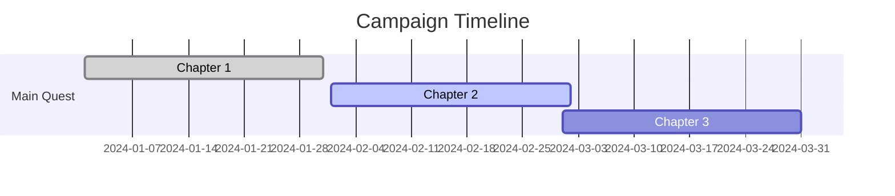

# 🎮 Campaign Dashboard

## 🚀 Quick Access Panels

### Current Session
```dataview
TABLE session-number as "Session", date as "Date", status as "Status"
FROM "01_Adventures/Sessions"
WHERE status = "upcoming"
LIMIT 1
```

### Active Quests
```dataview
TABLE file.link as "File"
FROM #quest
WHERE status = "active"
LIMIT 5
```

### Key NPCs
```dataview
TABLE location as "Location", faction as "Faction", attitude as "Attitude"
FROM #npc
WHERE important = true
LIMIT 10
```

## 📊 Campaign Statistics

### Player Characters
- **Active PCs**: [[07_Player_Resources/Active_Roster
- **Level Range**: 3-5
- **Next Milestone**: 2,000 XP

### World State
- **Current Date**: 15th of Flamerule, 1492 DR
- **Location**: [02_Worldbuilding/Locations/Current_Location]]
- **Weather**: Clear skies, warm
- **Moon Phase**: Waxing Gibbous

## 🎯 Session Prep Tools

### Quick Generators
- [[05_Rules/Generators/Generate_NPC|🧙 Generate NPC
- [05_Rules/Generators/Generate_Location|🏰 Generate Location]]
- [[Generate_Quest|📜 Generate Quest
- [Generate_Encounter|⚔️ Generate Encounter]]

### Reference Sheets
- [[00_Indexes/Combat_Lookup|Combat Reference
- [05_Rules/Conditions_Reference|Conditions]]
- [[03_Mechanics/Skill_DCs|Skill DCs

## 📈 Campaign Progress



## 🔄 Automated Tools

### Session Logger
- [Automation/Session_Logger|Start Session Log]]
- [[Automation/Combat_Tracker|Combat Tracker
- [Automation/Loot_Generator|Generate Loot]]

### Post-Session
- [[Automation/Session_Cleanup|Session Cleanup
- [Automation/XP_Calculator|Calculate XP]]
- [[Automation/Send_Recap|Send Recap to Players

## 🌍 World Simulation Status

### Active Simulations
- **Faction Politics**: Running
- **Economic System**: Active
- **Weather Patterns**: Cycling
- **NPC Schedules**: Tracking

### Recent Events
```dataview
TABLE file.link as "File"
FROM "World_Simulation/Events"
SORT date DESC
LIMIT 5
WHERE file.name != ""
```

## 📱 Player Portal Access

- [Players/Portal_Home|Player Portal]]
- [[Players/Shared_Lore|Shared Lore
- [Players/Character_Journals|Character Journals]]
- [[Players/Session_Recaps|Session Recaps

## 🎵 Audio Controls

### Ambient Soundscapes
- [Audio/Forest_Ambience|🌲 Forest]]
- [[Audio/Tavern_Sounds|🍺 Tavern
- [Audio/Battle_Music|⚔️ Battle]]
- [[Audio/Mystery_Theme|🔍 Mystery

## 📤 Export Options

- [Export/PDF_Generator|📄 Generate PDF]]
- [[Export/Roll20_Package|🎲 Roll20 Export
- [Export/Foundry_Module|🏰 Foundry VTT]]
- [[Export/World_Anvil|🌍 World Anvil

## 📊 Analytics Overview

### This Week
- **Pages Viewed**: 342
- **Most Accessed**: [02_Worldbuilding/Locations/Tavern]]
- **Unused Content**: 12 files
- **Optimization Score**: 94%

---
*Dashboard refreshes automatically*
*Last updated: {datetime.now()}*
