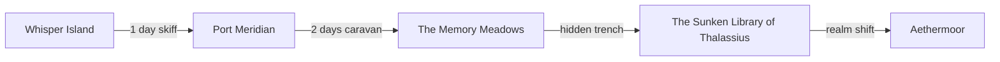

# Location Network Graph

## Travel Network Overview
```dataview
TABLE WITHOUT ID link(file.name) AS "Location",
  travel_time AS "Travel Time",
  realm_shift AS "Realm Shift Points",
  resources AS "Resources",
  danger AS "Danger Level"
FROM "02_Worldbuilding/Places"
WHERE status = "complete"
SORT file.name ASC
```

## Graph (Sample)


## Notes
- Travel time is expressed in days by default; underwater routes may use pressure-lock segments.
- Realm-shift points are rare; consuming a charge from a shard or meeting ritual requirements may be necessary.
- Resource availability fluctuates with the Living Economy; see [[Living_Economy_System.md.

## Connections

- See also: [Master_Timeline]]
- Related: [[Recent Events
- Connected to: [World Events]]

## DM Notes

*Private notes for campaign integration:*
- Can be adapted to fit current story needs
- Scalable threat/reward based on party level
- Multiple entry points for different play styles
- Connections to overarching campaign themes

## Atmosphere

### Sights
- *[What characters see when they arrive]*

### Sounds
- *[Ambient sounds and noises]*

### Smells
- *[Distinctive scents and odors]*

### Feel
- *[Temperature, humidity, air pressure]*

### Overall Mood
- *[Emotional atmosphere and general feeling]*

## Overview

*[Content for overview goes here]*

## Geography

*[Content for geography goes here]*

## Population

*[Content for population goes here]*

## Government

*[Content for government goes here]*

## Economy

*[Content for economy goes here]*

## Culture

*[Content for culture goes here]*

## Notable Locations

*[Content for notable locations goes here]*

## History

*[Content for history goes here]*

## Adventure Hooks

*[Content for adventure hooks goes here]*

## Demographics
- **Population**: *[Number of inhabitants]*
- **Races**: *[Breakdown by race]*
- **Social Classes**: *[Rich, middle, poor percentages]*

## Notable Features
### Landmarks
- *[Famous buildings or sites]*

### Districts
- *[Different areas of the location]*

### Services
- *[Shops, inns, temples available]*

## Climate & Environment
- **Climate**: *[Weather patterns]*
- **Terrain**: *[Geographic features]*
- **Flora & Fauna**: *[Local plants and animals]*
- **Natural Resources**: *[Available materials]*

## Threats & Dangers
- **Local Monsters**: *[Nearby creatures]*
- **Environmental Hazards**: *[Natural dangers]*
- **Political Tensions**: *[Social conflicts]*
- **Crime**: *[Types and frequency]*

## Resources
- Natural resources
- Trade goods

## Dangers
- Environmental hazards
- Hostile creatures

## Rumors
- Local gossip
- Urban legends

## Weather
- Typical conditions
- Seasonal changes

## NPCs
- [[Sage Elara]]
