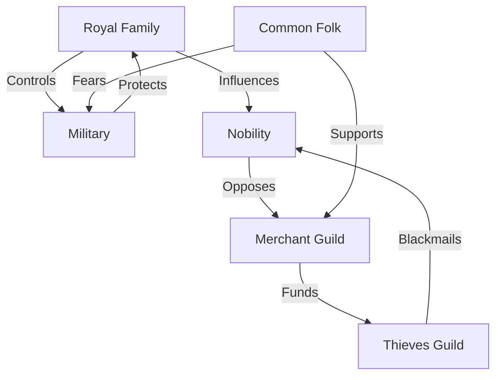
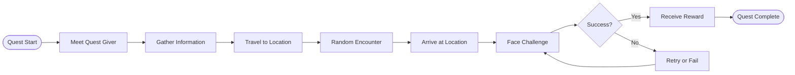

## Table of Contents
- [[#🎮 Core Systems|🎮 Core Systems
- [#📚 Content MOCs|📚 Content MOCs]]
- [[#🎭 Characters & NPCs|🎭 Characters & NPCs
- [[#🗺️ [locations|Locations]] & World|🗺️ [[locations|Locations & World]]
- [[#⚔️ Gameplay Content|⚔️ Gameplay Content
- [[#📖 [Lore|Lore]] & Story|📖 [[Lore|Lore & Story]]
- [[#🎲 Rules & Mechanics|🎲 Rules & Mechanics
- [#📅 Sessions & Campaign|📅 Sessions & Campaign]]
- [[#🔧 System MOCs|🔧 System MOCs
- [#📂 Organization|📂 Organization]]

-tags: [moc, index, navigation, master, combat, magic, exploration, lore]er]
created: 2025-08-15
cssclass: master-moc
---

# 🗺️ MASTER MAP OF CONTENT

> *Your complete navigation hub for the entire vault*

## 🎮 Core Systems
- [[00_COBCAND_CENTER/[[Campaign_Dashboard|Campaign_Dashboard|📊 [Campaign_Dashboard|Campaign Dashboard]]]]
- [[00_System/MASTER_CONTROL|🎮 [MASTER_CONTROL|Master Control]]
- [[00_System/Players/Portal_Home|👥 Player Portal

## 📚 Content MOCs

### 🎭 Characters & NPCs
- [_INDEXES/MOC_NPCs|All NPCs]]
- [[_INDEXES/MOC_Player_Characters|Player Characters
- [[_INDEXES/MOC_Factions|Factions & [Organization|Organization]]s]]

### 🗺️ [[locations|Locations & World
- [_INDEXES/MOC_Locations|All Locations]]
- [[_INDEXES/MOC_[Aethermoor|Aethermoor|Aethermoor - Sky Realm]]
- [[_INDEXES/MOC_[Aquabyssos|Aquabyssos|Aquabyssos - Ocean Depths]]
- [[_INDEXES/MOC_Regions|World Regions

### ⚔️ Gameplay Content
- [[_INDEXES/MOC_[Quests|Quests]]|Quests & Adventures]]
- [[_INDEXES/MOC_Combat|Combat & [Encounters|Encounters]]
- [[_INDEXES/MOC_[Items|Items|Items & Equipment]]
- [[_INDEXES/MOC_Magic|[spells|Spells & Magic]]

### 📖 [[Lore|Lore & Story
- [_INDEXES/MOC_Lore|World Lore]]
- [[_INDEXES/MOC_Timeline|Historical Timeline
- [_INDEXES/MOC_Religion|Gods & Religion]]
- [[_INDEXES/MOC_Culture|Cultures & Societies

### 🎲 Rules & Mechanics
- [_INDEXES/MOC_Rules|Game Rules]]
- [[_INDEXES/MOC_Homebrew|Homebrew Content
- [[_INDEXES/MOC_Tables|[Random_Tables|Random Tables]]]]

### 📅 Sessions & Campaign
- [[_INDEXES/MOC_Sessions|Session Notes
- [[_INDEXES/MOC_Campaign|[Campaign_Overview|Campaign Overview]]]]
- [[_INDEXES/MOC_Recaps|[Session_Recaps|Session Recaps]]

## 🔧 System MOCs

### 📂 Organization
- [[_METADATA/TAG_TAXONOMY|Tag System
- [_METADATA/NAMING_STANDARDS|Naming Conventions]]
- [[_METADATA/FRONTMATTER_TEMPLATES|Frontmatter Templates

### 🤖 Automation
- [_INDEXES/MOC_Templates|Templates Library]]
- [[_INDEXES/MOC_Scripts|Automation Scripts
- [_INDEXES/MOC_Dataview|Dataview Queries]]

### 📊 Analytics
- [[09_Performance/Vault_Statistics|Vault Statistics
- [_INDEXES/MOC_Reports|Performance Reports]]

## 🎯 Quick Access

### Current Focus
```dataview
TABLE file.link as "File"
FROM #status/active AND #priority/high
LIMIT 5
WHERE file.name != ""
```

### Recently Modified
```dataview
TABLE modified as "Last Modified"
FROM ""
SORT modified DESC
LIMIT 10
WHERE file.name != ""
```

### Orphaned Notes
```dataview
TABLE file.link as "File"
FROM ""
WHERE length(file.inlinks) = 0 AND length(file.outlinks) = 0
LIMIT 10
```

## 🗂️ [[DIRECTORY_STRUCTURE|Directory Structure

```
📁 Vault Root
├── 📁 ROOT_GUIDES (Master guides)
├── 📁 00_COBCAND_CENTER (Dashboards)
├── 📁 01_PLAY (Active campaign)
├── 📁 02_PREP (Session prep)
├── 📁 03_BUILD (Worldbuilding)
├── 📁 04_REFERENCE (Rules)
├── 📁 05_GENERATE (Generators)
├── 📁 07_TEMPLATES (Templates)
├── 📁 _INBOX (Unsorted)
├── 📁 _METADATA (System)
└── 📁 _INDEXES (Navigation)
```

## 🔍 Search Shortcuts

- [Special:RandomNote|🎲 Random Note]]
- [[Special:UnlinkedMentions|🔗 Unlinked Mentions
- [Special:BrokenLinks|❌ Broken Links]]
- [[Special:DuplicateFiles|👥 Duplicates]]

---

*Master MOC - Your vault's navigation center*
*Part of the 1000-step optimization plan*

> [!dm] DM Note
> Ancient magic still lingers here

## Campaign Connection
Witnessed important events in the past

## Recent NPCs
```dataview
TABLE file.mtime as "Modified"
FROM "03_People"
SORT file.mtime DESC
LIMIT 10
WHERE file.name != ""
```

## Active Quests
```dataview
TABLE file.link as "File"
FROM "01_Adventures"
WHERE contains(status, "active")
```

## Session Log
```dataview
TABLE date as "Date", players_present as "Players"
FROM "06_Sessions"
SORT date DESC
WHERE file.name != ""
```

## Location Network
```dataview
TABLE file.link as "File"
FROM "02_Worldbuilding"
WHERE contains(file.name, "Location") OR contains(tags, "location")
```

## Faction Relationships



## Quest Flow


## See Also
- [[NPC01841_Malakai_Nightfall_the_Wise
- [NPC01974_Thalia_Zephyrblade_the_Lost]]
- [[NPC00920_Malakai_Ravenheart_the_Guardian
- [NPC01664_Pyria_Lightbringer_the_Redeemed]]
- [[NPC00749_Xander_Quicksilver
- [Measurement_Guide_Depth_and_Pressur]]
- [[NPC00599_Cedric_Lightbringer_the_Wise
- [NPC01447_Baelor_Winterborn_the_Strong]]
- [[NPC00395_Aeliana_Thornweave
- [Player_Comfort_Check]]
- [[10 Appendix B Creature Stat Blocks
- [NPC00949_Nerys_Underhill_the_Wise]]
- [[NPC00162_Xander_Thornweave
- [07 Customization Options]]
- [[NPC00317_Pyria_Blackstone_the_Redeemed
- [NPC01301_Jorah_Underhill_the_Broken]]
- [[NPC00259_Delara_Proudmore
- [Faction_Relationship_Web]]
- [[Keeper Elara Mindwell
- [NPC01463_Aeliana_Zephyrblade_the_Fallen]]
- [[05 Personality and Background
- [NPC00190_Cedric_Silverleaf]]
- [[NPC01290_Pyria_Ashford_the_Broken
- [MOC_Items]]
- [[NPC01013_Corvus_Ravenheart_the_Bold
- [03 Races]]
- [[Session Planning Toolkit_1 (06_Sessions)
- [Session 0 - Aquabyssos]]
- [[Item_Catalog_Complete.md
- [11 Spellcasting]]
- [[MASTER_NAVIGATION
-

## Related Content
- [10K_GENERATION_REPORT]]
- [[ULTIMATE_VAULT_ACHIEVEMENT
- [NEXT_LEVEL_IMPROVEMENTS]]

## Game Mechanics
- **Combat**: See ACX p.189-198

## D&D 5e References

*(Combat rules: ACX p.189-198)*
*(Attack rolls: ACX p.194)*
*(Damage & Healing: ACX p.196-197)*
*(Spellcasting: ACX p.201-205)*
*(Spell slots: ACX p.201)*
*(Ritual casting: ACX p.201-202)*
*(Character creation: ACX p.11-15)*
*(Ability scores: ACX p.12-13)*
*(Backgrounds: ACX p.125-141)*
*(Equipment: ACX p.143-161)*
*(Weapons: ACX p.146-147)*
*(Armor: ACX p.144-146)*
*(Exploration: WWT p.242-243)*
*(Travel pace: ACX p.182)*
*(Wilderness survival: WWT p.109-112)*

## Connections

- Originates from [[Heritage Archive
- Related: [step_089 (phase_074)]]
- Leads to [[step_028 (phase_062)
- Originates from [Armor Xphb]]
- Parallels [[Captain Zara Stormwind
- Requires [Wings of Flying Xdmg]]
- Related: [[mordenkainens-sword-xphb (spells)
- Leads to [ENC0001_Random_Encounter_2]]
- Affected by [[step_050 (phase_067)
- Related: [ENC00048_Environmental_Encounter_49]]
- Connects to [[Legislative Archive
- Related: [step_051 (phase_015)]]
- Requires [[Assets Portraits Portrait NPC the Depth Blessed Fisherman Captain Sal Deepcurrent the Depth Blessed Fisherman Captain Sal Deepcurrent.svg
- Related: [step_060 (phase_030)]]
- Leads to [[step_004 (phase_020)
- Originates from [step_039 (phase_089)]]
- Compare with [[Social Clubs (D&D_References)
- See also: [Provincial Governments]]
- Requires [[Assets Item Artifact Enspelled Armor Level 7 Xdmg V3 Enspelled Armor Level 7 Xdmg.png
- Affected by [NPC00063_Aeliana_Goldleaf_the_Broken]]
- Requires [[Fishing Tackle
- Affected by [Assets Item Artifact Warhammer Xphb Warhammer Xphb.png]]
- Parallels [[Location City the Screaming Battleground the Screaming Battleground.svg
- Leads to [step_027 (phase_046)]]
- Affected by [[Cultural Historian Deepcurrent
- Influences [Phantom Harbor Charter]]
- Leads to [[silk-xdmg (items)
- Leads to [step_070 (phase_092)]]
- Connects to [[ITEM00309_Thunder_Hammer_of_Slaying
- Originates from [step_099 (phase_039)]]
- Affected by [[step_034 (phase_026)
- See also: [Map World Layer World Political Boundaries V2 World Political Boundaries.svg]]
- Originates from [[Session 05 (Shadow_Conspiracy)
- Compare with [step_053 (phase_087)]]
- Influences [[Protocol Expert Formal 2
- Related:
- Connects to [Potion of Acid Resistance Xdmg]]
- Compare with [[Portrait NPC the Scattered Emperor V1 the Scattered Emperor.svg_1 (Portraits)
- Originates from [step_045 (phase_070)]]
- Compare with [[Portrait NPC Duchess Marina Ever Drowning V1 Duchess Marina Ever Drowning.svg
- Parallels
- Parallels [Depth_Survey_Authority (02_Worldbuilding)]]
- Requires [[International Academic Exchange (D&D_References)
- Related: [seeking-spell-xphb (optional-features)]]
- Requires [[NPC00068_Nerys_Grimholt
- Influences [Counter-Mirror Task Force]]
- Connects to [[fiery-blast-trap-xge (traps-hazards)
- Related: [dwarven-roknar-mtf (deities)]]
- Originates from [[step_062 (phase_079)
- Leads to [QUEST00074_Main_Quest_75]]
- Influences [[step_047 (phase_071)
- Originates from [ITEM01095_Lesser_Salve_of_Healing]]
- Influences [[LOC00219_Towns_Location_220
- Compare with [LOC00220_Wilderness_Location_221]]
- Affected by [[step_090 (phase_085)
- Connects to [ITEM0078_Glorious_Shield_of_the_Dawn]]
- See also: [[Infected Experiments (Lore)
- Related: [step_072 (phase_005)]]
- Requires [[QUEST00096_Main_Quest_97
- Compare with [Quartermaster David Simpleton]]
- See also: [[Family Matriarch Anvil
- Related: [NPC01716_Gareth_Ashford_the_Fallen]]
- Compare with [[LOC00201_Towns_Location_202
- Influences [NPC00323_Aldric_Grimholt_the_Seeker]]
- Affected by [[Assets Item Artifact Enspelled Armor Level 7 Xdmg V1 Enspelled Armor Level 7 Xdmg.png
- Originates from [04_Resources_Assets_Portraits_portrait-npc-captain-twin-reality-marsh-captain-twin-reality-marsh.svg_Quick_Ref]]
- Affected by [[step_082 (phase_099)
- Affected by [Similar Topic 1]]
- Parallels [[step_053 (phase_076)
- See also: [MON00152_Aberrations_Creature_153]]
- See also: [[flensing-claws-huge-vgm (items)
- Requires [step_018 (phase_100)]]
- Compare with [[step_068 (phase_071)
- Requires [QUEST0042_In_Search_of_Power]]
- Compare with [[Dwarves in the Clan Clans Status Mtf
- Connects to [Democratic Technology Development (D&D_References)]]
- Related: [[step_094 (phase_094)
- Originates from [Cow Xdmg]]
- Related: [[step_080 (phase_086)
- Parallels [Free Current]]
- Originates from [[04_Resources_Assets_Locations_location-city-living-stone-v1-living-stone.svg
- Requires [step_006 (phase_080)]]
- See also: [[The Phantom Tide
- Originates from [Scene Scene Airship Docks Riot V1 Airship Docks Riot.svg]]
- Leads to [[Voidwhisper Diplomat Seraphina Darkgrace (D&D_References)
- Compare with [Symbol Heraldry Purist Coalition Thugs Purist Coalition Thugs.svg]]
- Leads to [[Assets Locations Location City Wise Counselor Deep V1 Wise Counselor Deep.svg
- Requires [hew-lmop (items)]]
- Connects to [[NPC00070_Erasmus_Silverleaf_the_Wise
- Connects to [Living Reef]]
- Compare with [[Resoce Chamber
- Leads to [Void-touched Crew Member]]
- Leads to [[Hybrid Healing
- Requires [Sacred Texts of Transformation (D&D_References)]]
- Connects to [[LOC00149_Planes_Location_150
- See also: [The Crystal Cult (Cults_and_Movements)]]
- Affected by [[Assets Portraits Portrait NPC the Resonance Prophet the Resonance Prophet.svg
- Influences [Public Libraries 2]]
- Influences [[Hidden Pit Xdmg
- Related: [MON00037_Constructs_Creature_38]]

## Visual References
![[03_People/portrait_assets_locations_location_city_quartermaster_sterling_suppystone_quartermaster_sterling_suppystone_svg_friendly.png
![03_People/token_00_indexes_master_index_medium_normal.png]]
![[03_People/portrait_assets_locations_location_city_deep_current_flowmaster_deep_current_flowmaster_svg_standard.png]]
