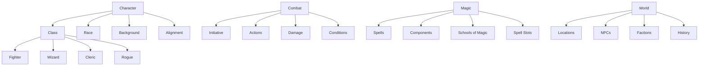

# Concept Relationship Map

## Core D&D Concepts

## Homebrew Integration

All homebrew content connects to these core concepts:
- [[Custom Classes]] extend the Class system
- [[Custom Races]] follow Race design patterns
- [[Custom Spells]] use Magic system rules
- [[Custom Items]] follow Item rarity guidelines

## Cross-References

### By Category
- **Character Building**: [[PHB Characters]], [[TCE Options]], [[Custom Origins]]
- **Combat System**: [[PHB Combat]], [[DMG Variants]], [[Homebrew Actions]]
- **Magic System**: [[PHB Spells]], [[XGE Spells]], [[Custom Magic]]
- **World Building**: [[DMG Worldbuilding]], [[Setting Guides]], [[Custom Lore]]

## Connections

- Originates from [[Dwarven Abbathor Mtf]]
- Influences [[step_031 (phase_060)]]
- Requires [[Assets Locations Location City Trader Compass Rose V1 Trader Compass Rose.svg]]
- Affected by [[step_056 (phase_068)]]
- See also: [[step_002]]
- Connects to [[step_083 (phase_090)]]
- Connects to [[Determine the Villains Actions Event Based Villain Actions]]
- Leads to [[step_094 (phase_064)]]
- See also: [[SPELL00090_Nature_Spell_91]]
- Parallels [[step_053]]
- Parallels [[step_065]]
- Affected by [[Symbol Heraldry Quest the Family Reunion Quest the Family Reunion.svg]]
- Leads to [[step_014]]
- Compare with [[Assets Locations Location City Port Meridian V1 Port Meridian.svg]]
- Related: [[Location City Pressure Technology Pressure Technology.svg]]
- Parallels [[NPC00516_Gavril_Lightbringer_the_Scholar]]
- Originates from [[Assets Locations Location City Coral Vortextrader V1 Coral Vortextrader.svg]]
- Compare with [[Kraken Territories 2]]
- Affected by [[Captain Truth Ironwill (D&D_References)]]
- Originates from [[Pressure Gate.md (Places)]]
- Parallels [[step_088 (phase_086)]]
- See also: [[Captain Tempest-Eye Marelda (D&D_References)]]
- Connects to [[Quest - Medical Conspiracy]]
- Connects to [[SPELL00038_Arcane_Spell_39]]
- Requires [[shadow-dragon-xmm (legendary-group)]]
- Leads to [[Crystalhaven Royal Palace]]
- Originates from [[Portrait NPC Pirate Captain Blacktide Pirate Captain Blacktide.svg]]
- Affected by [[Thalassius the Wise 3 (D&D_References)]]
- Leads to [[step_080 (phase_035)]]
- Compare with [[Comparative Mythology (D&D_References)]]
- Compare with [[Faction Intelligence]]
- Affected by [[step_069 (phase_087)]]
- Connects to [[step_001 (phase_011)]]
- Influences [[The Ethical Council of Mages]]
- Connects to [[step_045 (phase_045)]]
- See also: [[Location City Memorial Tender Sarah Memorial Tender Sarah.svg]]
- Originates from [[step_007 (phase_035)]]
- Related: [[LORE00137_History_Entry_138]]
- Parallels [[NPC01646_Hestara_Voidwalker_the_Seeker]]
- Leads to [[step_075 (phase_064)]]
- Influences [[The Shadowmere (D&D_References)]]
- Parallels [[step_037]]
- Related: [[location-city-the-last-dance-v1-the-last-dance.svg]]
- Affected by [[Cleric Xphb Death Domain Dmg]]
- Leads to [[Location City Temporal Rescue V1 Temporal Rescue.svg]]
- See also: [[The Pressure-Crystal Synthesis Project]]
- Compare with [[step_088]]
- Parallels [[QUEST0052_In_Search_of_Knowledge]]
- Originates from [[Dungeon Dressing General Furnishings and Appointments]]
- Influences [[step_047 (phase_026)]]
- Leads to [[Shadow Honor System]]
- Requires [[NPC00944_Felicia_Silverleaf_the_Scholar]]
- Parallels [[step_055 (phase_048)]]
- See also: [[Dungeon Creator]]
- Leads to [[Queen Current Monarch]]
- Requires [[step_022 (phase_038)]]
- See also: [[Biological Enhancement Procedures (D&D_References)]]
- Parallels [[Portrait NPC the Throne Chamber of Eternal Bubbles V2 the Throne Chamber of Eternal Bubbles.svg_1 (Portraits)]]
- Connects to [[figurine-of-wondrous-power-golden-lions-xdmg (items)]]
- Influences [[Location City Council of Faiths V1 Council of Faiths.svg]]
- Influences [[DUN00070_Dungeon_71]]
- Requires [[step_074 (phase_053)]]
- Related: [[polar-bear-xmm]]
- Leads to [[EVENT00081_Natural_Event_82]]
- Leads to [[Assets Locations Location City the Suicide Bridges the Suicide Bridges.svg]]
- Connects to [[beholder]]
- Affected by [[step_035]]
- Connects to [[step_032 (phase_052)]]
- Influences [[step_085 (phase_066)]]
- Requires [[Location City Navigator Depthseer V1 Navigator Depthseer.svg]]
- Connects to [[Maintenance Supervisor Tide Fixwright]]
- Compare with [[deep-water-xdmg (traps-hazards)]]
- Connects to [[Royal Court 2]]
- Influences [[Shadow Market Canals (D&D_References)]]
- Connects to [[Reflection Thief]]
- Leads to [[Portrait NPC Coral Empress Scarletina V2 Coral Empress Scarletina.svg]]
- Influences [[Portrait NPC the Bloodline Awakens the Bloodline Awakens.svg_1 (Portraits)]]
- Affected by [[step_027 (phase_018)]]
- Compare with [[item properties#Thrown]]
- See also: [[Assets Portraits Portrait NPC Nerissa Deepcurrent Nerissa Deepcurrent.svg]]
- Connects to [[Template Session Enhanced]]
- See also: [[random-buildings-tavern (tables)]]
- Leads to [[step_069 (phase_065)]]
- Connects to [[MON00162_Undead_Creature_163]]
- Leads to [[step_036 (phase_027)]]
- See also: [[Cosmic Truth Seekers]]
- Compare with [[step_028 (phase_009)]]
- Related: [[NPC01812_Xander_Lightbringer_the_Swift]]
- Related: [[SPELL00129_Nature_Spell_130]]
- Leads to [[Hybrid Communities Integration (D&D_References)]]
- See also: [[step_012]]
- Related: [[step_009]]
- Affected by [[Prince Caelum Stormwright 2]]
- See also: [[step_083 (phase_024)]]
- Related: [[Downtime Activity Gaining Renown]]
- Originates from [[Defense Captain Ironguard]]
- Related: [[Death Tyrant]]
- Influences [[astral-dreadnought-mpmm (monstrosity)]]
- Originates from [[The Shattered Peaks]]
- Leads to [[human-names-celtic-female-xge (tables)]]