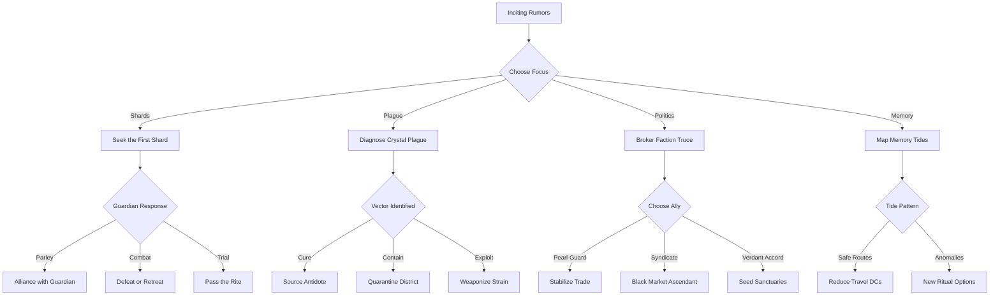

# Master Narrative Web

## Overview
High-level plot threads and how they interconnect across Aquabyssos and Aethermoor. Use this to visualize options, not to constrain play.

## Primary Threads
- Seven Shards Convergence
- Crystal Plague Contagion
- Faction War Over Sovereignty
- Memory Tide and Pressure Depth Hazards

## Decision Trees (Major Branches)


## Consequence Cascades
- If players ally with Syndicate early, increase black market availability but raise lawful scrutiny clocks by 2 ticks across port locations.
- If a shard is activated without guardian consent, spawn Convergence anomalies in nearby locations for three sessions.
- If a cure is rushed, it works but creates a resistant strain; later plague checks increase DC by 2 until Verdant Accord research completes.

## Timeline Dependencies
- Festival of Rising Tides must occur before The Second Rising; delaying triggers refugee waves, altering market supply.
- The Sunken Library revelations unlock shard resonance options; attempting before that imposes additional ritual components.
- War Council outcomes set mass-combat stakes for the Faction War finale.

## Cross-Index Links
- [[09_Performance/Indexes/Complete_NPC_Matrix.md|Complete NPC Matrix]]
- [[09_Performance/Indexes/Location_Network_Graph.md|Location Network Graph]]
- [[09_Performance/Indexes/Quest_Dependency_System.md|Quest Dependency System]]
- [[09_Performance/Indexes/Seven_Shards_Tracker.md|Seven Shards Tracker]]
```dataview
LIST FROM "01_Adventures/The_Seven_Shards_Campaign" OR "01_Adventures/Convergence_Crisis_Scenarios" WHERE status = "complete"
```