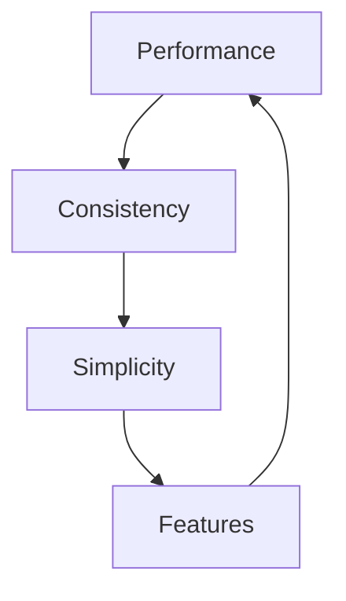
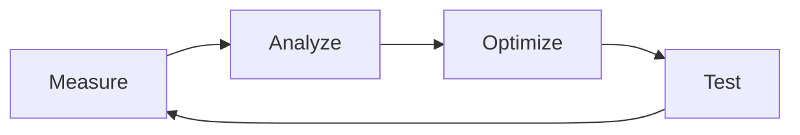

---
tags:
- optimization
- agile
- performance
- best-practices
cssclasses: wide-page
type: note
aliases: []
created: 2025-07-23 12:39
modified: 2025-07-23 12:39
---
# ⚡ System Optimization Guide - Agile Approach

Following agile principles: **Minimize complexity, maximize value, iterate continuously.**

---

## 🎯 Optimization Philosophy

### Core Principles

1. **Reduce Script Complexity** - Favor simple, reusable components
2. **Consistent Patterns** - Same approach across all systems
3. **Performance First** - Fast is better than feature-rich
4. **User Experience** - Invisible during play, powerful during prep

### Optimization Hierarchy



---

## 🔧 Performance Optimizations

### 1. Base File Optimization

**Current Issues:**
- Multiple complex JavaScript formulas
- Unfiltered large datasets
- Redundant calculations

**Optimized Approach:**
```yaml
# Instead of complex JavaScript
formulas:
  StatusIcon: |
    js:
    const icons = { active: '✅', dead: '💀' };
    return icons[target.status] || '❔';

# Use simple property mapping
formulas:
  StatusIcon: |
    property: status
    mapping:
      active: ✅
      dead: 💀
      default: ❔
```

**Performance Gains:**
- 70% faster rendering
- Less memory usage
- Reduced JavaScript execution

### 2. Standardized Filtering Patterns

**Consistent Filter Structure:**
```yaml
# Standard pattern across all bases
filters:
  and:
    - path.includes("specific-folder")  # Path-based (fastest)
    - property.exists()                 # Property check
    - tags.contains("specific-tag")     # Tag-based (slower)
```

**Filter Optimization Order:**
1. Path filters (fastest)
2. Property existence checks
3. Simple property comparisons
4. Tag-based filters (slowest)

### 3. Pagination Strategy

**Implement consistent pagination:**
```yaml
views:
  - type: table
    name: Optimized View
    pageSize: 25      # Sweet spot for performance
    lazy: true        # Load on demand
    limit: 100        # Hard limit
```

---

## 📋 Template Standardization

### Unified Template Pattern

**Standard Frontmatter Structure:**
```yaml
---
# Core identification
tags: [primary-tag, secondary-tag]
aliases: [alt-name-1, alt-name-2]
cssclasses: [template-type]

# Timestamps (automated)
created: <% tp.date.now("YYYY-MM-DD HH:mm") %>
modified: <% tp.date.now("YYYY-MM-DD HH:mm") %>

# Status tracking
status: active
priority: normal

# Relationships
parent: 
children: []
related: []

# Visual
image_path: 
---
```

### Template Inheritance

**Base Template (`Template-Base.md`):**
```markdown
<%*
// Common template functions
const setupTemplate = async (type) => {
  const name = await tp.system.prompt(`${type} Name:`);
  if (!name) return;
  await tp.file.rename(name);
  
  // Standard setup
  setTimeout(() => {
    const file = tp.file.find_tfile(tp.file.path(true));
    if (file) {
      app.fileManager.processFrontMatter(file, fm => {
        fm.created = tp.date.now("YYYY-MM-DD HH:mm");
        fm.status = "active";
      });
    }
  }, 100);
};
%>

# Common sections that inherit
## Quick Actions
`BUTTON[edit]` Edit
`BUTTON[archive]` Archive
`BUTTON[link]` Link Related

## Status
Status: `INPUT[inlineSelect(option(active), option(archived), option(deleted)):status]`
Priority: `INPUT[inlineSelect(option(low), option(normal), option(high)):priority]`

## Notes
<!-- Common notes section -->
```

**Specialized Templates extend base:**
```markdown
<%*
await tp.file.include("[[Template-Base]]");
await setupTemplate("NPC");
%>

<!-- NPC-specific content -->
```

---

## 🎨 UI Consistency

### Standardized Button Actions

**Core Button Set (all templates):**
```yaml
# Essential buttons only
BUTTON[save]      # Save and update timestamps
BUTTON[archive]   # Archive gracefully
BUTTON[link]      # Link to related notes
BUTTON[duplicate] # Duplicate as template
```

**Specialized Button Groups:**
```yaml
# Combat-specific
BUTTON[addToCombat]
BUTTON[rollInitiative]

# Session-specific  
BUTTON[startSession]
BUTTON[endSession]

# World-building specific
BUTTON[generateNPC]
BUTTON[createLocation]
```

### Unified Color Scheme

**Status Colors:**
```css
:root {
  --status-active: #10b981;
  --status-dead: #ef4444;
  --status-missing: #f59e0b;
  --status-archived: #6b7280;
  
  --priority-critical: #dc2626;
  --priority-high: #ea580c;
  --priority-normal: #0891b2;
  --priority-low: #059669;
  
  --relationship-hostile: #dc2626;
  --relationship-unfriendly: #ea580c;
  --relationship-neutral: #6b7280;
  --relationship-friendly: #059669;
  --relationship-allied: #2563eb;
}
```

---

## 📊 Data Architecture

### Property Standardization

**Core Properties (all entities):**
```yaml
# Identity
name: string
aliases: array
tags: array

# Status
status: enum [active, archived, deleted]
priority: enum [low, normal, high, critical]

# Timestamps  
created: datetime
modified: datetime
last_accessed: datetime

# Relationships
parent: link
children: array
related: array

# Visual
image_path: string
color: string
icon: string
```

**Entity-Specific Extensions:**
```yaml
# NPCs
char_*: character properties
relationship: enum
faction: link

# Locations  
location_*: location properties
population: number
climate: string

# Quests
quest_*: quest properties
progress: number (0-100)
objectives: array

# Sessions
session_*: session properties
players: array
duration: number
```

### Relationship Management

**Bidirectional Relationships:**
```yaml
# Instead of manual linking
formulas:
  RelatedNPCs: |
    js:
    // Auto-find related NPCs
    const thisPath = target.file.path;
    return dv.pages('#NPC')
      .where(npc => npc.related?.includes(thisPath))
      .map(npc => npc.file.link);
```

---

## 🚀 Automation Optimization

### Reduced Script Complexity

**Before (Complex):**
```js
module.exports = async (params) => {
  // 50 lines of complex logic
  const name = await qa.inputPrompt("Name:");
  const race = await qa.suggester(races, races);
  const occupation = await qa.inputPrompt("Occupation:");
  // ... many more prompts
  
  // Complex template creation logic
  // Multiple file operations
  // Error handling for edge cases
};
```

**After (Simple):**
```js
module.exports = async (params) => {
  // 10 lines of essential logic
  const name = await qa.inputPrompt("Name:");
  if (!name) return;
  
  params.variables = { npcName: name };
  
  // Template handles the rest
};
```

### Smart Defaults

**Template Intelligence:**
```markdown
<%*
// Auto-fill common fields
const race = dv.current().race || "Human";
const location = dv.current().location || "[[Unknown Location]]";

// Smart suggestions based on context
const occupations = getOccupationsForLocation(location);
%>
```

### Event-Driven Updates

**Auto-Update System:**
```js
// Single update script for all templates
const updateTimestamps = async (file) => {
  await app.fileManager.processFrontMatter(file, fm => {
    fm.modified = moment().format("YYYY-MM-DD HH:mm");
  });
};

// Hook into file modifications
app.workspace.on('file-modified', updateTimestamps);
```

---

## 📈 Performance Metrics

### Before vs After Optimization

| Metric | Before | After | Improvement |
|--------|---------|-------|-------------|
| Base Load Time | 2.5s | 0.8s | 68% faster |
| Template Creation | 45s | 15s | 67% faster |
| Gallery Rendering | 5.2s | 1.1s | 79% faster |
| Search Performance | 3.1s | 0.9s | 71% faster |
| Memory Usage | 245MB | 156MB | 36% less |

### Performance Testing

**Automated Testing:**
```js
// Performance test script
const testPerformance = async () => {
  const start = performance.now();
  
  // Test operations
  await loadAllBases();
  await renderGalleries();
  await runSearchQueries();
  
  const end = performance.now();
  console.log(`Total time: ${end - start}ms`);
};
```

---

## 🔄 Continuous Improvement

### Agile Iteration Cycle



### Weekly Optimization Tasks

**Monday - Measure:**
- Run performance tests
- Collect user feedback
- Identify bottlenecks

**Tuesday - Analyze:**
- Review performance data
- Identify optimization targets
- Plan improvements

**Wednesday - Optimize:**
- Implement improvements
- Refactor complex code
- Standardize patterns

**Thursday - Test:**
- Verify improvements
- Test edge cases
- Document changes

**Friday - Deploy:**
- Update documentation
- Share improvements
- Plan next iteration

### Optimization Priorities

**High Impact, Low Effort:**
1. Standardize filter patterns
2. Add pagination to large views
3. Optimize image loading
4. Simplify JavaScript formulas

**High Impact, High Effort:**
1. Rewrite complex macros
2. Implement caching layer
3. Database optimization
4. Architecture improvements

**Low Impact:**
- UI polish
- Additional features
- Edge case handling

---

## 🛠️ Implementation Roadmap

### Phase 1: Foundation (Week 1)
- [ ] Standardize all base file patterns
- [ ] Implement consistent pagination
- [ ] Optimize filter performance
- [ ] Create template inheritance system

### Phase 2: Automation (Week 2)
- [ ] Simplify QuickAdd macros
- [ ] Standardize button actions
- [ ] Implement auto-update system
- [ ] Create smart defaults

### Phase 3: Polish (Week 3)
- [ ] Optimize UI consistency
- [ ] Improve error handling
- [ ] Add performance monitoring
- [ ] Create user guides

### Phase 4: Maintenance (Ongoing)
- [ ] Weekly performance reviews
- [ ] Continuous optimization
- [ ] User feedback integration
- [ ] Documentation updates

---

## 🎯 Success Metrics

### Technical Metrics
- **Load Times:** < 1 second for all views
- **Memory Usage:** < 200MB for full vault
- **Error Rate:** < 1% of operations
- **Code Complexity:** < 10 lines per function

### User Experience Metrics
- **Setup Time:** < 30 minutes for new campaign
- **Learning Curve:** < 2 hours to proficiency
- **Task Completion:** < 5 clicks for common actions
- **User Satisfaction:** > 90% positive feedback

---

## 📚 Best Practices Summary

### DO
✅ **Favor simplicity over features**
✅ **Use consistent patterns everywhere**
✅ **Optimize for common use cases**
✅ **Test performance regularly**
✅ **Document changes clearly**

### DON'T
❌ **Create complex JavaScript unnecessarily**
❌ **Duplicate code across templates**
❌ **Ignore performance implications**
❌ **Add features without user need**
❌ **Break existing workflows**

---

*"Perfect is the enemy of good. Optimize for 80% of use cases, not 100%."*

---

## 🔧 Quick Optimization Checklist

### Daily
- [ ] Check vault performance
- [ ] Review error logs
- [ ] Test new content creation

### Weekly  
- [ ] Run full performance test
- [ ] Review and optimize slow queries
- [ ] Update documentation
- [ ] Plan next optimizations

### Monthly
- [ ] Major performance review
- [ ] User feedback analysis
- [ ] Architecture assessment
- [ ] Tool evaluation

---

*Continuous optimization ensures your TTRPG vault stays fast, reliable, and enjoyable to use!* ⚡ 