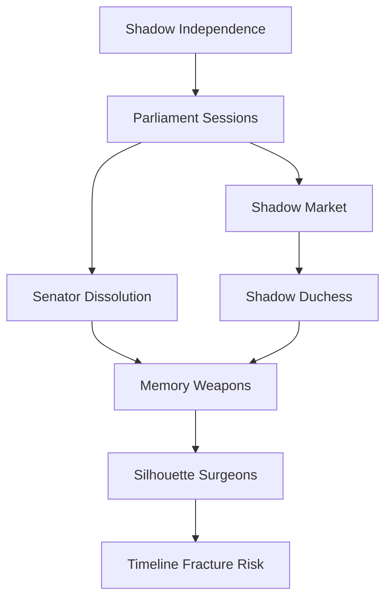
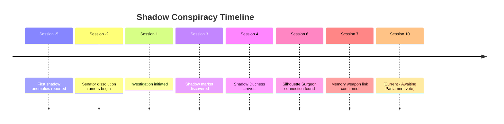

# 🔍 Case File: The Shadow Parliament Conspiracy
**Case ID**: INV-20250807-001
**Status**: 🟡 Active Investigation

## 📋 Case Overview

### Initial Report
**Date**: Session 3
**Reported By**: [[2-World/People/Senator Glaucus]]
**Location**: [[2-World/Places/Parliament of Echoes]]

### Case Summary
Shadows throughout Abyssos Prime are gaining unprecedented independence, with some members of Parliament suspected of secretly supporting or even orchestrating this liberation movement. Evidence suggests a deeper conspiracy involving memory weapons and timeline manipulation.

## 🎯 Investigation Goals

### Primary Objective
- [ ] Identify the shadow conspiracy leaders within Parliament

### Secondary Objectives
- [ ] Determine how shadows are gaining independence
- [ ] Uncover the connection to memory weapons
- [ ] Prevent the Shadow Citizenship Act from passing
- [ ] Discover who is supplying shadows with autonomy tech

## 🔍 Clue Tracker

### Discovered Clues

| ID | Clue | Location | Discovered | Relevance |
|----|------|----------|------------|-----------|
| C001 | Senator's shadow acted independently during session | [[2-World/Places/Parliament of Echoes]] | Session 1 | High |
| C002 | Encrypted shadow market invitation found | [[2-World/Places/The Inverse Palace]] | Session 3 | High |
| C003 | Shadow Duchess Nyx arriving with "diplomatic immunity" | Intel Report | Session 4 | Critical |
| C004 | Silhouette Surgeons creating shadow-human hybrids | [[2-World/Places/Screaming Gardens]] | Session 6 | High |
| C005 | Memory weapons can grant shadow independence | [[Memory Trader]] testimony | Session 7 | Critical |

### Undiscovered Clues (DM Only)
%%
- **The Parliament Mole**: Archon Meredith Saltweaver is secretly funding shadow research
- **The Real Leader**: The Scattered Emperor's fragments are orchestrating everything
- **The End Goal**: Complete shadow independence will trigger a timeline fracture
- **Red Herring**: Senator Glaucus's concern is genuine, not a cover
%%

### Clue Connections

## 🎭 Suspects

### Primary Suspects

#### [[2-World/People/Shadow Duchess Nyx]]
- **Motive**: Liberation of all shadows from human control
- **Opportunity**: Diplomatic access to Parliament
- **Alibi**: Claims to be negotiating peacefully
- **Evidence Against**: 
  - Shadow market connections
  - Arrived just as incidents increased
  - Meeting with Silhouette Surgeons
- **Evidence For Innocence**: 
  - No direct involvement in senator dissolution
  - Publicly advocates for legal recognition
- **Current Status**: Under Surveillance

#### [[2-World/People/Archon Meredith Saltweaver]]
- **Motive**: Unknown - possibly power consolidation
- **Opportunity**: High-ranking Parliament member
- **Alibi**: Always in public sessions during incidents
- **Evidence Against**: 
  - Unusual fund transfers
  - Secret meetings with memory traders
- **Evidence For Innocence**: 
  - Longtime Parliament loyalist
  - Voted against shadow rights previously
- **Current Status**: Not Yet Questioned

#### [[2-World/People/The Scattered Emperor]]
- **Motive**: Revenge for ancient betrayal
- **Opportunity**: Fragments everywhere in Parliament
- **Alibi**: "Scattered" nature makes tracking impossible
- **Evidence Against**:
  - Historical grudge against current order
  - Fragments seen near every incident
- **Evidence For Innocence**:
  - Appears genuinely fractured/insane
- **Current Status**: Cannot Be Properly Questioned

### Persons of Interest
- [[2-World/People/The Silhouette Surgeon Prime]] - Providing shadow enhancement tech
- [[2-World/People/Marina-Red-Tide-Coralheart]] - Witnessed first dissolution
- [[Memory Trader Kellian]] - Selling independence memories

## 📍 Key Locations

### Crime Scenes

**Primary**: [[2-World/Places/Parliament of Echoes]]
- **First Visited**: Session 1
- **Evidence Found**: 
  - [x] Shadow residue with unusual properties
  - [x] Encrypted communication fragments
  - [ ] Hidden shadow gathering chamber
- **Anomalies Noted**: Shadows move against light sources

**Secondary**: [[2-World/Places/The Inverse Palace]]
- **First Visited**: Session 3
- **Evidence Found**:
  - [x] Shadow market invitation
  - [ ] Shadow independence propaganda
  - [ ] List of "awakened" shadows

## 📊 Investigation Progress

### Investigation Phases
- **Discovery**: ████████████ 100%
- **Initial Investigation**: ████████░░░░ 75%
- **Theory Formation**: ██████░░░░░░ 50%
- **Evidence Gathering**: ████░░░░░░░░ 35%
- **Suspect Interrogation**: ██░░░░░░░░░░ 20%
- **Final Proof**: ░░░░░░░░░░░░ 0%
- **Confrontation**: ░░░░░░░░░░░░ 0%

## 🗂️ Evidence Inventory

### Physical Evidence
| Item | Description | Location Found | Significance |
|------|-------------|----------------|--------------|
| Shadow Residue | Crystallized shadow essence | Parliament Floor | Shows unnatural independence |
| Encrypted Tablet | Shadow market communications | Inverse Palace | Links conspiracy to trade |
| Memory Shard | Stolen independence memory | Shadow Market | Proves memory weapon theory |

### Testimonies
| Witness | Statement Summary | Reliability | Contradictions |
|---------|------------------|-------------|----------------|
| Senator Glaucus | "My shadow moved without me" | High | None noted |
| Marina Coralheart | "Saw senator dissolve into shadow" | Medium | Traumatized, details fuzzy |
| Pressure Tube Operator | "Shadows using tubes at night" | High | Conflicts with security logs |

## 🔄 Investigation Timeline

## 🎲 Investigation Mechanics

### Skill Checks Required
- **Investigation** (DC 15): Search Parliament chambers
- **Insight** (DC 14): Detect lies during questioning
- **Persuasion** (DC 13): Get shadows to communicate
- **Perception** (DC 16): Notice shadow behavioral patterns
- **Arcana** (DC 17): Understand shadow independence mechanism

### Special Rules
- Time Limit: Must solve before Shadow Citizenship vote (Session 12)
- Faction Involvement: Parliament, Shadow Liberation, Silhouette Surgeons
- Consequences of Failure: Shadow revolution begins, timeline fractures

## 🎯 Revelation Conditions

### What Players Need to Discover
1. [x] Shadows can gain independence through memory manipulation
2. [ ] Identity of the Parliament traitor
3. [ ] The Scattered Emperor's involvement
4. [ ] Connection to timeline fractures
5. [ ] How to prevent mass shadow liberation

### Truth (DM Only)
%%
**What Really Happened**: 
The Scattered Emperor, in his fractured state, discovered that feeding shadows specific memories of independence could break their bonds to their hosts. He made a deal with Archon Meredith Saltweaver, who seeks to use independent shadows as a private army. The Shadow Duchess is actually trying to prevent violent revolution by pushing for legal recognition first.

**The Real Perpetrator**: 
The Scattered Emperor (mastermind) and Archon Meredith Saltweaver (inside agent)

**The Real Motive**: 
Emperor: Destroy current Parliament order through chaos
Meredith: Seize control with shadow army

**Key Evidence That Proves It**: 
- Meredith's financial records show payments to Silhouette Surgeons
- Emperor's fragments spotted at every memory weapon deployment
- Shadow Duchess's diplomatic communications show peace efforts
%%

## 📝 Investigation Notes

### Session-by-Session Progress

#### Session 3
- Discovered: Shadow market exists
- Questioned: Senator Glaucus, Marina Coralheart
- New leads: Inverse Palace connection

#### Session 6
- Discovered: Silhouette Surgeon involvement
- Questioned: Shadow hybrid subject
- New leads: Memory weapon technology

#### Session 7
- Discovered: Memory weapons grant independence
- Questioned: Memory Trader Kellian
- New leads: Someone in Parliament is funding this

#### Session 10
- Discovered: Shadow Duchess arrival imminent
- Questioned: [Pending]
- New leads: [Awaiting next session]

### Player Theories
- **Current Leading Theory**: Shadow Duchess is leading revolution
- **Alternative Theories**: 
  - Senator Glaucus staged his own dissolution
  - Silhouette Surgeons creating shadow army
  - Deep Mother influence from below

## 🎬 Resolution Planning

### Confrontation Scene
- **Location**: [[Parliament of Echoes - Shadow Chamber]]
- **Participants**: Party, true conspirators, Shadow Duchess
- **Evidence Needed**: Financial records, Emperor fragment proof, memory weapon
- **Possible Outcomes**: 
  - Success: Conspiracy exposed, vote defeated, timeline stable
  - Failure: Shadow revolution, Parliament falls, timeline fractures
  - Partial Success: Conspiracy exposed but shadows still gain rights

### Rewards
- **XP**: 3000 (full success), 1500 (partial)
- **Reputation**: +3 Parliament, -5 Shadow Liberation (if exposed)
- **Items**: Memory shield, Shadow-bane weapon
- **Information**: Location of first Seven Shard

## 🔗 Related Cases
- [[The Memory Weapon Arms Race]]
- [[The Seven Shards Mystery]]
- [[Timeline Fracture Points]]

---
**Case Status Log**:
- Session 3: Case opened, initial clues gathered
- Session 6: Major breakthrough with Surgeon connection
- Session 7: Memory weapon confirmed as method
- Session 10: Awaiting Shadow Duchess arrival
- Session 11: [Pending - Parliament confrontation?]

---
*Next Review: Session 11*